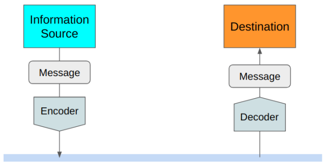
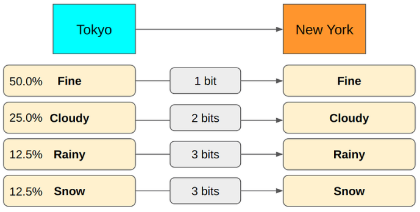

# entropy

## 最佳实践
1. 熵就是不确定性
2. 信息增益就是熵减的过程

1948 年，克劳德-香农(Claude Shannon)在其论文《通信的数学理论》(A Mathematical Theory of Communication)中提出了信息熵的概念。

香农用平均信息长度来衡量效率。因此，他考虑的是如何将原始信息编码成尽可能小的数据结构。

## 高效无损编码

假设您想从Tokyo(东京)向纽约(New York)发送一条关于东京今天天气的信息。

如果Tokyo和New York都知道是在传递和Tokyo今天天气有关的信息, 我们不需要发送今天, Tokyo, 天气等词语, 只需要告知Fine(好)和Not Fine(不好).

进一步, 可以用0表示Fine，1表示Not Fine

但如果我们还想讨论Cloudy(多云)或Rainy(下雨), 1位编码就无法涵盖所有情况。

可以使用2位, 既2个比特(bit).

从语义上讲，Cloudy和Rainy包含了Not Fine的意思。看来Not Fine是多余的, 把它去掉吧。

在上述编码中，"Fine "是 "00"，但我们不需要第二个 0。当第一位为 0 时，我们已经知道它是 "Fine"，因为 "Cloudy "和 "Rainy "都以 "1 "开头。

在上述编码中，第一位表示 "Fine or not"。第二位表示 "Cloudy or Rainy"。

东京可能会Snow(下雪)，可以添加第三个位，用于 "Rainy"和 "Snow"的情况。

我们将 "Rainy "从 11 改为 110，并将 "Snow "添加为 111，因为 110 与 111 有明显的不同，但当多种编码相继发送时，11 就会产生歧义。

例如，如果我们用 11 表示 "Rainy"，用 111 表示 "Snow"，那么 5 位数值 "11111 "既可以表示 "Rainy，Snow"，也可以表示 "Snow，Rainy"。因此，我们用 110 表示 "Rainy"，这样就可以用 "110111 "表示 "Rainy, Snow"，用 "111110 "表示 "Snow, Rainy"。这样就不会产生歧义。

因此，现在的编码使用第一个比特表示Fine or not，第二个比特表示Cloudy or others，第三个比特表示 "Rain or snow"。

例如，"010110111 "表示 "Fine, Cloudy, Rainy, Snow"。"110010111 "表示 "Rainy, Fine, Cloudy, Snow"。再一次，没有任何歧义。它是无损的.

## 计算平均编码大小

可以积累天气报告数据，从而了解从Tokyo发送到New York的信息类型的概率分布。

就可以计算出从Tokyo向New York发送信息所使用的平均比特数。

(0.6 x 1 bit)+(0.38 x 2 bits)+(0.01 x 3 bits)+(0.01 x 3 bits)=1.42 bits

每条信息平均使用 1.42 比特。可以看出，平均比特数取决于概率分布和报文编码（每种报文类型使用多少比特）。

如果Tokyo的Rainy, Snow天气更多，平均编码大小就会大不相同。

(0.1 x 1 bit)+(0.1 x 2 bits)+(0.4 x 3 bits)+(0.4 x 3 bits)=2.7 bits

我们可以通过改变编码来减少 "Rainy "和 "Snow "的平均编码量。

码平均需要 1.8 比特，比前一种编码产生的大小要小得多。

虽然这种编码方法产生的平均编码大小较小，但我们却失去了之前编码方案中的良好语义（即第一位表示 "好或不好"，第二位表示等）。没关系，因为我们
只关心平均编码大小，既不担心编码的语义，也不担心解码的难易程度。

## 寻找最小的平均编码大小

假设我们有以下概率分布。如何计算每种信息类型的最小无损编码大小？

Rainy所需的最小编码大小是多少？

假设我们用 1 位来编码 "Rainy"，那么 0 表示 "Rainy"。在这种情况下，我们就必须为其他信息类型使用至少 2 个比特，以使整个编码明确无误。由于 "Fine"和 "Cloudy"等信息类型出现的频率较高，这种编码方式并不理想。我们应该为它们保留 1 位编码，使平均编码大小更小。因此，我们应该为 "Rainy"使用多于1 位的编码，因为它出现的频率要低得多。

如下图所示，编码是明确的，但平均大小并不是理论上的最小值，因为我们对 "晴 "和 "多云 "等频率较高的信息类型使用了更多的比特。

用 2 比特来表示 "Rainy "如何？让我们交换一下 "Rainy "和 "Fine "的编码。

这种编码方式与前一种编码方式存在同样的问题，因为我们使用更多的比特来处理更频繁的信息类型（"Cloudy"）。

事实上，如果用 3 比特来表示 "Rainy"，我们平均就能达到最小编码大小。

如果 "Rainy "使用 4 比特，我们的编码就会变得多余。因此，3 比特才是 "Rainy "的正确编码大小。这一切都很好，但要找到正确的编码大小，这个过程涉及太多的试验和错误。

在给定概率分布的情况下，有没有简单的方法可以计算出从源头发送到目的地的信息的无损编码的最小平均大小。换句话说，我们如何计算熵？

## 如何计算熵
假设我们有 8 种信息类型，每种类型发生的概率相同（1/8= 12.5%）。要对它们进行编码而不产生歧义，至少需要多少比特？

编码 8 个不同的值需要多少比特？
1 个比特可以编码 0 或 1（2 个值）。由于 2 位 = 2x2 = 4 个值（00、01、10 和 11），再增加一位，容量就会翻倍。因此，8 个不同的值需要 3 位 = 2x2x2
= 8（000、001、010、011、100、101、110 和 111）。

一般来说，当我们需要用比特表示 N 个不同的值时，我们需要:
$$
log_2 N
$$

比如:
$$
log_2 8 = log_2 2^3 = 3比特
$$

如果一种信息类型在 N 次中出现 1 次，上式就给出了所需的最小大小。由于 P=1/N 是信息发生的概率，因此可以表示为：

$$
log_2 N = -log_2 \frac{1}{N} = -log_2 P

$$

让我们把这些知识与计算最小平均编码大小（以比特为单位）的方法结合起来，这就是熵：
$$
\text{Entropy} = - \sum_i P(i)log_2P(i)
$$
其中: $P(i)$是第$i$种信息类型的概率。

们以天气预报为例，加深理解。

这张图片展示了一系列关于天气概率及其对应信息熵的计算。

$ P(\text{Fine}) = 0.5 $
$ -\log_2 P(\text{Fine}) = -\log_2 0.5 = -\log_2 \frac{1}{2} = \log_2 2 = 1 \text{ bit} $。

$ P(\text{Cloudy}) = 0.25 $
$ -\log_2 P(\text{Cloudy}) = -\log_2 0.25 = -\log_2 \frac{1}{4} = \log_2 4 = 2 \text{ bits} $。

$ P(\text{Rainy}) = 0.125 $
$ -\log_2 P(\text{Rainy}) = -\log_2 0.125 = -\log_2 \frac{1}{8} = \log_2 8 = 3 \text{ bits} $。

$ P(\text{Snow}) = 0.125 $
$ -\log_2 P(\text{Snow}) = -\log_2 0.125 = -\log_2 \frac{1}{8} = \log_2 8 = 3 \text{ bits} $。

因此熵为:
$(0.5 x 1 bit)+(0.25 x 2 bits)+(0.125 x 3 bits)+(0.125 x 3 bits)=1.75 bits$

如果熵很高（平均编码大小很大），这意味着我们有很多概率很小的报文类型。因此，每次有新信息到来时，你都会期待与之前不同的信息类型。当一种信息类型发生的概率比其他信息类型小得多时，会让人感到意外，因为平均而言，你会想到其他更频繁发送的信息类型。

罕见的信息类型比更频繁的信息类型有更多的信息，因为它消除了很多其他概率，告诉我们更具体的信息。在天气情景中，如果我们发送 "下雨"（12.5% 的情况下会发生），那么我们就将概率分布（"晴、多云、下雪"）的不确定性降低了 87.5%，前提是我们之前没有任何信息。如果我们发送的是 "晴天"（50%），那么我们将只减少 50%的不确定性。

1. 高熵，平均编码大小就大，这意味着每条信息往往包含更多（具体的）信息。这也是为什么高熵与无序、不确定性、惊喜、不可预测性和信息量有关。
2. 低熵意味着大多数时候我们接收到的是更可预测的信息，这意味着更少的无序、更少的不确定性、更少的惊喜、更多的可预测性和更少（具体）的信息。

## 信息熵函数直觉

设$X$是一个取值有限的离散随机变量，其概率分布为：$P(X=x_i)=p_i, i=1,2,3,...,n$，则随机变量$X$的熵定义为
$$
H(X)=-\sum_{i=1}^{n}p_ilogp_i
$$

可以把X的熵记做H(p):
H(P)=-\sum_{i=1}^{n}p_ilogp_i

当随机变量只有两个取值的时候，例如0,1，那么X的分布为：

$$
P(X=1)=p,P(X=0)=1-p,0\leq p\leq 1
$$

那么X的熵为：

$$
H(p)=−plog_2p−(1−p)log_2(1−p)
$$

H(p)的变化曲线如下：

可以看出
1. 当p=0或者1的时候，熵为0，这个时候不确定度最低，因为p=0或1已经决定x属于什么了。
2. 当p=0.5的时候不确定度最高，此时很难分清x到底是什么。

## 参考
1. https://kikaben.com/entropy-demystified/
1. https://www.youtube.com/watch?v=YtebGVx-Fxw
2. https://www.zhihu.com/tardis/bd/art/339380585
