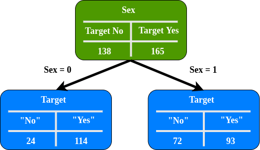

基尼不纯度(Gini Impurity)表示随机取样的两个样本不一致的概率, 或者说是样本的不纯度(impurity).

从数据集D中, 假设有M个类别, 第k个类别的概率为$p_k$, 则基尼指数的公式为:
$$
Gini(p) = \sum_{k=1}^M p_k(1-p_k)=1-\sum_{k=1}^M p_k^2
$$

其中: $p_i$是标签值的占比.

## 直觉

### 类别相同, 但比例不同

图中的公式是计算基尼系数（Gini coefficient）的表达式。具体内容如下：

1. 对于概率分布 $\left( \frac{1}{3}, \frac{1}{3}, \frac{1}{3} \right)$：

     \[
     G = 1 - \left( \frac{1}{3} \right)^2 - \left( \frac{1}{3} \right)^2 - \left( \frac{1}{3} \right)^2 \approx 0.6666
     \]

2. 对于概率分布 $\left( \frac{1}{10}, \frac{2}{10}, \frac{7}{10} \right)$：

     \[
     G = 1 - \left( \frac{1}{10} \right)^2 - \left( \frac{2}{10} \right)^2 - \left( \frac{7}{10} \right)^2 = 0.46
     \]

3. 对于概率分布 $\{1, 0, 0\}$：

     \[
     G = 1 - 1^2 = 0
     \]

分布越均匀, 基尼系数越大, 越不均匀, 基尼系数越小

### Gini Impurity

基尼不纯度是一种用于评估数据集中分类数据纯度的指标。假设我们有一个数据集，里面有红苹果、青苹果、橙子三种水果，分别有 4 个红苹果、3 个青苹果、3 个橙子。那么从这个数据集中随机选取一个水果，根据当前子集内标签的分布，红苹果被选中的概率是 40%，青苹果是 30%，橙子是 30%。如果我们随机给这个选取的水果贴上标签，按照这个分布，就有一定概率会贴错标签。比如选取的是红苹果，但随机贴上了橙子的标签，这就产生了错误标记。而基尼不纯度就是衡量这种随机标记产生错误的可能性大小的指标。

基尼杂质度公式:

$$ I_{Gini} = 1 - \sum_{i=1}^{j}p_i^2 $$

其中:
1. $j$ 类别的个数
2. $p$ 类别的分布, 既该类别的占比

基尼不纯度的值越小，表示数据集中的纯度越高，即同一类别的数据占比越大；反之，值越大，表示数据越不纯，各类别数据分布越均匀。在构建决策树时，我们希望每次分割后得到的子集的基尼不纯度尽可能小，这样可以使决策树的分类效果更好。

[Heart Disease Data set](https://www.kaggle.com/datasets/johnsmith88/heart-disease-dataset?resource=download) 数据集有303行, 13列, 目标变量包含138个0和165个1.

我们需要比较不同特征作为节点分割后的基尼不纯度, 越低表示分类好, 就将该特征作为节点.

$$ I_{Gini} = 1 - (P_{No})^2 - (P_{Yes})^2 $$

在这个案例中, 我们仅使用性别(sex), 空腹血糖(fasting blood sugar, fbs), 运动诱发的心绞痛(exercise induced angina, exang), and 目标属性(target attributes).

左节点基尼杂质度:
$$ I_{Left-Sex} = 1 - (\frac{24}{24+114})^2 - (\frac{114}{24+114})^2 = 0.29 $$

右节点基尼杂质度:
$$ I_{right-sex} = 1 - (\frac{72}{72+93})^2 - (\frac{93}{72+93})^2 = 0.49 $$

接着, 通过权重, 计算整体的基尼杂质度, 左节点有138个病人, 右节点有165个病人. 所以:

$W_{Left-Sex}=\frac{138}{138+165} = 0.46$

$W_{Right-Sex}=\frac{165}{138+165} = 0.54$

子节点总基尼杂质度:

$I_{sex} = W_{Right-Sex} \times I_{Left-Sex} + W_{Right-Sex} \times I_{Right-Sex}$

$I_{sex} = 0.46 \times 0.29 + 0.54 \times 0.49$

$I_{sex} = 0.399$

同理, 计算Fbs/Exang的基尼杂质度:

$$ I_{Fbs} = 0.249 $$
$$ I_{Exang} = 0.399 $$

Fbs有最低的基尼杂质度, 所以Fbs作为根节点

## 参考
1. https://tungmphung.com/information-gain-gain-ratio-and-gini-index/
2. https://blog.csdn.net/qq_39408570/article/details/89764177
3. https://datascience.stackexchange.com/questions/10228/when-should-i-use-gini-impurity-as-opposed-to-information-gain-entropy