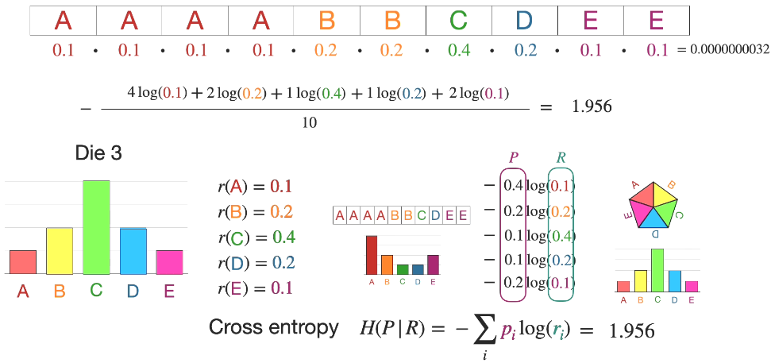

一个五边形的骰子, 每次投掷和地面接触的部分记1次, 得到如下的序列:

计算该序列的分布:

如果想得到如上的序列, 应该选择哪个(每个骰子的5个面落地的概率不一样)分布的骰子呢?

应该选择第一个骰子, 因为其投掷出该序列的似然值最大.

计算第1个骰子的交叉信息熵:

✨log的作用是将乘法改为加法, 将结果从极小值改为正常值

计算第2个骰子的交叉信息熵:

计算第3个骰子的交叉信息熵:

比较概率, 交叉熵, 散列的计算结果:

总结:

1. P表示序列中元素的概率, 也可以理解为出现该序列所对应的理想的骰子每个元素应该有的概率
2. Q表示不同骰子中元素的概率
3. 散列值是当前骰子交叉熵减去理想骰子的交叉熵

## 参考
1. https://www.youtube.com/watch?v=sjgZxuCm_8Q