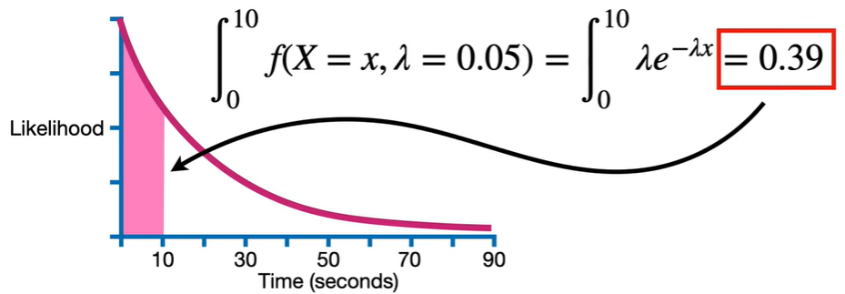

# 期望

## 离散变量的期望

总共有213人, 其中有37人知道troll 2电影. 随机挑选1个人, 如果知道troll 2电影则, 失去1块钱; 如果不知道troll 2电影, 则得到1块钱, 我们可以得到下表:

$$ E(X)= (0.17 \cdot -1)+ (0.83 \cdot 1) =0.66$$

因此，期望值代表的是如果我们多次进行这样的投注，每次投注我们所能期望得到的结果.

使用sigma符号表示, 期望是概率乘以概率对应的值并进行加总.

$$ E(X)=\sum{xP(X=x)}$$

## 连续变量的期望

在街道上, 记录通过车辆的等待时间, 以10秒为间隔.

1. 第一次, 如果在8秒内遇到1辆车, 则在(0~10]的矩形内放一个点. 从新计数.
2. 第二次, 如果在12秒内遇到1辆车, 则在(10~20]的矩形内放一个点. 从新计数.
3. 依次类推, 直到观测结束.

将每个矩形的点的个数除以总个数, 1辆车出现在某个事件段内的概率值. 如下图中:
2. x轴表示时间$x$
3. y轴表示概率密度(似然, 待考证)
4. 矩形的面积表示概率$P(X)$

期望$E(X) = \sum x P(X=x)$表示等待一辆车出现的平均时间.

将离散的结果和近似的概率值带入等式:

$$ E(X) = \sum xP(X=x)= (10 \times 0.4)+(20 \times 0.2)+(30 \times 0.1) + ...+(90 \times 0.01) = 22 $$

如果想提高近似值, 可以将间隔砍一半, 使用5秒的间隔代替10秒的间隔. 将结果和对应的概率带入公式, 得到21.8.

$$ E(X) = \sum xP(X=x)= (5 \times 0.22)+(10 \times 0.17) = 21.8 $$

继续, 降低间隔

直到方形的宽度为0, 方形的数量趋近于无穷

注意观测值的概率是方形的高度*宽度.

$$\lim_{numOfRect \rightarrow \infty}E(X)$$
$$= \lim_{numOfRect \rightarrow \infty} \sum xP(X=x) $$
$$= \lim_{numOfRect \rightarrow \infty} x(Height \times Width)$$
$$= \lim_{numOfRect \rightarrow \infty} x(L(X=x)\times Width) $$
$$= \lim_{numOfRect \rightarrow \infty} x(L(X=x)\times \delta x) $$

当矩形的个数趋近于无穷, 宽度趋近于$\delta x = 0$

$$= \int xL(X=x)dx $$

其中:
1. $x$表示时间
2. $L(X=x)$表示概率密度(似然值, 待考证), 矩形的高
3. $dx$表示时间的微分, 矩形的宽

上述的过程, 可以得到指数分布(exponential distribution)的公式:

$$f(x)=\begin{cases}\lambda e^{-\lambda x},&x\geq0\\0,&x\lt0\end{cases}$$

其中: $\lambda$也被称为比率(rate), 决定了曲线的形状, 在这个例子中的含义是, 每一秒遇到人的数量. 如果设$\lambda = 0.05$, 则正好拟合搜集的数据.

$f(X=x,\lambda=0.05) = \lambda e^{-\lambda x}$ when $x \ge 0$, otherwise $0$.

如果我们想计算10s内遇到某人的概率, 只要计算0~10曲线下面的面积, 即对指数分布(exponential distribution)的0~10范围求积分.

✨我们称y轴为似然(likelihood), 因为指数分布函数结果是似然值, 用来进行最大似然估计.❓不应该是概率密度嘛, 未找到其他支持该论点的文章, 基本都是说是概率密度.

$$\int_a^b f(X=x,\lambda=0.05)=\int_a^b \lambda e^{\lambda x}$$

## 计算指数分布的期望

由于通过指数分布等式计算似然值, 所以可以通过积分指数分布等式计算期望值.

$$E(X)=\int_{-\infty}^{+\infty} |x|f(x)dx=\int_{0}^{+\infty}xf(x)dx=\int_{0}^{+\infty}x \lambda e^{-\lambda{x}}dx= \frac{1}{\lambda}\int_{0}^{+\infty} {\lambda}x e^{-\lambda{x}}d{\lambda}x$$

$u=λx$，并使用分步积分法积分，则：
$$E(X)=\frac{1}{\lambda}\int_{0}^{+\infty}ue^{−u}du=\frac{1}{\lambda}[(−e^{−u}−ue^{−u})\big|_{0}^{+\infty}=\frac{1}{\lambda}$$

化简之后的等式为:

$$ E(x) = \frac{1}{\lambda} $$

## 总结

1. 离散变量的期望$E(X) = \sum xP(X=x)$
2. 连续变量的期望$E(X) = \int xL(X=x)dx$

## 参考
1. https://www.youtube.com/watch?v=OSPr6G6Ka-U
2. https://www.mathsisfun.com/calculus/integration-by-parts.html