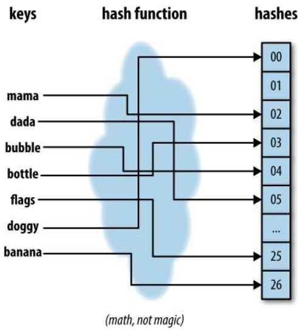
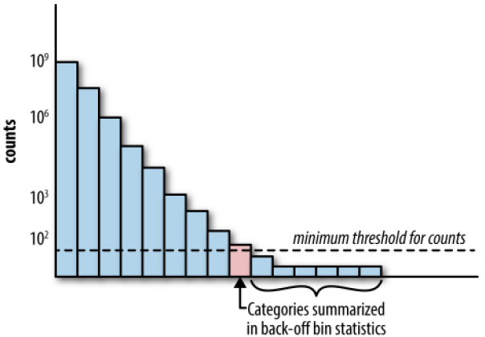
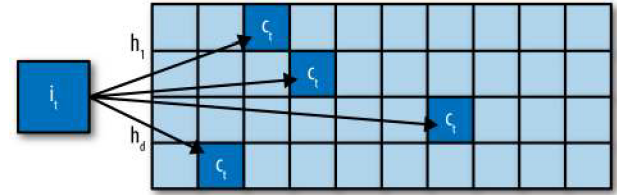

# 分类变量

## 1　分类变量的编码

分类变量中的类别通常不是数值型的。 如，眼睛的颜色可以是“黑色”“蓝色”和“褐色”。很容易想到，可以简单地为 k 个可能类别中的每个类别分配一个整数，如从 1 到 k，但这样做的结果是使类别彼此之间有了顺序，这在分类变量中是不允许的。

### 1.1　one-hot编码

one-hot 编码，它可以通过 scikit-learn 中的 sklearn.preprocessing.OneHotEncoder 实现。每个比特位表示一个特征，因此，一个可能有 k 个类别的分类变量就可以编码为一个长度为 k 的特征向量。

--|e_1| e_2 |e_3
--|--|--|--
San Francisco| 1| 0| 0
New York| 0| 1| 0
Seattle| 0| 0| 1

one-hot 编码很容易理解，但它使用的比特位(k位)要比实际需要(k-1位)的多一位。如果k-1位都是0，那么最后一位肯定是 1，因为变量必须取k个值中的一个。在数学上，可以将这个限制条件表述为“所有位的和必须等于1”：

$$
e_1 + e_2 + ... + e_k = 1
$$

于是就得到了一个线性相关关系。线性相关的特征有一点讨厌，因为它们会使训练出的模型不唯一。特征的不同线性组合可以做出同样的预测，所以我们需要做些额外的努力才能理解某个特征对预测结果的作用。

### 1.2　虚拟编码(Dummy Coding)

one-hot 编码的问题是它允许有 k 个自由度，而变量本身只需要 k-1 个自由度。虚拟编码在进行表示时只使用 k-1 个特征，除去了额外的自由度（如下表）。没有被使用的那个特征通过一个全零向量来表示，它称为参照类。虚拟编码和 one-hot 编码都可以通过 Pandas包中的 pandas.get_dummies 来实现。

--|$e_1$|$e_2$
--|--|--
San Francisco |1| 0
New York |0| 1
Seattle |0| 0

使用虚拟编码的模型结果比使用 one-hot 编码的模型结果更具解释性，在简单的线性回归
问题中很容易看出这一点。

### 1.3　效果编码(Effect Coding)

另一种分类变量编码是效果编码。效果编码与虚拟编码非常相似，区别在于参照类是用全部由 -1 组成的向量表示的

--|e_1| e_2
--|--|--
San Francisco| 1| 0
New York| 0| 1
Seattle| -1| -1

one-hot 编码、虚拟编码和效果编码彼此之间非常相似，它们都有各自的优缺点。one-hot编码有冗余，这会使得同一个问题有多个有效模型，这种非唯一性有时候比较难以解释。它的优点是每个特征都明确对应一个类别，而且可以把缺失数据编码为全零向量，模型输出也是目标变量的总体均值。

虚拟编码和效果编码没有冗余，它们可以生成唯一的可解释的模型。虚拟编码的缺点是不太容易处理缺失数据，因为全零向量已经映射为参照类了。它还会将每个类别的效果表示为与参照类的相对值，这看上去有点不直观。

效果编码使用另外一种编码表示参照类，从而避免了这个问题，但是全由 -1 组成的向量是个密集向量，计算和存储的成本都比较高。正是因为这个原因，像 Pandas 和 scikit-learn这样的常用机器学习软件包更喜欢使用虚拟编码或 one-hot 编码，而不是效果编码。

当类别的数量变得非常大时，这 3 种编码方式都会出现问题，所以需要另外的策略来处理超大型分类变量。

## 2　处理大型分类变量

### 2.1　特征散列化(Feature Hashing)

散列函数（即哈希函数）：将一个无界整数（正整数）映射到一个有限的范围内。

哈希函数的原理并不复杂，就是利用“同余”特性，先把“文本特征”（字符串）转换为一个整数，再对它求 m 的余数，以余数为标签，把该整数映射到 0 到 m-1 的 m个分箱里面。

散列函数是一种确定性函数，它可以将一个可能无界的整数映射到一个有限的整数范围[1, m] 中。因为输入域可能大于输出范围，所以可能有多个值被映射为同样的输出，这称为碰撞。均匀散列函数可以确保将大致相同数量的数值映射到 m 个分箱中。

地将散列函数想象为一台机器，它吸入一些带数字标号的圆球（键），再把它们分发到 m 个分箱中。标有同样数字的球总是被分发到同一个分箱中（如下图）。散列函数在保持特征空间的同时，又可以在机器学习的训练和评价周期中减少存储空间和处理时间。

过对特征 ID 应用散列函数，特征散列化可以将初始特征向量压缩为 m 维向量。举例来说，如果初始特征是一篇文档中的单词，那么不管输入散列函数的有多少唯一单词，散列化之后的特征都应该是固定长度为 m 的词汇表。

特征散列化的一个缺点是散列后的特征失去了可解释性，只是初始特征的某种聚合。特征散列化对计算能力大有裨益，但牺牲了直观的用户可解释性。

使用 scikit-learn 的 FeatureHasher 函数.

### 2.2　分箱计数(Bin Counting)
是一种特征工程技术，不是建模或优化方法，所以没有关于它的研究论文。

分箱计数的思想稍有一点复杂：它不使用分类变量的值作为特征，而是使用目标变量取这个值的条件概率。换句话说，我们不对分类变量的值进行编码，而是要计算分类变量值与要预测的目标变量之间的相关统计量。对于那些熟悉朴素贝叶斯分类器的人来说，这个统计量肯定耳熟能详，因为它就是在所有特征都是独立的这个假设之下的各个类别的条件概率。

用户|点击数|未点击数|点击概率|查询散列值、广告域|点击数|未点击数|点击概率
--|--|--|--|--|--|--|--
Alice|5|120|0.0400|0x598fd4fe,|foo.com|5000|30000|0.167
Bob|20|230|0.0800|0x50fa3cc0,|bar.org|100|900|0.100

根据用户 Alice 点击广告的次数和她没有点击广告的次数，可以计算出她点击广告的概率。同样，也可以计算出任意一个查询 - 广告域组合的点击概率。在训练模型时，只要遇到 Alice，就可以使用她的点击概率作为模型的输入特征。对于像“0x437a45e1, qux.net”（查询散列值 - 广告域）这样的成对特征，也可以进行同样的处理。

假设有 10 000 个用户，one-hot 编码会生成一个长度为 10 000 的稀疏向量，只在对应当前数据点的列上有一个 1。分箱计数会将所有 10 000 个二值列编码为一个单独的特征，是 0和 1 之间的一个实数值。

除了历史点击概率，我们还可以包括其他特征：原始计数本身（点击数和未点击数）、对数优势比，或任何其他概率衍生指标。本节的例子是预测广告点击率，但现有技术是用来预测一般性的二值分类问题的。通过常用的将二值分类扩展为多值分类的技术，如一对多优势比或其他多类别标记编码技术，我们很容易扩展到多类别分类。

简而言之，分箱计数将一个分类变量转换为与其值相关的统计量，它可以将一个大型的、稀疏的、二值的分类变量表示（如 one-hot 编码生成的结果）转换为一个小巧的、密集的、实数型的数值表示

1. 如何处理稀有类

和罕见词一样，稀有类也需要特殊处理。设想一个一年只登录一次的用户：只有极少的数据能用来可靠地估计这个用户的广告点击率。而且，稀有类还会浪费计数表中的空间。

解决这个问题的一种方法称为 back-off，这是一种将所有稀有类的计数累加到一个特殊分箱中的简单技术（如下图）。如果类别的计数大于一个确定的阈值，那么就使用它自己的计数统计量；否则，就使用 back-off 分箱的统计量。这种方法本质上就是把单个稀有类的统计量转换为使用所有稀有类计算的统计量。当使用 back-off 方法时，可以添加一个表示统计量是否来自于 back-off 分箱的二值指示器。

解决这个问题的另外一种方法称为最小计数图（Cormode and Muthukrishnan, 2005）。在这种方法中，不管是稀有类还是频繁类，所有类别都通过多个散列函数进行映射，每个散列函数的输出范围 m 都远远小于类别数量 k。在计算统计量时，需要使用所有散列函数进行计算，并返回结果中最小的那个统计量。与使用单散列函数相比，使用多个散列函数可以降低碰撞概率。这种方法的有效之处在于，散列函数的数量乘以散列表大小 m 之后，不但可以小于类别数量 k，而且能保持非常低的碰撞概率。

下图演示了这个过程。对于每个项目$i$，都把它映射到计数数组每一行中的某个单元。当项目$i_t$的计数$c_t$更新时，就使用函数$h_1,...,h_d$进行散列，添加到每个单元中。

2. 防止数据泄露

出现数据泄露有多种原因，比如测试数据泄露到训练数据中，或者未来数据泄露到过去数据中。只要模型获得了在生产环境中实时预测时不应该接触到的信息，就会发生数据泄露。Kaggle 的 wiki 中给出了更多数据泄露的例子，以及它不利于机器学习应用的原因。

还有一种基于差分隐私的解决方案。对于一个统计量，如果不管有没有任何一个数据点，它的分布都保持基本不变，那么它就是近似防漏的。实际上，使用 Laplace(0,1) 分布添加一个小的随机噪声，就足以弥补任何来自单数据点的潜在泄露。这种思想可以和留一计数方法结合起来，构成用于当前数据的统计量（Zhang, 2015）。

3. 无界计数

一个训练好的模型应该“知道”输入数据的可见范围。训练好的决策树可以这样表述：“当 x 大于 3 时，预测值为 1。”训练好的线性模型可以这样表述：“将 x 乘以 0.7，然后看看结果是否大于全局平均数。”当 x 位于 0 和 5 之间时，这些可能是正确的决策。但如果超出这个范围呢？没有人知道。

当输入计数增加时，模型需要维持原来的规模。如果计数累积得比较慢，有效范围不会变得太快，模型就不需要维护得特别频繁。但当计数增加得非常快时，过于频繁的维护就会造成很多问题。

由于这个原因，通常更好的做法是使用归一化后的计数，这样就可以保证把计数值限制在一个可知的区间中。例如，点击率的估计值被限制在 [0, 1] 这一范围。另一种方法是进行对数变换，这样可以强加一个严格的边界，但当计数值非常大时，变换结果的增加速度是非常慢的。

## 参考:
- https://zhuanlan.zhihu.com/p/254894091
- https://www.jianshu.com/p/9c40b8dc60bf
- Feature Engineering for Machine Learning

