# 特征工程


特征是原始数据的数值表示

## 2.1标量、向量和空间

单独的数值型特征称为标量，标量的有序列表称为向量，向量位于向量空间中。在绝大多数机器学习应用中，模型的输人通常表示为数值向量。


在数据世界中，抽象的向量和它的特征维度具有实际意义。
- 如，可以用向量表示某个人对歌曲的偏好，这时每首歌都是一个特征，值为1时表示喜欢这首歌，值为－1时表示不喜欢。

    - 假设向量$v$表示听众Bob的偏好，他喜欢BobDylan的`Blowin’in theWind`和LadyGaga的`PokerFace`。
    - 其他听众则会有不同的偏好。

    总体来说，所有数据的集合可以在特征空间中形象地表示为一个点云。


- 反之，一首歌曲也可以通过一组听众的个人偏好表示出来。假设只有两个听众，Alice和Bob。
    - Alice喜欢`Poker Face`, `Blowin’in the Wind`和Leonard Cohen 的`Hallelujah`，但是讨厌KatyPerry的`Roar`和Radiohead的`Creep`。
    - Bob喜欢`Roar`, `Hallelujah`和`Blowin'in the Wind`，但是讨厌`PokerFace`和`Creep`。

    每首歌都是听众空间中的一个点。就像可以在特征空间中表示出数据一样，我们也可以在数据空间中表示出特征。

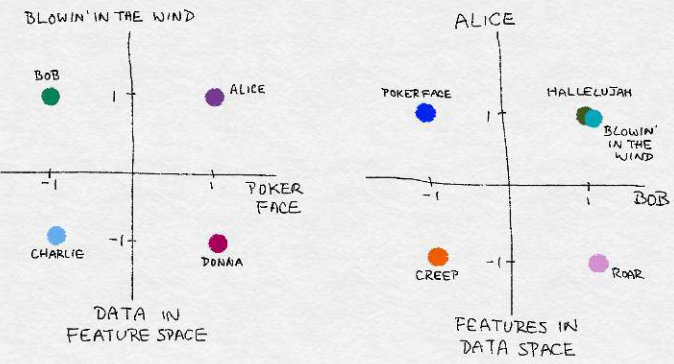


## 2.2处理计数

### 2.2.1二值化

在百万歌曲数据集中，原始的收听次数并不是衡量用户喜好的强壮指标。（在统计学术语中，“强壮”意味着该方法适用于各种情况。）不同的用户有不同的收听习惯，有些人会无限循环地播放他们最喜欢的歌曲，有些人则只是在特定情形下欣赏音乐。我们不能认为收听了某首歌曲20次的人喜欢该歌曲的程度肯定是收听了10次的人的两倍。

更强壮的用户偏好表示方法是将收听次数二值化，把所有大于1的次数值设为1。换言之，如果用户收听了某首歌曲至少一次，那么就认为该用户喜欢该歌曲。这样，模型就不用花费开销来预测原始收听次数之前的时间差别。二值目标变量是一个既简单又强壮的用户偏好衡量指标。


### 2.2.2区间量化(分箱)


原始的点评数量横跨了若干个数量级，这对很多模型来说都是个问题。在线性模型中，同一线性系数应该对所有可能的计数值起作用。过大的计数值对无监督学习方法也会造成破坏，比如k-均值聚类，它使用欧氏距离作为相似度函数来测量数据点之间的相似度。数据向量某个元素中过大的计数值对相似度的影响会远超其他元素，从而破坏整体的相似度测量。


一种解决方法是对计数值进行区间量化，然后使用量化后的结果。换言之，我们将点评数量分到多个箱子里面，去掉实际的计数值。区间量化可以将连续型数值映射为离散型数值，我们可以将这种离散型数值看作一种有序的分箱序列，它表示的是对密度的测量。为了对数据进行区间量化，必须确定每个分箱的宽度。有两种确定分箱宽度的方法：固定宽度分箱和自适应分箱。

1. 固定宽度分箱

通过固定宽度分箱，每个分箱中会包含一个具体范围内的数值。这些范围可以人工定制，也可以通过自动分段来生成，它们可以是线性的，也可以是指数性的。例如，我们可以按10年为一段来将人员划分到多个年龄范围中：0~9岁的在分箱1中、10~19岁的在分箱2中，等等。要将计数值映射到分箱，只需用计数值除以分箱的宽度，然后取整数部分。

```python
import numpy as np

## 普通分箱
small_counts = np.random.randint(0, 100, 20)
small_counts # array([30, 64, 49, 26, 69, 23, 56,  7, 69, 67, 87, 14, 67, 33, 88, 77, 75, 47, 44, 93])
np.floor_divide(small_counts, 10)  # array([3, 6, 4, 2, 6, 2, 5, 0, 6, 6, 8, 1, 6, 3, 8, 7, 7, 4, 4, 9], dtype=int32)

## 跨数量级分箱
large_counts = [296, 8286, 64011, 80, 3, 725, 867, 2215, 7689, 11495, 91897, 44, 28, 7971, 926, 122, 22222]
np.floor(np.log10(large_counts))  # array([ 2.,  3.,  4.,  1.,  0.,  2.,  2.,  3.,  3.,  4.,  4.,  1.,  1.,3.,  2.,  2.,  4.])
```

2. 分位数分箱
固定宽度分箱非常容易计算，但如果计数值中有比较大的缺口，就会产生很多没有任何数据的空箱子。根据数据的分布特点，进行自适应的箱体定位，就可以解决这个问题。这种方法可以使用数据分布的分位数来实现。分位数是可以将数据划分为相等的若干份数的值。例如，中位数（即二分位数）可以将数据划分为两半，其中一半数据点比中位数小，另一半数据点比中位数大。四分位数将数据四等分，十分位数将数据十等分，等等。


```python
import pandas as pd
pd.qcut(large_counts, 4, labels=False)
large_counts_series = pd.Series(large_counts)
large_counts_series.quantile([0.25, 0.5, 0.75])

# 0.25     122.0
# 0.50     926.0
# 0.75    8286.0
# dtype: float64
```


## 2.3对数变换
### 2.3.1对数变换实战
对数函数是指数函数的反函数，它的定义是$log_a(a^x) = x$，其中$a$是个正的常数，$x$可以是任意正数。因为$a°=1$，所以有$log_a(1)=0$。这意味着对数函数可以将(0,1)这个小区间中的数映射到$(-∞,0)$这个包括全部负数的大区间上。函数$log(x)$可以将区间[1，10]映射到[0,1]，将[10，100]映射到[1,2]，以此类推。换言之，对数函数可以对大数值的范围进行压缩，对小数值的范围进行扩展。x越大，log(x)增长得越慢。


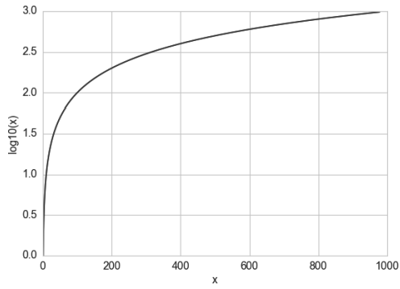


于具有重尾分布的正数值的处理，对数变换是一个非常强大的工具。（与高斯分布相比，重尾分布的概率质量更多地位于尾部。）它压缩了分布高端的长尾，使之成为较短的尾部，并将低端扩展为更长的头部。


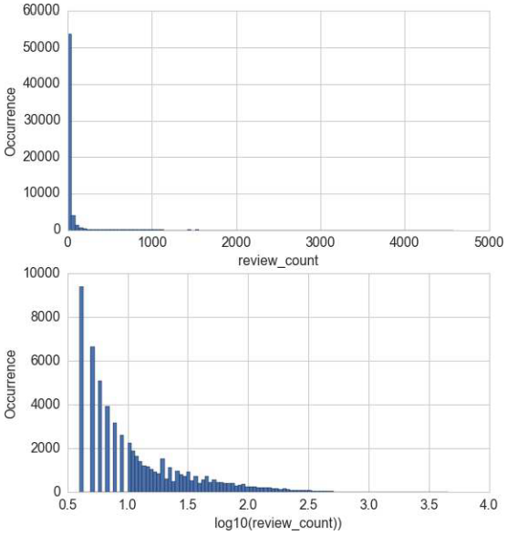


上面是商家的点评图，x轴表示一个商家的点评数量，y轴表示商家点评数量的分布。两幅图中的y轴都是正常（线性）标度。在下方的图形中，区间（0.5，1]中的箱体间隔很大，是因为在1和10之间只有10个可能的整数计数值。请注意，初始的点评数量严重集中在低计数值区域，但有些异常值跑到了4000之外。经过对数变换之后，直方图在低计数值的集中趋势被减弱了，在x轴上的分布更均匀了一些。


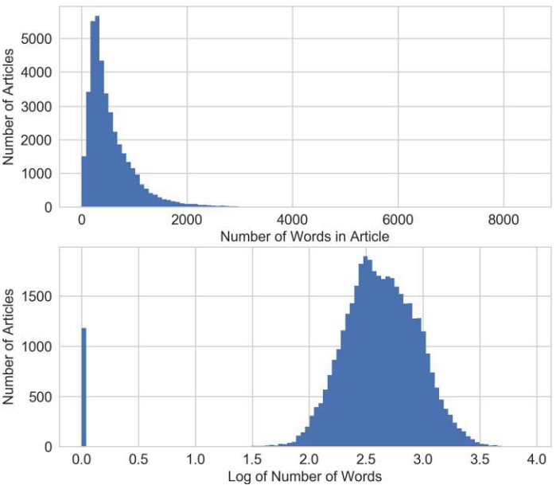

X轴表示文章中的单词个数， Y轴表示文章的单词个数的分布。在对数变换之后，特征分布更像是高斯分布了，但有一个例外，就是0长度文章（无内容）的数量有一个突变。

对数变换重组了x轴，对于那些目标变量值异常巨大（>200000个分享）的文章，对数变换将它们更多地拉向了x轴的右侧，这就为线性模型在输入特征空间的低值端争取了更多的“呼吸空间”。如果不进行对数变换，模型就会面临更大的压力，要在输人变化很小的情况下去拟合变化非常大的目标值。


### 2.3.2指数变换

对数变换的推广指数变换是个变换族，对数变换只是它的一个特例。用统计学术语来说，它们都是方差稳定化变换。要理解为什么方差稳定是个好性质，可以考虑一下泊松分布。泊松分布是一种重尾分布，它的方差等于它的均值。因此，它的质心越大，方差就越大，重尾程度也越大。指数变换可以改变变量的分布，使得方差不再依赖于均值。例如，假设一个随机变量

$X$具有泊松分布，如果通过取它的平方根对它进行变换，那么$\tilde{X} = \sqrt{X}$的方差就近似是-个常数，而不是与均值相等。下图表示出了对泊松分布的影响，表示泊松分布的均值。当变大时，不仅整个分布模式向右移动，质量也更加分散，方差随之变大。

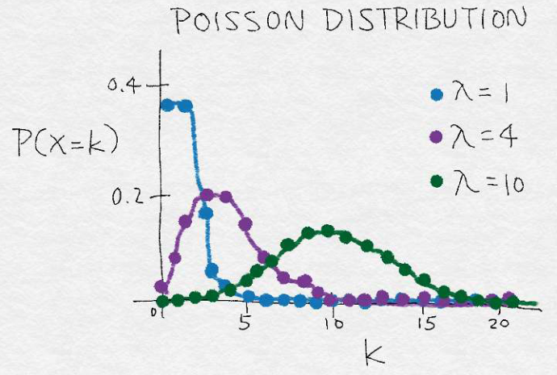


平方根变换和对数变换都可以简单推广为Box-Cox变换：


$$
\tilde{x}=
\begin{cases}
    \frac{x^{\lambda} - 1}{\lambda} & (\lambda \neq 0) \\
    ln(x) & (\lambda = 0)
\end{cases}
$$


下图展示了$\lambda = 0$（对数变换）、$\lambda=0.25$、$\lambda=0.5$（平方根变换的一种缩放和平移形式）、$\lambda=0.75$和$\lambda=1.5$时的Box-Cox变换。小于1时，可以压缩高端值；大于1时，起的作用是相反的。


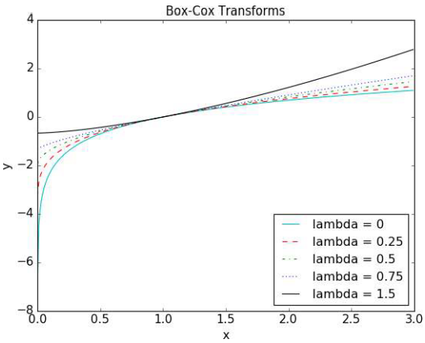


只有当数据为正时，Box-Cox公式才有效。对于非正数据，我们可以加上一个固定的常数，对数据进行平移。当应用Box-Cox变换或更广义的指数变换时，必须确定参数的值，这可以通过极大似然方法（找到能使变换后信号的高斯似然最大化的值）或贝叶斯方法来完成。幸运的是，SciPy的stats包中有Box-Cox变换的实现方法，并包括找到最优变换参数的功能。

```python
import json
import pandas as pd
from scipy import stats
import matplotlib.pyplot as plt
import seaborn as sns
%matplotlib notebook
sns.set_style('whitegrid')
biz_f = open('data/yelp/v6/yelp_dataset_challenge_academic_dataset/yelp_academic_dataset_business.json')
biz_df = pd.DataFrame([json.loads(x) for x in biz_f.readlines()])
biz_f.close()
# Box-Cox transform assumes that input data is positive. 
# Check the min to make sure.
biz_df['review_count'].min()
# Setting input parameter lmbda to 0 gives us the log transform (without constant offset)
rc_log = stats.boxcox(biz_df['review_count'], lmbda=0)
# By default, the scipy implementation of Box-Cox transform finds the lmbda parameter
# that will make the output the closest to a normal distribution
rc_bc, bc_params = stats.boxcox(biz_df['review_count'])
bc_params
biz_df['rc_bc'] = rc_bc
biz_df['rc_log'] = rc_log

fig, (ax1, ax2, ax3) = plt.subplots(3,1)
# original review count histogram
biz_df['review_count'].hist(ax=ax1, bins=100)
ax1.set_yscale('log')
ax1.tick_params(labelsize=14)
ax1.set_title('Review Counts Histogram', fontsize=14)
ax1.set_xlabel('')
ax1.set_ylabel('Occurrence', fontsize=14)
# review count after log transform
biz_df['rc_log'].hist(ax=ax2, bins=100)
ax2.set_yscale('log')
ax2.tick_params(labelsize=14)
ax2.set_title('Log Transformed Counts Histogram', fontsize=14)
ax2.set_xlabel('')
ax2.set_ylabel('Occurrence', fontsize=14)# review count after optimal Box-Cox transform
biz_df['rc_bc'].hist(ax=ax3, bins=100)
ax3.set_yscale('log')
ax3.tick_params(labelsize=14)
ax3.set_title('Box-Cox Transformed Counts Histogram', fontsize=14)
ax3.set_xlabel('')
ax3.set_ylabel('Occurrence', fontsize=14)

```


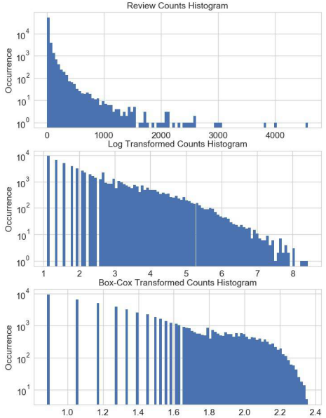


概率图（probplot）是一种非常简单的可视化方法，用以比较数据的实际分布与理论分布，它本质上是一种表示实测分位数和理论分位数的关系的散点图。图2-14展示了Yelp点评数据的两种概率图，分别是初始点评数量、变换后点评数量的概率图，并和正态分布进行了对比。因为观测数据肯定是正的，而高斯分布可以是负的，所以在负数端，实测分位数和理论分位数不可能匹配。因此，我们只关注正数部分。于是，我们可以看出与正态分布相比，初始的点评数量具有明显的重尾特征。（排序后的值可以达到4000以上，而理论分位数只能到达4左右。）普通对数变换和最优Box-Cox变换都可以将正尾部拉近正态分布。根据图形明显可以看出，相比对数变换，最优Box-Cox变换对尾部的压缩更强，它使得尾部变平，跑到了红色等值斜线下面。


```python
fig2, (ax1, ax2, ax3) = plt.subplots(3,1)
prob1 = stats.probplot(biz_df['review_count'], dist=stats.norm, plot=ax1)
ax1.set_xlabel('')
ax1.set_title('Probplot against normal distribution')
prob2 = stats.probplot(biz_df['rc_log'], dist=stats.norm, plot=ax2)
ax2.set_xlabel('')
ax2.set_title('Probplot after log transform')
prob3 = stats.probplot(biz_df['rc_bc'], dist=stats.norm, plot=ax3)
ax3.set_xlabel('Theoretical quantiles')
ax3.set_title('Probplot after Box-Cox transform')
```


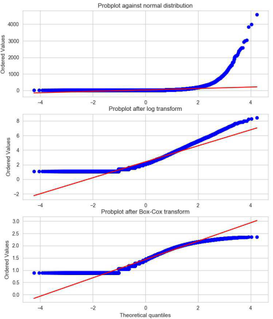


## 2.4特征缩放/归一化


如果模型对输入特征的尺度很敏感，就需要进行特征缩放。顾名思义，特征缩放会改变特征的尺度，有些人将其称为特征归一化。


### 2.4.1min-max缩放
令$x$是一个独立的特征值(即某个数据点中的特征值)，$min(x)$和$max(x)$分别为这个特征在整个数据集中的最小值和最大值。min-max缩放可以将所有特征值压缩（或扩展）到[0,1]区间中。公式如下:
$$
\frac{x-min(x)}{max(x)-min(x)}
$$

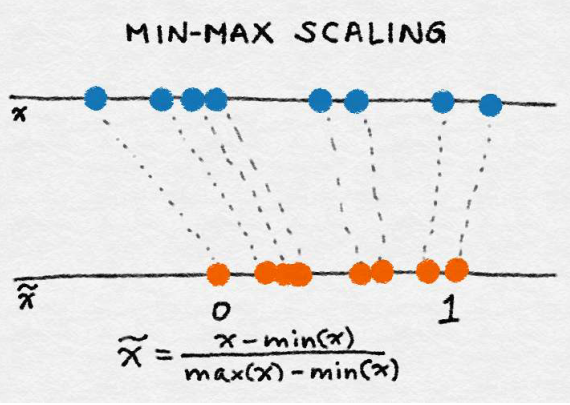

### 2.4.2特征标准化/方差缩放
$$
\tilde{x} = \frac{x-mean(x)}{sqrt(var(x))}
$$
它先减去特征的均值（对所有数据点），再除以方差，因此又称为方差缩放。缩放后的特征均值为0，方差为1。如果初始特征服从高斯分布，那么缩放后的特征也服从高斯分布。

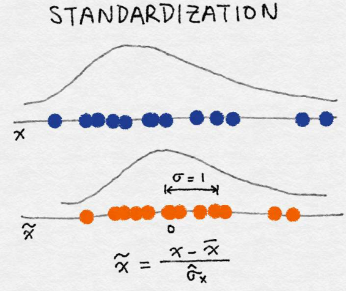


### 2.4.3 $l^2$归一化


这种归一化技术是将初始特征值除以一个称为范数的量，范数又称为欧几里得范数，定义如下:
$$
\tilde{x} = \frac{x}{||x||_2}
$$

$l^2$数是坐标空间中向量长度的一种测量。它的定义可以根据著名的毕达哥拉斯定理（给定一个直角三角形两条直角边的长度，可以求出斜边的长度）导出：

$$
||x||_2 = \sqrt{x_1^2 + x_2^2 + ... + x_m^2}
$$

$l^2$数先对所有数据点中该特征的值的平方求和，然后算出平方根。经过归一化后，特征列的范数就是1。有时候这种处理又称为$l^2$缩放。（不严格地说，缩放意味着乘以一个常数，而归一化可以包括多种操作。）:

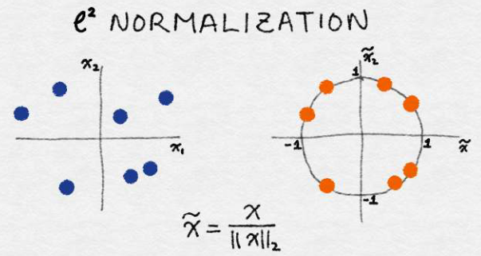


不论使用何种缩放方法，特征缩放总是将特征除以一个常数（称为归一化常数）。因此，它不会改变单特征分布的形状。


当一组输入特征的尺度相差很大时，就需要进行特征缩放。例如，一个人气很高的商业网站的日访问量可能是几十万次，而实际购买行为可能只有几千次。如果这两个特征都被模型所使用，那么模型就需要在确定如何使用它们时先平衡一下尺度。如果输入特征的尺度差别非常大，就会对模型训练算法带来数值稳定性方面的问题。在这种情况下，就应该对特征进行标准化。


## 2.5交互特征

两个特征的乘积可以组成一对简单的交互特征，这种相乘关系可以用逻辑操作符 AND 来
类比，它可以表示出由一对条件形成的结果：“该购买行为来自于邮政编码为 98121 的地
区”AND“用户年龄在 18 和 35 岁之间”。

简单线性模型使用独立输入特征$x_1, x_2,..., x_n$的线性组合来预测结果变量$y$：
$$
y = w_1x_1 + w_2x_2 + ... + w_nx_n
$$

含输入特征的两两组合，如下所示：

$$
y = w_1x_1 + w_2x_2 + ... + w_nx_n + w_{1,1}x_1x_1 + w_{1,2}x_1x_2 + w{1,3}x_1x_3 + ...

$$

这样，就可以捕获特征之间的交互作用，因此这些特征对就称为交互特征。如果$x_1$和 $x_2$是二值特征，那么它们的积$x_1 x_2$就是逻辑函数 $x_1 AND x_2$。

如果线性模型中包含有交互特征对，那它的训练时间和评分时间就会从$O(n)$增加到$O(n^2)$，其中$n$是单一特征的数量。


## 2.6　特征选择

特征选择技术可以精简掉无用的特征，以降低最终模型的复杂性，它的最终目的是得到一个简约模型，在不降低预测准确率或对预测准确率影响不大的情况下提高计算速度。

为了得到这样的模型，有些特征选择技术需要训练不止一个待选模型。换言之，特征选择不是为了减少训练时间（实际上，一些技术会增加总体训练时间），而是为了减少模型评分时间。

粗略地说，特征选择技术可以分为以下三类。

- 过滤

    过滤技术对特征进行预处理，以除去那些不太可能对模型有用处的特征。例如，我们可以计算出每个特征与响应变量之间的相关性或互信息，然后过滤掉那些在某个阈值之下的特征。我们最好谨慎地使用预过滤技术，以免在有用特征进入到模型训练阶段之前不经意地将其删除。


- 打包方法

    这些技术的成本非常高昂，但它们可以试验特征的各个子集，这意味着我们不会意外地删除那些本身不提供什么信息但和其他特征组合起来却非常有用的特征。打包方法将模型视为一个能对推荐的特征子集给出合理评分的黑盒子。

- 嵌入式方法

    这种方法将特征选择作为模型训练过程的一部分。例如，特征选择是决策树与生俱来的一种功能，因为它在每个训练阶段都要选择一个特征来对树进行分割。另一个例子是$ℓ^1$正则项，它可以添加到任意线性模型的训练目标中。$ℓ^1$正则项鼓励模型使用更少的特征，而不是更多的特征，所以又称为模型的稀疏性约束。嵌入式方法将特征选择整合为模型训练过程的一部分。它们不如打包方法强大，但成本也远不如打包方法那么高。与过滤技术相比，嵌入式方法可以选择出特别适合某种模型的特征。从这个意义上说，嵌入式方法在计算成本和结果质量之间实现了某种平衡。


## 参考:
- Feature Engineering for Machine Learning