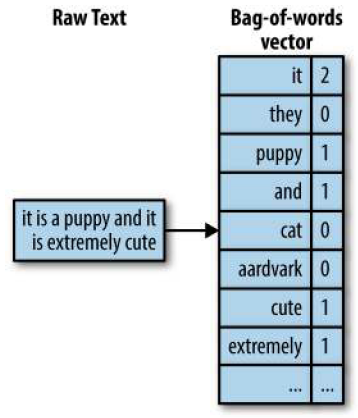
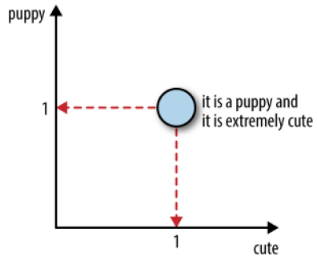
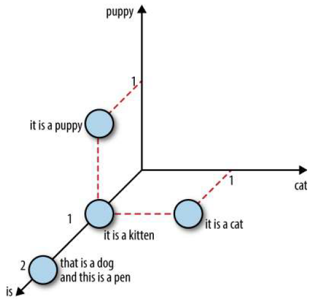
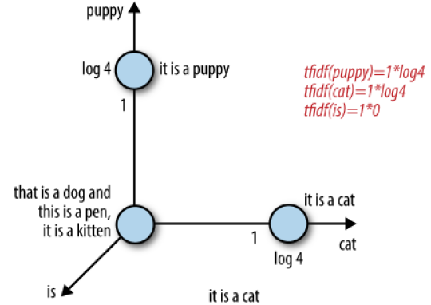

# 自然语言
## 1元素袋

### 1.1 词袋(bag-of-words, BOW)

在词袋特征化中，一篇文本文档被转化为一个计数向量。（向量就是 n 个数值的集合。）这个计数向量包含词汇表中所有可能出现的单词。如果某个单词（比如“aardvark”）在文档中出现了 3 次，那么特征向量在对应于这个单词的位置就有一个计数值 3。如果词汇表中的某个单词没有出现在文档中，那么它的计数值就是 0。例如，文本“it is a puppy and it is extremely cute”:

词袋将一个文本文档转换为一个扁平向量。之所以说这个向量是“扁平”的，是因为它不包含原始文本中的任何结构。原始文本是一个单词序列，但词袋中没有任何序列，它只记录每个单词在文本中出现的次数。

词袋也不表示任何单词层次。例如，“animal”这个概念包括“dog”“cat”“raven”等，但在词袋表示中，这些单词在向量中都是平等的元素。

在词袋向量中，每个单词都是向量的一个维度。如果词汇表中有n个单词，那么一篇文档就是n维空间中的一个点。下图展示了由单词“puppy”和“cute”所构成的二维特征空间，以及我们的例句在这个空间中的样子。

词袋并 非完美无缺， 将 句 子 分 解 为单词会破坏语义。例如，“not bad”在语 义上是“decent”，甚至是“good”（特别是在英式英语里）。但“not”和“bad”被分开后表示的是一种否定和负面的情感。“toy dog”和“dog toy”是差别很大的两种东西（除非是玩具狗的狗玩具），但拆成“toy”和“dog”这两个单词后，都失去了原来的意义。

### 1.2 n元词袋
n元词袋（bag-of-n-grams）是词袋的一种自然扩展。n-gram（n元词）是由n个标记（token）组成的序列。1-gram就是一个单词（word），又称为一元词（unigram）。经过分词（tokenization）之后，计数机制会将单独标记转换为单词计数，或将有重叠的序列作为n-gram进行计数。例如，句子“Emmaknockedonthedoor”会生成n-gram“Emmaknocked”“knockedon”“onthe”和“thedoor”。

n-gram能够更多地保留文本中的初始序列结构，因此n元词袋表示法可以表达更丰富的信息。然而，这不是没有代价的。理论上，有k个不同的单词，就会有k2个不同的2-gram（又称二元词）。实际上，没有这么多，因为不是每个单词都可以跟在另一个单词后面。尽管如此，n-gram（n>1）一般来说也会比单词多得多。这意味着n元词袋是一个更大也更稀疏的特征空间，也意味着n元词袋需要更强的计算、存储和建模能力。n越大，能表示的信息越丰富，相应的成本也会越高。

## 2　使用过滤获取清洁特征

### 2.1　停用词

分类和提取通常不要求对文本进行深入的理解。例如，在句子“Emma knocked on the door”中，单词“on”和“the”并不能改变这个句子是关于一个人和一扇门这样的事实。在像分类这样的粗粒度任务中，代词、冠词和介词没有什么价值。但在情感分析中，情况就完全不同了，它需要对语义进行细粒度的深刻理解。

Python 中通用的 NLP 包 NLTK 中包含了一个由语言学家定义的停用词列表，适用于多种语言。

### 2.2　基于频率的过滤

1. 高频词
2. 罕见词

    罕见词可能是真正的生僻词，也可能是拼写错误的普通词。对于统计模型来说，只在一两篇文档中出现的词更像是噪声，而不是有用信息。例如，假设我们的任务是基于 Yelp 点评数据对商家进行分类，而且只有一条点评中包含“gobbledygook”这个词。那么基于这么一个词，我们怎么能辨别出这个商家是餐馆、美发沙龙，还是酒吧呢？在这种情况下，即使我们知道这个商家是个酒吧，如果将包含“gobbledygook”这个词的其他点评划分为酒吧，也很可能是个错误。

    罕见词不仅无法作为预测的凭据，还会增加计算上的开销。Yelp 点评数据集中有 160 万条点评数据，包括 357 481 个单词（根据空格和标点符号进行分词），其中有 189 915 个单词只出现在一条点评中，有 41 162 个单词出现在两条点评中。词汇表中 60% 以上的词都是罕见词。这就是所谓的重尾分布，在实际数据中这种分布屡见不鲜。很多统计机器学习模型的训练时间是随着特征数量线性增长的，但有些模型则是平方增长或更糟糕。罕见词带来了很大的计算和存储成本，却收效甚微。

### 2.3　词干提取

文本的简单解析有一个问题，就是同一个单词的各种变体会被视为不同的词而分别计数。例如，“flower”和“flowers”在技术上是两个不同的标记，“swimmer”“swimming”和“swim”也是一样的情况，尽管它们的含义非常相近。如果这些不同变体能映射为同一单词，那文本解析的效果会更好。

Python 的 NLTK 包运行 Porter stemmer 的例子。正如你看到的，它适用于很多情况，但不是万能的。“goes”被映射到了“goe”，而“go”被映射到了它本身。

## 3　意义的单位：从单词、n元词到短语

### 3.2　通过搭配提取进行短语检测

从语义上说，我们更习惯于理解短语，而不是n元词。在计算机自然语言处理（NLP）中，有用短语的概念被称为搭配（collocation）。

搭配能表达的意义比组成它的各个单词的总和还要多。例如，“strong tea”的意义绝对不止“great physical strength”和“tea”，因此可以认为它是个搭配。另一方面，短语“cute puppy”的意义则就是两个单词“cute”和“puppy”之和，因此我们认为它不是个搭配。

搭配不一定是个连贯的序列。例如，可以认为句子“Emma knocked on the door”包含搭配“knock door”，因此，不是所有的搭配都是 n 元词。反之，也不是所有 n 元词都一定是有意义的搭配。

因为搭配的意义比组成它的各个单词的总和要多，所以单词计数不能恰当地表示出它的意义。这时用词袋来表示就力不从心了，用 n 元词袋表示也有问题，因为 n 元词袋中有太多无意义的序列（比如 n 元词袋示例中的“this is”），有意义的序列（如 knock door）则不够多。

由于过去 20 年中统计自然语言处理的出现和发展，人们已经越来越愿意使用统计方法来找出短语。与建立一个短语与惯用语的固定列表不同，统计性的搭配提取方法可以根据不断发展变化的数据来找出当前的流行用语。

1. 基于频率的方法

    一种简单方法是查看那些出现频率最高的 n 元词。通过文档计数得出的最常见的二元词都是平淡无奇的词语，没有多少意义。

2. 用于搭配提取的假设检验

    简单计数是一种太简陋的测量方式，我们必须找到更加聪明的统计手段，以便轻松地提取出有意义的短语。其中的关键是要回答一个问题：对于两个经常同时出现的词，它们同时出现的频率是否远高于由于偶然才同时出现的频率。能回答这个问题的统计学手段就是假设检验。

    在搭配提取方面，近年来提出了很多相关的假设检验方法，其中最成功的方法之一是基于似然比的检验（Dunning, 1993）。对于一对给定的单词，该方法在观测数据集上检验两个假设。第一个假设（原假设）认为单词 1 的出现与单词 2 无关，换种说法就是看到单词 1对于能否看到单词 2 没有影响。第二个假设（备择假设）则认为看到单词 1 会改变看到单词 2 的可能。如果我们接受了备择假设，就意味着这两个单词可以组成一个常见短语。因此，用于短语检测（即搭配提取）的似然比检验会提出以下问题：在一个特定的文本语料库中，我们可以建立两个模型，其中一个模型中的单词出现频率是彼此不相关的，另一个模型中的单词出现频率则彼此相关，那么在语料库中实际观测到的单词出现频率更可能是哪个模型中生成的频率呢？

    我们可以将原假设$H_{null}$（不相关）表述为$P(w_2|w_1) = P(w_2|not w_1)，将备择假设$H_{alternate}（相关）表述为$P(w_2|w_1) ≠ (w_2|not w_1)$, 最终统计量为以下两个函数的比值的对数：

    $$
    log \lambda = log \frac{L(Data;H_{null})}{L(Data:H_{alternate})}
    $$

    似然函数 $L(Data; H)$ 表示在使用相关模型或不相关模型时，得到一对单词在数据集中出现频率的概率。为了计算出这个概率，还必须做出另外一个假设，即数据是如何生成的。最简单的数据生成模型是二项式模型，对于数据集中的每个单词，我们都掷一次硬币，如果硬币正面向上，我们就插入一个特定单词，否则就插入某个其他单词。在这种策略下，这个特定单词的出现次数就服从二项式分布。二项式分布完全由单词的总数、感兴趣单词的出现次数和硬币正面向上的概率来决定。

    通过似然比检验这种分析方法来检测常见短语的算法如下。
    1. 计算出所有单词的出现概率：$P(w)$。
    2. 对所有的唯一二元词，计算出成对单词出现的条件概率：$P(w_2|w_1)$。
    3. 对所有的唯一二元词，计算出似然比$log λ$。
    4. 按照似然比为二元词排序。
    5. 将似然比最小的二元词作为特征。

3. 文本分块和词性标注

    我们最感兴趣的是找出一个问题中的所有名词短语，即这个问题中的实体（在下面的例子中是文本标题）。为了找出这些短语，我们先切分出所有带词性的单词，然后检查这些标记的邻近词，找出按词性组合的词组，这些词组又称为“块”。将单词映射到词性的模型通常与特定的语言有关。一些开源的 Python 程序库（比如 NLTK、spaCy 和TextBlob）中带有适用于多种语言的模型。

## 1　tf-idf：词袋的一种简单扩展
tf-idf(词频, term frequency–inverse document frequency): 计算的不是数据集中每个单词在每个文档中的原本计数，而是一个归一化的计数，其中每个单词的计数要除以这个单词出现在其中的文档数量。即：

bow(w, d) = 单词w在文档d中出现的次数. (term frequency)
tf-idf(w, d) = bow(w, d) * (N /  单词 w 出现在其中的文档数量). (inverse document frequency)

N 是数据集中的文档总数。分数 N /  单词 w 出现在其中的文档的数量  就是所谓的逆文档频率。如果一个单词出现在很多文档中，那么它的逆文档频率就接近于 1。如果一个单词只出现在少数几个文档中，那么它的逆文档频率就会高得多。

我们也可以使用逆文档频率的对数变换，而不是它的原始形式。对数变换可以将 1 转换为0，并使大的数值（那些远远大于 1 的值）变小。

如果将 tf-idf 定义为：

tf-idf(w, d) = bow(w, d) * log(N / 单词 w 出现在其中的文档数量 )

那么就可以有效地将一个几乎出现在所有单个文档中的单词的计数归零，而一个只出现在少数几个文档中的单词的计数将会被放大。

我们通过几张图片来加深一下理解。如下图，其中有 4 个句子：“it is a puppy”“it is a cat”“it is a kitten”和“that is a dog and this is a pen”。我们在由“puppy”“cat”和“is”这 3 个单词构成的特征空间中绘制出这些句子。

下面看一下 tf-idf 表示法中同样的 4 个句子，我们对逆文档频率使用了对数变换。如下图展示了特征空间中的文档，可以看到，单词“is”作为一个特征被有效地消除了，因为它在这个数据集的所有句子中都出现了。另外，单词“puppy”和“cat”因为在 4 个句子中都只出现了 1 次，所以它们的计数被放大了（log(4) = 1.38... > 1）。因此，tf-idf 使得罕见词更突出，并有效地忽略了常见词。tf-idf 与第 3 章中基于频率的过滤方法密切相关，但相对于设置固定边界阈值的做法，它在数学上显得更加优雅。

tf-idf 的直观理解: tf-idf 突出了罕见词，并有效地忽略了常见词。

## 参考
- Feature Engineering for Machine Learning

## 参考:
- Feature Engineering for Machine Learning