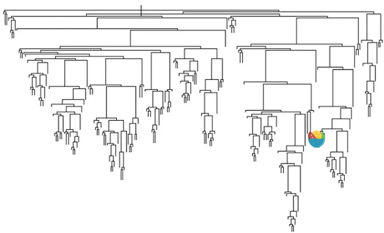
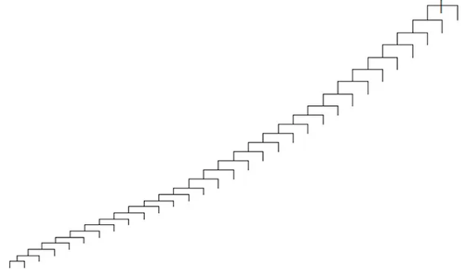

## 最佳实践
1. 树模型不需要进行onehot编码
2. 树模型仅需要进行label编码

## 内容

数值型变量对任何语言实现的任何模型都一样, 但是分类变量对不同语言实现的不同模型则不相同. 比如R语言使用factor来处理分类变量, 可以适用于任何的模型. 而python则需要先将变量进行标签编码.

onehot编码对绝大大数模型来说, 都可以提升效果. 但是对树模型则不然.

使用[shot selection data](https://www.kaggle.com/c/kobe-bryant-shot-selection/data)数据集来进行验证.使用onehot编码相比ordinal编码效果变差了.

在树模型中, 分裂算法会考虑所有特征, 以及每个特征的分裂点, 来降低节点的不纯度. 

当特征的分裂点较多时, 树一般会朝着两个方向增长:

当特征的分裂点变少时, 树一般会在一个方向上增长:

onehot编码后, 一个特征将只含有两个值(1,0)

另外, 在one-hot编码后的特征分裂后所获取的增益也是很小的.

在进行特征重要程度展示时, 也变得不好解释
在进行树模型展示时, 也不好解释
在分裂多个特征计算成本也增加了

## 参考
1. https://towardsdatascience.com/one-hot-encoding-is-making-your-tree-based-ensembles-worse-heres-why-d64b282b5769