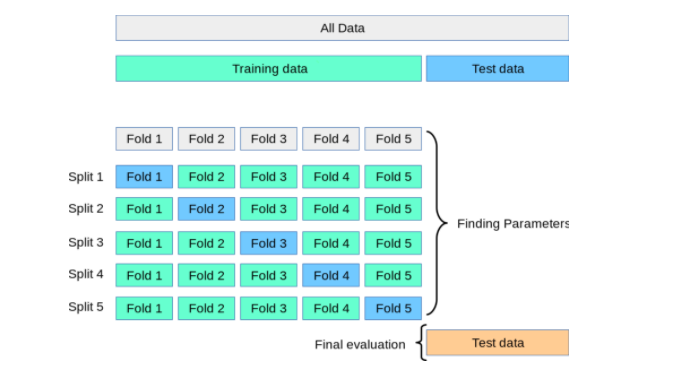

## 数据拆分技术的比较
1. training-test split的缺点时, 当我们使用不同的超参数进行调试时, 一些数据可能会泄露给训练集, 从而导致过拟合.
2. training-validation-test split
    1. 超参的调试是在验证集上
    2. 泛化的评估是在测试集上
    3. 缺点是用于训练的数据变瘦啊了
3. cross-validation则解决了上述的问题, 但仍需注意:

    

    1. 不均衡数据要均衡抽样(保证特征和目标分在训练集和验证集上成比例分布), 使用stratified k-fold
    2. 遇到序列数据, 需要进行分组, 使用GroupKFold


## 交叉验证的应用

1. 超参调优, 如, 神经网络中选择不同的学习率, 正则参数, 隐藏层数等.
2. 模型选择, 如, 同时使用逻辑回归, 神经网络, 决策树, 选择最优的模型
3. 数据处理选择, 如, 评估使用不同归一化方法的效果

## 参数K如何选择

1. 一般K=10
2. 当数据量较大时, 可以选择K=5, 主要减少训练的次数
3. 当数据量较小时, 增加K
4. 当数据量及少时, 适用leave-one-out cross-validation (LOOCV), 也就是说验证集中只有一个数据.


## k-fold分类
1. k-fold
2. StratifiedKFold: 当样本目标不均衡时, 保证训练集和验证集中的目标值比例相同
3. GroupKFold:
4. ShuffleSplit: 每次都拆分训练集和验证集都从新洗牌, 但是至少保证所有的样本都被训练过一次
5. StratifiedShuffleSplit: 整合了StratifiedKFold和ShuffleSplit
6. GroupShuffleSplit: 整合了GroupKFold和ShuffleSplit
7. LeaveOneOut: 每次验证集只分1个样本
8. LeavePOut: 每次验证集分p比例个样本


## 步骤

1. 将数据集拆分为训练集和测试集
2. 将训练集分成K折(K-folds)
3. 指定参数的模型, 使用k-1折数据训练, 使用1折数据验证. 将评估结果记录下来.
4. 重复3步骤, 直到所有折的数据都被测试过.
5. 将K个指定参数的模型的结果求均值和标准差作为该模型的最后评估指标.
6. 使用不同的参数模型, 重复3~5步骤.
7. 将具有最优均值和标准差的参数做为最终选择.
8. 将最终选择的参数模型在整个训练集中进行训练, 然后在测试集中进行评估.


## 实战

```python
from sklearn.model_selection import cross_val_score
from sklearn.pipeline import make_pipeline
from sklearn.preprocessing import StandardScaler
from sklearn.svm import SVC
from sklearn.ensemble import RandomForestClassifier
from sklearn.model_selection import StratifiedKFold


pipeline = make_pipeline(StandardScaler(), RandomForestClassifier(n_estimators=100, max_depth=4))

strtfdKFold = StratifiedKFold(n_splits=10)
kfold = strtfdKFold.split(X_train, y_train)
scores = []

for k, (train, test) in enumerate(kfold):
    pipeline.fit(X_train.iloc[train, :], y_train.iloc[train])
    score = pipeline.score(X_train.iloc[test, :], y_train.iloc[test])
    scores.append(score)
    print('Fold: %2d, Training/Test Split Distribution: %s, Accuracy: %.3f' % (k+1, np.bincount(y_train.iloc[train]), score))

print('\n\nCross-Validation accuracy: %.3f +/- %.3f' %(np.mean(scores), np.std(scores)))

```

```python
from sklearn.model_selection import cross_val_score
from sklearn.pipeline import make_pipeline
from sklearn.preprocessing import StandardScaler
from sklearn.svm import SVC
from sklearn.ensemble import RandomForestClassifier
#
# Create an instance of Pipeline
#
pipeline = make_pipeline(StandardScaler(), RandomForestClassifier(n_estimators=100, max_depth=4))
#
# Pass instance of pipeline and training and test data set
# cv=10 represents the StratifiedKFold with 10 folds
#
scores = cross_val_score(pipeline, X=X_train, y=y_train, cv=10, n_jobs=1)
 
print('Cross Validation accuracy scores: %s' % scores)
 
print('Cross Validation accuracy: %.3f +/- %.3f' % (np.mean(scores),np.std(scores)))
```


### 模型选择

```python

from sklearn.linear_model import LogisticRegression
from sklearn.svm import SVC
from sklearn.ensemble import RandomForestClassifier
import numpy as np
from sklearn.datasets import load_digits
import matplotlib.pyplot as plt
digits = load_digits()
from sklearn.model_selection import train_test_split
X_train, X_test, y_train, y_test = train_test_split(digits.data,digits.target,test_size=0.3)


lr = LogisticRegression(solver='liblinear',multi_class='ovr')
lr.fit(X_train, y_train)
lr.score(X_test, y_test)  # Score : 0.972222, best

svm = SVC(gamma='auto')
svm.fit(X_train, y_train)
svm.score(X_test, y_test)  # Score : 0.62037

rf = RandomForestClassifier(n_estimators=40)
rf.fit(X_train, y_train)
rf.score(X_test, y_test)  # Score: 0.96666

score_lr=cross_val_score(LogisticRegression(solver='liblinear',multi_class='ovr'), digits.data, digits.target,cv=3)
print(score_lr)  # [0.89482471 0.95325543 0.90984975]
print("Avg :",np.average(score_lr))  # Avg : 0.9193099610461881

score_svm =cross_val_score(SVC(gamma='auto'), digits.data, digits.target,cv=3)
print(score_svm)  # [0.38063439 0.41068447 0.51252087]
print("Avg :",np.average(score_svm))  # Avg : 0.4346132442960489

score_rf=cross_val_score(RandomForestClassifier(n_estimators=40),digits.data, digits.target,cv=3)
print(score_rf)  # [0.92821369 0.95325543 0.92320534]
print("Avg :",np.average(score_rf))  # Avg : 0.9348914858096827, best
```

### 参数调优

```python
knn = KNeighborsClassifier(n_neighbors=5)
scores = cross_val_score(knn, X, y, cv=10, scoring='accuracy')
print(scores.mean())  # 0.9666666666666668

k_range = list(range(1, 25))
k_scores = []
for k in k_range:
    knn = KNeighborsClassifier(n_neighbors=k)
    scores = cross_val_score(knn, X, y, cv=10, scoring='accuracy')
    k_scores.append(scores.mean())
print(k_scores)  # [0.96, 0.95333, 0.96666, 0.96666, 0.966668, 0.96666, 0.966666, 0.966666, 0.97333, 0.96666, 0.96666, 0.97333, 0.9800, 0.97333, 0.97333, 0.97333, 0.97333, 0.98000, 0.9733333, 0.980000, 0.966666, 0.96666, 0.973333, 0.96, 0.96666, 0.96, 0.96666, 0.953333, 0.95333, 0.95333]
```


## 参考
1. https://stats.stackexchange.com/questions/52274/how-to-choose-a-predictive-model-after-k-fold-cross-validation
1. [The Essential Guide to K-Fold Cross-Validation in Machine Learning](https://medium.com/@bididudy/the-essential-guide-to-k-fold-cross-validation-in-machine-learning-2bcb58c50578)
1. [K-Fold Cross Validation in Machine Learning – Python Example](https://vitalflux.com/k-fold-cross-validation-python-example/)
2. [K-Fold Cross Validation Technique and its Essentials](https://www.analyticsvidhya.com/blog/2022/02/k-fold-cross-validation-technique-and-its-essentials/)
3. https://machinelearningmastery.com/repeated-k-fold-cross-validation-with-python/
4. https://www.statlect.com/machine-learning/k-fold-cross-validation
5. https://www.statlect.com/machine-learning/boosted-tree


