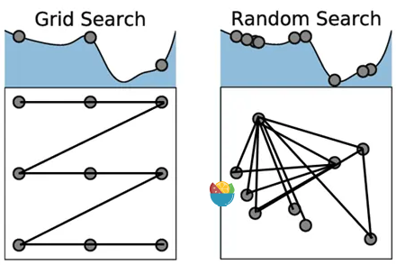

## 步骤

1. 选择模型
2. 罗列模型需要调整的参数, 建立超参空间
3. 使用不同方法搜索最优参数, 如网格搜索, 随机搜索, 贝叶斯搜索
4. 进行交叉验证, 取均值比较

## 搜索方法


### 手动搜索(Manual Search)

手动创建一系列参数组合

```python
import pandas as pd
from sklearn.model_selection import train_test_split
from sklearn.tree import DecisionTreeClassifier
from sklearn.metrics import accuracy_score
df = pd.read_csv("pima-indians-diabetes.csv")
# Train Test Split 
#df = df.drop(['name','origin','model_year'], axis=1)
y = df['class'] 
X = df.drop(['class'],axis=1)
X_train, X_test, y_train, y_test = train_test_split(X, y, test_size=0.3, random_state=30)

# sets of hyperparameters
params_1 = {'criterion': 'gini', 'splitter': 'best', 'max_depth': 50}
params_2 = {'criterion': 'entropy', 'splitter': 'random', 'max_depth': 70}
params_3 = {'criterion': 'gini', 'splitter': 'random', 'max_depth': 60}
params_4 = {'criterion': 'entropy', 'splitter': 'best', 'max_depth': 80}
params_5 = {'criterion': 'gini', 'splitter': 'best', 'max_depth': 40}
# Separate models
model_1 = DecisionTreeClassifier(**params_1)
model_2 = DecisionTreeClassifier(**params_2)
model_3 = DecisionTreeClassifier(**params_3)
model_4 = DecisionTreeClassifier(**params_4)
model_5 = DecisionTreeClassifier(**params_5)
model_1.fit(X_train, y_train)
model_2.fit(X_train, y_train)
model_3.fit(X_train, y_train)
model_4.fit(X_train, y_train)
model_5.fit(X_train, y_train)
# Prediction sets
preds_1 = model_1.predict(X_test)
preds_2 = model_3.predict(X_test)
preds_3 = model_3.predict(X_test)
preds_4 = model_4.predict(X_test)
preds_5 = model_5.predict(X_test)
print(f'Accuracy on Model 1: {round(accuracy_score(y_test, preds_1), 3)}')  # Accuracy on Model 1: 0.693
print(f'Accuracy on Model 2: {round(accuracy_score(y_test, preds_2), 3)}')  # Accuracy on Model 2: 0.693
print(f'Accuracy on Model 3: {round(accuracy_score(y_test, preds_3), 3)}')  # Accuracy on Model 3: 0.693
print(f'Accuracy on Model 4: {round(accuracy_score(y_test, preds_4), 3)}')  # Accuracy on Model 4: 0.736
print(f'Accuracy on Model 5: {round(accuracy_score(y_test, preds_5), 3)}')  # Accuracy on Model 5: 0.688
```

### 网格搜索(Grid-Search)

Scikit-Learn提供过了GridSearchCV()方法进行Grid-Search.

```python
from sklearn.neighbors import KNeighborsClassifier
knn_clf = KNeighborsClassifier()
knn_clf.fit(X_train, y_train)

from sklearn.metrics import accuracy_score
from sklearn.model_selection import GridSearchCV

param_grid = {'n_neighbors': list(range(1,9)),'algorithm': ('auto', 'ball_tree', 'kd_tree' , 'brute') } ## 对比8*4=32个参数组合
gs = GridSearchCV(knn_clf,param_grid,cv=10)
gs.fit(X_train, y_train)

gs.cv_results_['params']  # 打印所有参数
gs.cv_results_['mean_test_score']  # 查看交叉验证分数
gs.best_params_  # 获得最优参数, {'algorithm': 'auto', 'n_neighbors': 6}
gs.score(X_test,y_test)  # 最优参数测试集上的表现, 0.70129870

```

### 随机搜索(Random Search)
网格搜索是遍历所有参数, 计算量很大.


```python
from sklearn.model_selection import RandomizedSearchCV
from sklearn.ensemble import RandomForestClassifier
from scipy.stats import randint as sp_randint

# build a RandomForestClassifier
clf = RandomForestClassifier(n_estimators=50)

param_dist = {"max_depth": [3, None],
              "max_features": sp_randint(1, 11),
              "min_samples_split": sp_randint(2, 11),
              "min_samples_leaf": sp_randint(1, 11),
              "bootstrap": [True, False],
              "criterion": ["gini", "entropy"]}


samples = 8  # number of random samples 
randomCV = RandomizedSearchCV(clf, param_distributions=param_dist, n_iter=samples,cv=3)


randomCV.fit(X, y)
randomCV.best_params_
randomCV.cv_results_['mean_test_score']
randomCV.score(X_test,y_test)  # 0.8744588744588745
```


### 网格搜索和随机搜索比较

网格搜索|随机搜索
--|--
参数被定义好|参数没有被定义好
超参是离散的|超参是连续的
定义了网格空间|没有定义网格空间
计算复杂, 表现一般|计算简单, 表现较好





## 进行超参搜索和不进行超参搜索比较


```python
import pandas as pd
from sklearn.model_selection import train_test_split
from sklearn.tree import DecisionTreeClassifier, plot_tree
from sklearn.metrics import accuracy_score
from sklearn.model_selection import GridSearchCV

data_all = pd.read_csv(
    './data/test/titanic.csv', 
    usecols=['Survived', 'Pclass', 'Age', 'SibSp', 'Parch', 'Fare', 'Sex', 'Embarked'])

data_all = data_all.dropna()

data_all = pd.merge(data_all, pd.get_dummies(data_all[['Sex', 'Embarked']]), how="inner", left_index=True, right_index=True)
data_all = data_all.drop(['Sex', 'Embarked'], axis=1)

data_y = data_all['Survived']
data_x = data_all.drop('Survived', axis=1)


X_train, X_test, y_train, y_test = train_test_split(data_x, data_y, random_state = 100)

params_default ={
    'criterion': 'gini',
    'splitter': 'best',
    'max_depth': None,
    'max_features': None,
    'random_state': 10
}

clf = DecisionTreeClassifier(**params_default)
clf.fit(X_train, y_train)
print(accuracy_score(y_test, clf.predict(X_test)))  # 0.79


params = {
    'criterion':  ['gini', 'entropy'],
    'splitter': ['best', 'random'],
    'max_depth':  [None, 2, 4, 6, 8, 10],
    'max_features': [None, 'sqrt', 'log2', 0.2, 0.4, 0.6, 0.8],
    'random_state': [10]
    
}

clf_grid = GridSearchCV(
    estimator=DecisionTreeClassifier(),
    param_grid=params,
    cv=5,
    n_jobs=5,
    verbose=0,
)

clf_grid.fit(X_train, y_train)
print(accuracy_score(y_test, clf_grid.predict(X_test)))  # 0.79

```

网格搜索后, 反倒是准确率下降了. 产生以上结果可能原因是测试集对直接训练的模型更有利. 我们随机分配训练集和测试集, 做100次训练, 可以看到通过网格搜索后的模型表现更稳定.


```python
count = 0
for i in range(1,101):
    

    X_train, X_test, y_train, y_test = train_test_split(data_x, data_y, random_state = i)
    params_default ={
        'criterion': 'gini',
        'splitter': 'best',
        'max_depth': None,
        'max_features': None,
        'random_state': 10
    }


    clf = DecisionTreeClassifier(**params_default)
    clf.fit(X_train, y_train)
    score_base = accuracy_score(y_test, clf.predict(X_test))


    params = {
        'criterion':  ['gini', 'entropy'],
        'splitter': ['best', 'random'],
        'max_depth':  [None, 2, 4, 6, 8, 10],
        'max_features': [None, 'sqrt', 'log2', 0.2, 0.4, 0.6, 0.8],
        'random_state': [10]
        
    }

    clf_grid = GridSearchCV(
        estimator=DecisionTreeClassifier(),
        param_grid=params,
        cv=5,
        n_jobs=5,
        verbose=0,
    )

    clf_grid.fit(X_train, y_train)
    score_select = accuracy_score(y_test, clf_grid.predict(X_test))
    count = count + int(score_select >= score_base)

print(count/100)  # 0.89
```


## 参考
1. https://www.analyticsvidhya.com/blog/2022/02/a-comprehensive-guide-on-hyperparameter-tuning-and-its-techniques/
2. https://www.analyticsvidhya.com/blog/2024/06/hyperparameter-optimization-in-machine-learning-models/
3. https://www.analyticsvidhya.com/blog/2021/09/a-hands-on-discussion-on-hyperparameter-optimization-techniques/
4. https://www.analyticsvidhya.com/blog/2020/03/beginners-guide-random-forest-hyperparameter-tuning/
5. https://blog.csdn.net/weixin_38037405/article/details/120869498 
6. https://zhuanlan.zhihu.com/p/334322761


