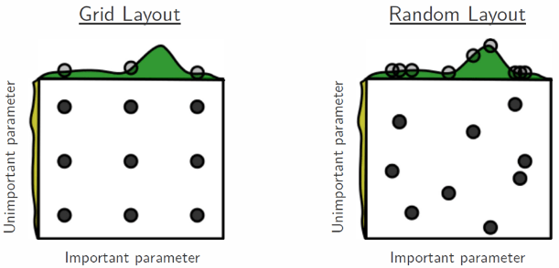

1. 网格搜索: 提供离散的参数组合
2. 随机搜索: 提供参数的统计分布, 在每次迭代中, 超参值从分布中随机抽取
    1. 超参空间中的值并不是一样重要, 只有一部分超参值是重要的
    2. 网格搜索只能是离散值, 随机搜索可以是连续的 
    

如下图, 网格搜索和随机搜索都进行了9个参数组合的试验:
1. 网格搜索, 在不重要的参数分布上浪费了时间, 错失了最重要的参数
2. 随机搜索, 则将更多精力放在了重要的参数上




## 接口
### 构造参数
```python
GridSearchCV(
    estimator=,                   # sklearn的模型, 
    param_distributionsdict =,    # 字典, 包含了参数名和参数值, 参数值可以是scipy.stats.distributions的分布, 也可以是列表. 如果是分布, 则随机采样, 如果是列表则等概率抽取
    n_iter=,                      # 迭代次数, 抽样多少次
    scoring=,                     # 字符串或可调用的, 评分的方法
    n_jobs=,                      # 整型, 并行进程数量
    refit=,                       # 布尔, 将最好的参数模型在整个测试集上训练一遍
    cv=,                          # 整型, 交叉验证的K值, 默认为5
    verbose=                      # 整型, 信息详细等级
)
```


### 对象属性与方法

属性或方法|类型|说明
--|--|--
best_estimator_|模型|最优的模型, 仅在参数refit=True时可用
best_score_|float|最优模型的交叉验证平均分
best_params_|dict|最优模型的超参, 仅在参数refit=True时可用

## 实战


```python
from sklearn.datasets import load_breast_cancer 
from sklearn.neighbors import KNeighborsClassifier
from sklearn.model_selection import RandomizedSearchCV, train_test_split 
from sklearn.metrics import classification_report


dataset = load_breast_cancer()
X=dataset.data
Y=dataset.target

X_train, X_test, y_train, y_test = train_test_split( 
    X,Y,test_size = 0.2, random_state = 10) 

params_default = {
    'n_neighbors': 5,
    'weights': 'uniform',
    'p': 2
}

model = KNeighborsClassifier(**params_default)
model.fit(X_train, y_train) 


#               precision    recall  f1-score   support
# 
#            0       0.89      0.87      0.88        39
#            1       0.93      0.95      0.94        75
# 
#     accuracy                           0.92       114
#    macro avg       0.91      0.91      0.91       114
# weighted avg       0.92      0.92      0.92       114


predictions = model.predict(X_test) 
print(classification_report(y_test, predictions)) 

params = {
    'n_neighbors': range(1,21),
    'weights': ['uniform', 'distance'],
    'p': [1,2]
}

clf_grid = RandomizedSearchCV(
    estimator=KNeighborsClassifier(),
    param_distributions=params,
    n_iter=10,
    cv=5,
    n_jobs=5,
    verbose=1
)

clf_grid.fit(X_train, y_train) 

print(clf_grid.best_params_)  # {'weights': 'uniform', 'p': 1, 'n_neighbors': 9}
grid_predictions = clf_grid.predict(X_test) 

print(classification_report(y_test, grid_predictions)) 

#               precision    recall  f1-score   support
# 
#            0       0.92      0.90      0.91        39
#            1       0.95      0.96      0.95        75
# 
#     accuracy                           0.94       114
#    macro avg       0.93      0.93      0.93       114
# weighted avg       0.94      0.94      0.94       114

```

随机只搜寻了10次, 但总共有20*2*2=80种可能, 所以有70种可能没有覆盖. 
1. 对比[text](超参调优_网格搜寻.md), 确实没有达到最优.
2. 但是计算量确大大的下降了


上文中的params的n_neighbors传入的是列表, 也可传入一个分布, 如下

```python
from scipy.stats import randint

params = {
    'n_neighbors': randint(1, 20),
    'weights': ['uniform', 'distance'],
    'p': [1,2]
}
```


## 参考
1. https://scikit-learn.org/stable/modules/generated/sklearn.model_selection.RandomizedSearchCV.html
2. https://www.jmlr.org/papers/volume13/bergstra12a/bergstra12a.pdf
3. https://www.datacamp.com/tutorial/parameter-optimization-machine-learning-models