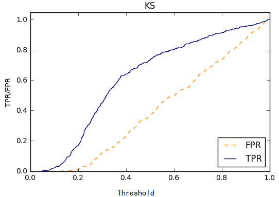

# ks曲线


训练出来的模型给的是为正类的概率，我们还需要选择一个阈值，大于阈值，判断为正类，小于阈值判断为负类。把阈值看成自变量，TPR、和FPR看成因变量，在二维坐标系里面做关系曲线，这就是KS曲线。




在阈值等于0.4的地方，TPR和FPR差最大，说明该处阈值可作为最佳区分点。


## 案例
```python
### 绘制ROC曲线, 计算AUC
fpr, tpr, thresholds = roc_curve(y_test, y_pred_proba)
auc_score = roc_auc_score(y_test, y_pred_proba)


plt.plot(fpr, tpr, label=f'AUC = {auc_score:.2f}')  # 绘制ROC曲线，标注AUC的值
plt.plot([0, 1], [0, 1], linestyle='--', color='r', label='Random Classifier')  # 绘制随机分类器的ROC曲线
plt.xlabel('False Positive Rate')  # x轴标签为FPR
plt.ylabel('True Positive Rate')   # y轴标签为TPR
plt.title('ROC Curve')             # 设置标题
plt.legend()
plt.show()

### 绘制KS曲线
ks_arg = (tpr - fpr).argmax()  # 取最大值的下标
ks_value = max(tpr - fpr)  # 取最大值
threshold = thresholds[ks_arg] # 取阈值

tpr_value = tpr[ks_arg] # tpr值
fpr_value = fpr[ks_arg] # fpr值

plt.plot(thresholds, fpr, label=f'fpr')  # 绘制ROC曲线，标注AUC的值
plt.plot(thresholds, tpr, label=f'tpr')  # 绘制ROC曲线，标注AUC的值
plt.plot([thresholds[ks_arg],thresholds[ks_arg]],[tpr[ks_arg],fpr[ks_arg]], label=f'ks')

plt.xlabel('thresholds')  # x轴标签为FPR
plt.ylabel('tpr&fpr')   # y轴标签为TPR
plt.title('KS Curve')   # 设置标题
plt.legend()
plt.show()
```


## 参考
- https://zhuanlan.zhihu.com/p/87456089
- https://www.cnblogs.com/siriJR/p/12093513.html