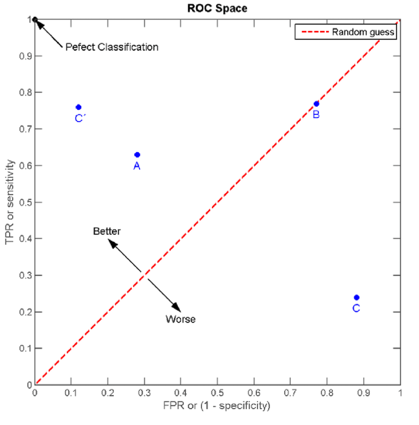
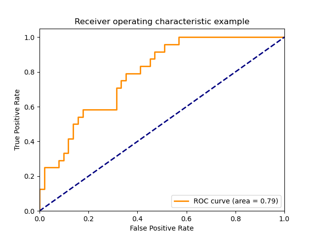
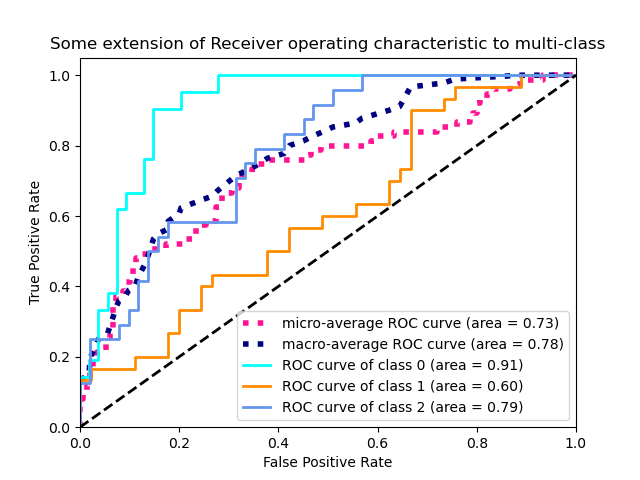

# ROC


## ROC
ROC(Receiver operating characteristic)是一个二分类模型评估方法.名字的来源是其最早发明用于军队雷达接收的操作者(operators of military radar receivers)


- 真阳率(TPR):在label为阳性的样本中, 被正确地判断为阳性的比率. $$TPR=\frac{TP}{TP+FN}$$
真阳率即我们所说的召回率(recall)
- 伪阳率(FPR):在label为阴性的样本中, 被错误地判断为阳性的比率.$$FPR=\frac{FP}{FP+TN}$$
假阳率, 即误伤率 ,将阴性的样本判别为阳性.


比如在作弊审核中.尽量把作弊玩家审核出来是主要任务, 也就是TPR越高越好.而把正常玩家, 误审为作弊玩家, 也就是FPR, 要越低越好. 两个指标是相互制约的. 如果我们比较在意TPR, 即想把所有作弊玩家全部揪出来, 那么不可避免的FPR也会相应升高, 即会误伤很多正常的玩家. 极端的, 把所有的玩家都预测为作弊玩家, 那么TPR为1, FPR也为1.


ROC空间将伪阳率(FPR)定义为X轴, 真阳率(TPR)定义为Y轴:



1. 图片中的左上角(TPR=1,FPR=0),为完美分类, 即作弊全部预测正确, 且没有误伤
2. 图片中的红色线上的点(TPR=FPR), 即作弊揪出50%, 误伤50%. 可以说是蒙对一半, 蒙错一半.
3. 图片中的右下角(TPR=0,FPR=1), 将作弊的全部判为正常, 将正常的全部判为作弊.

ROC曲线, 只能在某个特定阈值来评价模型, 我们需要一个独立于阈值的评价指标来衡量这个模型如何, 也就是遍历所有阈值, 得到ROC曲线.



上图中, 我们可以根据需要来选择不同的TPR和FPR.



上图中, 我们可以以求均值的方式对多分类模型进行评估


## AUC
AUC(Area Under Curve)值为ROC曲线下面区域面积，显然，AUC越大，分类器分类效果越好。
1. AUC = 1，不管设定什么阈值都能得出完美预测
2. 0.5 < AUC < 1, 妥善设定阈值的话，能有预测价值
3. AUC = 0.5, 跟随机猜测一样（例：丢铜板），模型没有预测价值。
4. AUC < 0.5，比随机猜测还差, 但只要总是反预测而行，就优于随机猜测。


## 案例

```python
### 绘制ROC曲线, 计算AUC
fpr, tpr, thresholds = roc_curve(y_test, y_pred_proba)
auc_score = roc_auc_score(y_test, y_pred_proba)


plt.plot(fpr, tpr, label=f'AUC = {auc_score:.2f}')  # 绘制ROC曲线，标注AUC的值
plt.plot([0, 1], [0, 1], linestyle='--', color='r', label='Random Classifier')  # 绘制随机分类器的ROC曲线
plt.xlabel('False Positive Rate')  # x轴标签为FPR
plt.ylabel('True Positive Rate')   # y轴标签为TPR
plt.title('ROC Curve')             # 设置标题
plt.legend()
plt.show()
```


## 参考
- https://zhuanlan.zhihu.com/p/347627036
- https://zhuanlan.zhihu.com/p/616190701
- [ROC曲线与AUC值 - gatherstars - 博客园](https://www.cnblogs.com/gatherstars/p/6084696.html)
- [Receiver Operating Characteristic (ROC) ‒ scikit-learn 0.24.2 documentation](https://scikit-learn.org/stable/auto_examples/model_selection/plot_roc.html)

