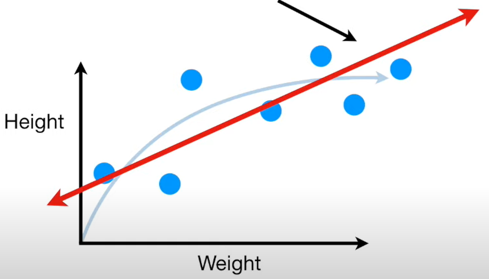

# bias-Variance

Imagine we measured the weight and height of a bunch of mice and plotted the data on the graph.

Given this data, we would like to predict mice height given its weight.

Ideally, we would know the exact mathematical formula that describes the relationship between weight and height.

but, in this case, we don't know the formula, so we're going to use two machine learning method to approximate this relationship.

However, I'll leave the "true" relationship curve in the figure for reference.

The first thing we do is split the data into two sets, one for training the machine learning algorithms and one for testing them. The blue dots are the training set and the green dots are the testing set.

The first machine learning algorithm that we use is Linear Regression(aka "Least Squares"):

Linear Regression fits a straight line to the training set.
NOTE: The Straight line doesn't have the flexibility to accurately replicate the arc in the "true" relationship.Thus, the straight line will never capture the true relationship between weight and height, no matter how well we fit it to the training set.

The inability for a machine learning method(like linear regression) to capture the true relationship is called `bias`. Because the straight line can't be curved like the "true" relationship, it has a relatively large amount of bias.
Another machine learning method might fit a squiggly line to the training set.

Because the squiggly line can handle the arc in the true relationship between weight and height, it has very little bias.
We can compare how well the straight line and squiggly line fit the training set by calculating their sums of squares. In other words, we measure the distances from the fit lines to the data, square them and add them up.

Notice how the squiggly line fits the data so well that the distances between the line and the data are all 0. so the squiggly line wins.
But remember, so for we've only calculate the sums of squares for the training set. We also have a testing set.

Now let's calculate the sums of squares for the testing set. This time, the straight line wins.

Even though squiggly line did a great job fitting the training set, it did a terrible job fitting the testing set.

In machine learning lingo, the difference in fits between data sets is called variance. The squiggly line has low bias, since it is flexible and can adapt to the curve in the relationship between weight and height, but hte squiggly line has high variability, because it results in vastly different sums of squares for different datasets. In other words, it's hard to predict how well the squiggly line will perform with future datasets.It might do well sometimes, and other times it might do terribly.

In contrast, the straight line has relatively high bias, since it can't capture the curve in the relationship between weight and hight. But the straight line has relatively low variance, because the sums of squares are very similar for different datasets. In other words, the straight line might only give good predictions, and not great predictions. But they will be consistently good predictions.

Because the Squiggly line fits the training set really well, but not the testing set, we say that the squiggly line is overfit. In machine learning, the ideal algorithm has low bias and can accurately model the true relationship and it has low variability, by producing consistent predictions across different datasets.

This is done by finding the sweet spot between a simple model(straight line) and a complex model(squiggly line).Three commonly used methods for finding the sweet spot between simple and complicate models are:

- regularization
- boosting
- bagging

## 参考
- [bias-and-variance](https://www.youtube.com/watch?v=EuBBz3bI-aA&list=PLblh5JKOoLUIcdlgu78MnlATeyx4cEVeR&index=9)
- [bias-and-variance](https://medium.com/analytics-vidhya/bias-and-variance-613ff5c9ef5c)