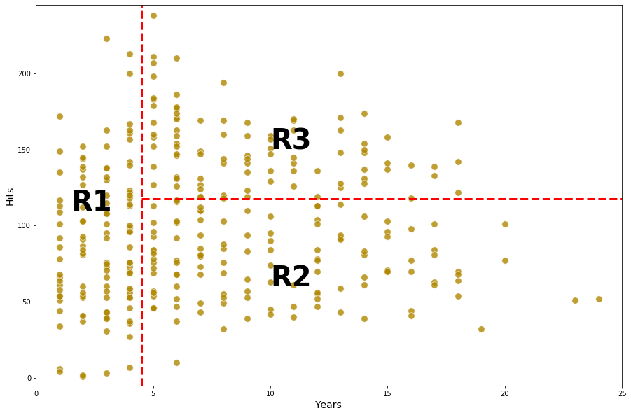
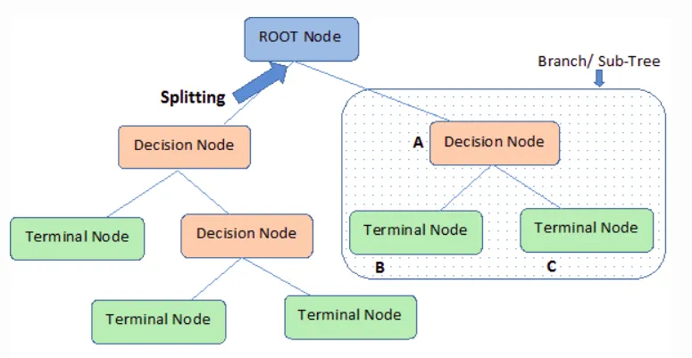

`scikit-learn`使用的是CART树.

类别:
1. 按任务分：分类树（Classificationtree）与回归树（Decisiontree）
2. 按特征选择方法分：ID3决策树算法、C4.5决策树算法、CART决策树算法

| 时间  | 模型 | 任务     | 树         | 特征选择                |
|-------|------|----------|------------|-------------------------|
| 1984  | CART | 分类、回归 | 二叉树     | 基尼系数（Gini）、平方误差（MSE） |
| 1986  | ID3  | 分类     | 多叉树     | 信息增益（Information Gain） |
| 1993  | C4.5 | 分类     | 多叉树     | 信息增益比（Information Gain Ratio） |

## 决策树的专有名词

- 根节点(Root node): 决策树的第一个节点
- 分裂(Splitting): 将节点分解为多个子节点
- 节点(node): 从根节点分裂出来, 或者从节点分裂出来的子节点
- 叶子节点(Leaf or terminal node): 不能再分裂的节点
- 剪枝(Pruning): 减少子节点, 目的是降低树的复杂度, 从而避免过拟合
- 分支(Branch/Sub-Tree): 整个树的子集合
- 父节点儿子节点(Parent and Child Node): 被分裂的节点是父节点, 分裂得到的节点是子节点

## 决策树直觉

通过决策树来预测蓝球员的薪水案例, 选取的特征是年限(Years)和命中(Hits)

1. 年限(Years): 在联盟内效力的年数
1. 命中(Hits): 上一年度的命中次数

如下图所示: 
1. 根节点根据$Years < 4.5$规则分裂为左侧分支, 并产生一个节点, 表示运动员效力年限小于4.5时, 平均的薪水是5.11
2. 根节点根据$Years \ge 4.5$规则分裂为右侧分支, 在进一步根据$Hits < 177.5$分裂为左侧分支, 并产生一个节点, 表示运动员在该规则下, 平均薪水是6.00
3. 根节点根据$Years \ge 4.5$规则分裂为右侧分支, 在进一步根据$Hits \ge 177.5$分裂为右侧分支, 并产生一个节点, 表示运动员在该规则下, 平均薪水是6.74

在这个案例中, 决策树通过年薪和薪水将整个区域分割成三份, 用公式描述为:

- $R1 = \{X|Years<4.5\}$
- $R2 = \{X|Years>=4.5, Hits<117.5\}$
- $R3 = \{X|Years>=4.5, Hits>=117.5\}$

✨R是Region的简写

## 最优分裂特征

## Splitting in Decision Tree
优先选择最具有信息量的特征进行分类, 以达到分裂后最大化信息增益(information gain, IG)的目的, 公式如下:

$$ IG(D_p,f) = I(D_p) - \sum_{j=1}^{m}\frac{N_j}{N_p}I(D_j) $$

其中, 
1. $f$ 要分裂的特征
2. $D_p$ 是父节点的数据集合
3. $D_j$ 是子节点的数据集合
4. $j-th$ 子节点的顺位(没有固定顺序, 只是为了标明)
5. $I$ 杂质量(impurity measure)
6. $N_p$ is the total number of samples at the parent node
7. $N_j$ is the number of samples in the $j-th$ child node.

信息增益就是父节点的杂质量和子节点杂质量的差, 子节点杂质量越小, 信息增益越大.

✨为了简化和减少子节点的搜索空间, 很多库(包含scikit-learn)都是使用二叉决策树(binary decision tree), 这意味着父节点只分割成两个子节点, 左节点(D-left)和右节点(D-right).

$$ IG(d_p,f) = I(D_p) - \frac{N_{left}}{N_p}I(D_{left}) - \frac{N_{right}}{N_p}I(D_{right}) $$

## 参考
1. https://medium.datadriveninvestor.com/the-basics-of-decision-trees-e5837cc2aba7
2. https://medium.com/analytics-vidhya/classification-in-decision-tree-a-step-by-step-cart-classification-and-regression-tree-8e5f5228b11e
3. https://arifromadhan19.medium.com/regrssion-in-decision-tree-a-step-by-step-cart-classification-and-regression-tree-196c6ac9711e

