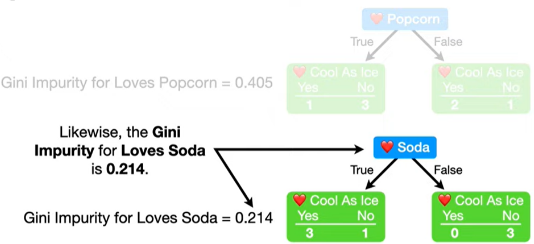

# classification

## 最佳实践

1. cart树是一个二叉树，只判断true或false，ture是左child，false是右child
2. 当最终预测的叶子节点包含了混合的预测特征的样本（比如二分类问题，最终叶子节点既包含了0，又包含了1），我们称为`impure`。如果仅包含了一种预测样本，我们称为`pure`.
3. 显然`pure`的叶子节点预测的效果更好，我们可以使用`Gini impurity`或`Entropy and Information Gain`来量化`impurity`. scikit-learn是使用`Gini impurity`
4. 计算过程
  - 遍历所有候选特征，计算每一个候选特征的`total gini impurity`, `tottal gini impurity` 等于各个子叶子的`gini impurity`的权重和
  - 每个叶子节点的`gini impurity`，对于二分类问题是`1-P(yes or no)`的概率，显然如果只有一个分类是0，而各占50%时，达到最大值。如果有多个分类，则要计算每个分类。
  - 选择`total gini impurity`作为分裂的节点
5. 对于连续性的数值特征，排序后分别取相邻两点的均值作为分裂点，既如果有n个数值，则会有n-2个分裂点

## CART树

使用如下数据集创建决策树, 数据集包含:
1. 喜欢爆米花(Loves Popcorn)
2. 喜欢苏打水(Loves Soda)
3. 年龄(Age)
4. 喜欢看不羁小子(Loves Cool As Ice)

决策树的任务是, 通过1~3来预测4.

## 分裂特征的选择

### 直觉
第一件事是决定以1~3中的哪个属性作为第一个分裂的节点(根节点), 为了解决这个问题, 我们首先看`Loves Popcorn`是否能很好的预测`Loves Cool As Ice`

我们仅关注`Loves Popcorn`属性, 从第一条记录开始, 如果`Loves Popcorn = Yes`则放在左边子节点, 然后该记录的`Love Cool As Ice = No`, 则在该子节点的中的`No`中记录`1`. 依次类推, 处理所有的记录.

同理, 处理`loves Soda`属性.

可以看到, 有三个叶子节点包含了`Love Cool As Ice = YES`和`Love Cool As Ice = NO`, 我们称他们为不纯的(Impure)

只有一个叶子节点包含了`Love Cool As Ice = NO`, 我们称之纯的(Pure)

`Loves Popcorn`两个叶子节点都是不纯的, 而`Loves Soda`只有一个叶子节点是不纯的, 看起来`Loves Soda`能更好的预测`Love Cool As Ice`, 可以通过以下两种方法进行量化节点的不纯度(impurity):

1. `Gini impurity`(本文使用)
2. `Entropy` and `Information Gain`

### 分类变量的基尼不纯度

计算`Loves Popcorn`的基尼不纯度:

首先计算子节点的各自的基尼不纯度:

$$Gini_{left_leaf} = 1- (\frac{1}{1+3})^2 + (\frac{3}{1+3})^2 = 0.375 $$
$$Gini_{right_leaf} = 1- (\frac{2}{2+1})^2 + (\frac{1}{2+1})^2 = 0.444 $$

然后计算子节点的总基尼不纯度, 其是各自节点乘以对应人数权重然后求和

$$ Gini_{Loves_Popcorn} = \frac{4}{4+3}0.375 + \frac{3}{4+3}0.444 = 0.405 $$

同理, 可以计算`Loves_Soda`的基尼不纯度: 

$$ Gini_{Loves_Soda} = 0.214 $$

### 数值变量的基尼不纯度

计算`Age`的基尼不纯度, 作为数值型数据, 处理方法有所不同.
首先将`Age`从小到大排序. 然后计算相邻年龄的均值. 以这些均值作为分裂点, 分别计算基尼不纯度.

例如, 计算第一个相邻均值9.5的基尼不纯度:

相邻均值15和44具有相同的最低不纯度0.343

我们可以任意选择一个, 这里选择15

### 特征选择

至此我们已经分别计算了:
1. `Loves Popcorn`的不纯度: 0.405
2. `Loves Soda`的不纯度: 0.214
3. `Age`的不纯度: 0.343

因为`Loves Soda`的不纯度最低,

所以将其作为第一个分裂点, 将3个`Loves Soda = No`人移动到右边的节点. 这个量化的结果和我们的直觉是一致的.

左侧的节点, 有三人`Loves cool as Ice = Yes`, 一人不是, 所以该节点是不纯的. 可以通过对`Loves Popcorn`或`Age`继续分裂, 降低不纯度.

同上, 计算`Loves Popcorn` 和 `Age`的不纯度:
1. $$ Gini_{Popcorn} = 0.25 $$
2. $$ GIni_{Age} = 0 $$

因为`Age`不纯度最低, 所以选择其作为分裂节点:

### 投票作为最终的输出

最后每个叶子节点选择投票最多的选择作为最终的输出.

至此, 我们的决策树创建完成.

## 剪枝(Pruning)

当使用`Age<12.5`作为分裂点时, 只有一个人落在了左叶子点上, 这样就没有足够的信心进行预测, 称为过拟合.

一个处理方法是剪枝, 我们可以限制树的生长, 比如每个叶子节点必须有3或更多的人, 那么我们最终将得到不纯的叶子节点, 此时会有更好的预测结果. 注意, 即使节点不纯, 我们仍需要通过投票的方式决定该节点最终的输出.

