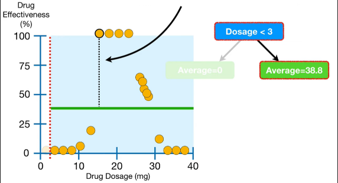

# regression

## 总结
1. cart树回归问题，是计算ssr(sum of squared residual),寻找最小的ssr作为特征的分裂点
2. 每个叶子节点的输出是该所包含连续变量的均值

## 推演

在医学实验中, 更多的药剂量(dosages, x轴)会有更好的治疗效果(effectiveness, y轴)

我们可以拟合一条直线, 根据这条直线, 如果药剂量是27mg, 则会有62%的效果.

但是数据分布并不总是如上那么简单.

在这种情况下, 拟合直线就没有作用了.

所以需要一个非线性的模型, 比如回归树(Regression Tree), 回归树也是一种决策树(Decision Tree). 回归树的每个叶子节点是一个数值, 而分类树(Classification Trees)则是分类集合.

比如, 如果药剂量$>= 14.5$ and $<23.5$, 我们可以获得四个观测值, 他们的均值是100%. 也就是说回归树用均值100%, 来预测药剂量在14.5和23.5之间的样本值.

同理, 不同药剂量都对应了不同的效果均值:

## 分割点选择

Let's build the tree. The first thing we do is figure out why we start by asking if `Dosage < 14.5`.

首先, 选择最小的药剂量3和倒数第二药剂量间隔作为分隔点, 下图中红色虚线所示, 将观测点分为了两部分. 药剂量 < 3部分的效果均值是0, 药剂量>=3的效果均值是38.8(图中绿色线).

当药剂量 < 3, 预测值为0, 预测是非常准的.

当药剂量 >3, 预测值为38.8, 预测则非常差.

对于每一个观测值, 我们都可以计算期预测值(绿色线)到真实值(黄色点)的距离, 既残差(residual), 图中黑色虚线所示. 我们使用残差来评估预测的准确性.

我们将残差的平方和作为Y轴, 将药剂量分隔点作为X轴, 绘制药剂量等于3时的残差图.

绘制所有药剂量分隔点的残差图

药剂量 < 14.5时, 有最小的残差平方和, 所以选择药剂量 = 14.5作为第一个分裂点. 

同理, 我们可以将药剂量<14.5的部分进一步分隔成3部分. 其中
1. 11.5 <= 药剂量 < 14.5: 只包含1个观测点
1. 9 <= 药剂量 < 11.5: 只包含1个观测点
1. 药剂量< 9: 包含4个观测点, 因为这个4个点值相同, 所以不需要再分隔.

当模型很好拟合训练集时, 意味着过拟合, 将会在测试集表现很糟糕. 在机器学习领域里, 我们说有较低的偏差(bias)和较高的方差(variance). 可以通过减枝(prune)来避免过拟合.

设置节点包含观测点的最小值为7个. 因为只有6个观测值在药剂量<14.5区域, 所以将不再分隔该节点, 该节点的预测值是6个观测点的均值, 4.2%.

由于药剂量>=14.5区域有多余7个观测点, 所以我们可以继续分裂:

对于多个属性的树模型, 方法同分类树.

refs:
https://www.youtube.com/watch?v=g9c66TUylZ4