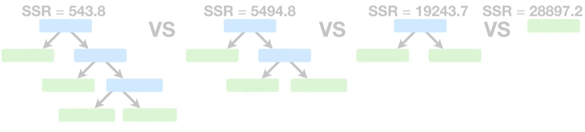

# 剪枝

## 问题引入
在[CART_回归树](./2_4决策树理论_CART回归树.md), 我们创建了一个回归树.

如果下图中红色的观测点来自测试集怎么办? 这些红色的残差值会很大, 而训练集的4个观测值预测效果为100%看起来像是离群值. 也就说, 在训练集上出现了过拟合.

一个避免过拟合的方法是删除叶子节点, 适用包含更多观测值的子节点来替代叶子节点. 现在, 14.5 <= 药剂量 < 29的观测值在树的最右侧.

更大的残差表示在训练集上表现不如之前的不好, 但是在测试集却表现的更好.

如果我们想如下图进一步裁剪枝叶:

我们该如何决定使用哪一个被裁剪后的树呢?答案是`Cost Complexity Pruning`

## Cost Complexity Pruning

`Cost Complexity Pruning`第一步是计算每一棵树的残差平方和.

如何比较每棵树?

最弱链接剪枝(Weakest Link Pruning)方法是计算树的得分(Tree Score), 它包含的因素有:
1. 残差平方和(SSR), 越小，说明树或子树对数据的拟合效果越好
2. 树复杂度惩罚(Tree complexity Penalty), 叶子节点数量越多，意味着树的结构越复杂，模型可能更容易出现过拟合的情况。当叶子节点数量增加时，“Tree complexity Penalty” 会相应增大，使得 “Tree Score” 降低，从而倾向于选择更简单的树结构

在剪枝过程中，它会不断比较不同子树的 “Tree Score”，选择得分最高的子树作为最终的模型结构。这样可以有效地去除那些对模型性能提升不大，但却增加了模型复杂度的分支，从而得到一个既具有较好拟合效果，又相对简单的决策树模型，提高模型的泛化能力和可解释性。

$\alpha$是一个调优参数，我们会通过“交叉验证”来确定它的值，稍后我们会对此展开更多讨论。就目前而言，让我们先设定$\alpha = 10000$。

$$ TreeScore = SSR + \alpha \cdot T $$

计算每棵树的得分:

首先, 创建一课完整的回归树, 该树拟合了所有数据, 包含训练数据和测试数据.

当$\alpha = 0$时, 该完整的回归树具有最低的得分. 因为, $\alpha = 0$时, 树的复杂度惩罚为0, 树的得分就是SSR的值. 就如之前所说, 其子树会有更大的SSR.

我们增加$\alpha$, 直到有更低的树得分.

在这种情况, 当$\alpha = 10000$时, 如果我们删除两个叶子节点, 将会获得更低的树得分.

在这种情况, 当$\alpha = 15000$时, 如果我们删除两个叶子节点, 将会获得更低的树得分.

在这种情况, 当$\alpha = 22000$时, 如果我们删除两个叶子节点, 将会获得更低的树得分.

回到完整的数据集, 将其分隔为训练集和测试集, 在训练集上, 使用之前的发现的$\alpha$, 来创建完整的树和一系列的子树, 来最小化树得分.

现在仅在测试集上计算每棵新树的SSR.

在这个案例中, 通过十折交叉验证, 得到最终的$\alpha$, 当$\alpha = 10000$时, 有最小的SSR.

## 参考
- https://www.youtube.com/watch?v=D0efHEJsfHo