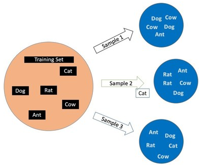
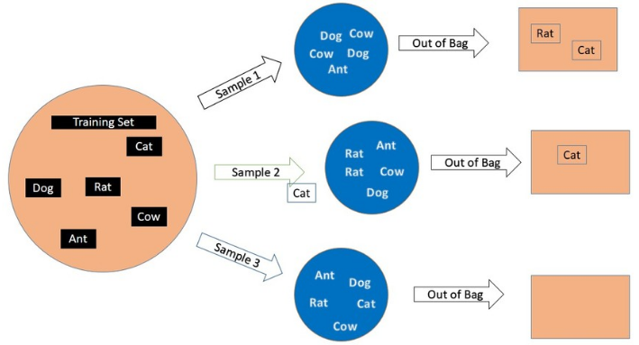
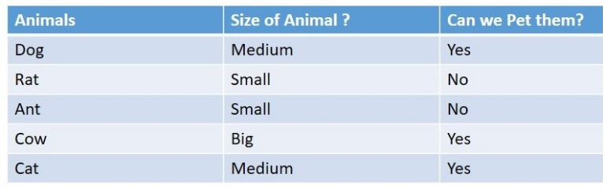
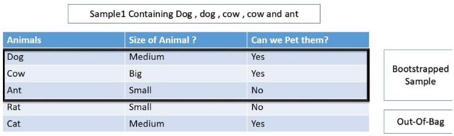
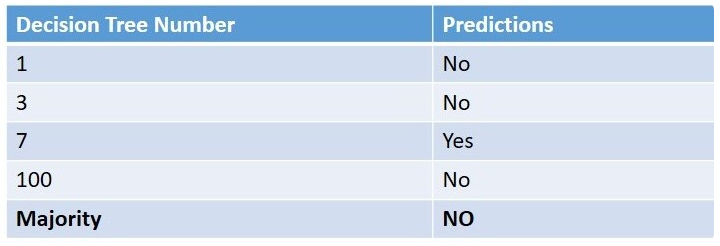

## Bootstrapping

Bootstrapping是随机有放回的抽样. 如下图, 训练集中有5个数据, Cat, Dog, Rat, Cow, Ant. 开始抽样:
1. 设定抽样的样本集大小以及样本集个数. 这里样本集大小为5, 样本个数为3.
2. 随机收取数据记录
3. 将收取后的数据记录放回
4. 重复2~3直到满足样本集大小为5
5. 重复2~4直到满足样本集个数为3

## Out-Of-Bag Sample

样本集1中没有包含Rat和Cat, 样本集2中没有包含Cat, 样本集3中包含了所有数据记录. 没有被包含的记录我们称为Out-Of-Bag记录.

## Out-of-Bag Score (OOB_Score)

当我们使用cross-validation technique进行验证时, 验证集上的数据已经用来训练过, 既又数据泄露, 因此会有大的方差. 使用OOB_Score则可以避免这个问题.

假设有完整的数据集如下, 通过Animals的类型和大小(Size), 来预测能不能被驯化(Pet)?

通过Bootstrapping取样得到数据集DT_1. 在DT_1中Rat和Cat没有被抽样到, 他们是DT_1的OOB.我们将使用DT_1的数据来预测Rat和Cat. 注意, 这里在训练DT_1时, Rat和Cat没有被使用, 为泄露.

假设, 抽样集DT_3, DT_7, DT_100也都没有抽到Rat, 将这些抽样集训练的模型来预测Rat. 可以看到, 虽然这些抽样集都没有Rat的数据, 但多数模型还是预测对了, 最后进行投票, 得出正确结论.

同样的, 每一条数据都会使用OOB抽样集来预测, 得到最终的预测结果. OOB_score就是正确预测的记录数.

## OOB的优缺点
1. 优点
    1. 没有数据泄漏问题
    2. 低的方差
    3. 更好的预测模型
    4. 计算量较少
2. 缺点
    1. 计算时间较长

## 参考
1. https://www.analyticsvidhya.com/blog/2020/12/out-of-bag-oob-score-in-the-random-forest-algorithm/

