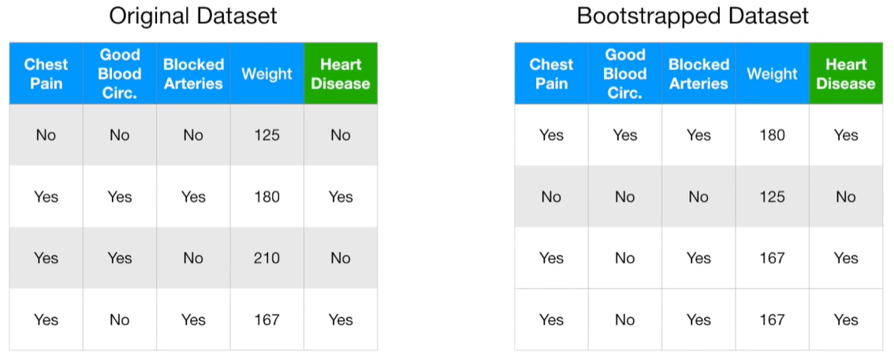
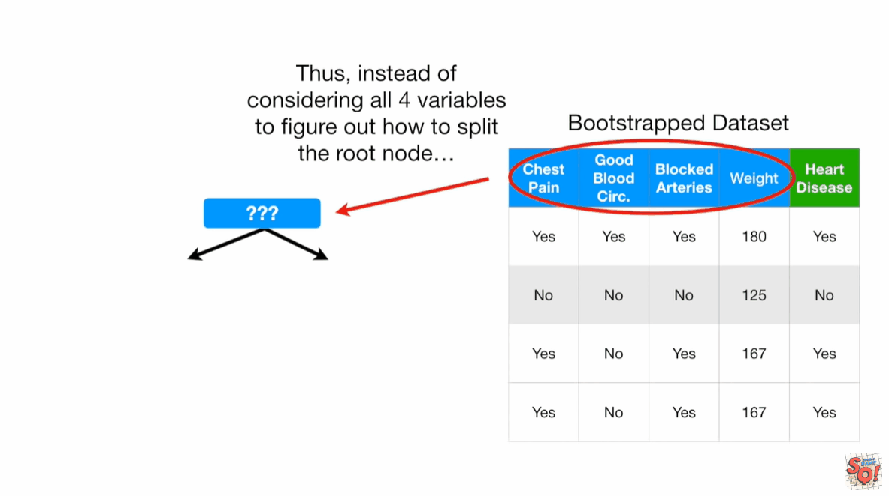
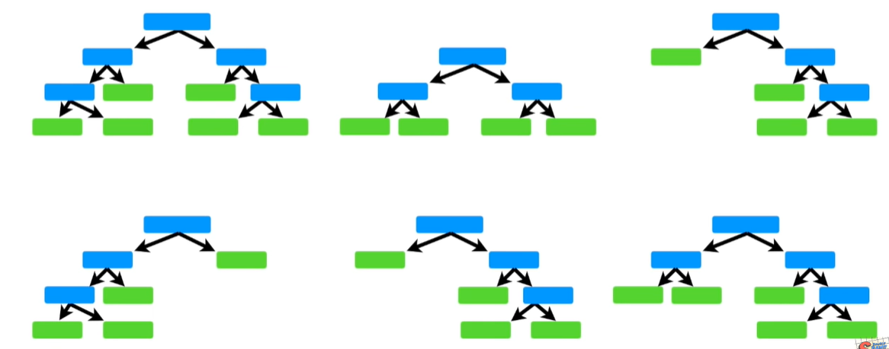

# randomforest

## 总结

1. 随机森林步骤
  1. 使用随机样本, 可放回的随机抽取样本，建立和初始数据集一样大小的样本集合，这个过程叫做`bootstrapped`
  2. 使用随机特征
  3. 将多课树的结果进行分类打分，求最终的结果
2. 缺失值的处理
  - 首先进行差值
  - 根据多课树预测结果，将相同的预测结果样本放在一起，然后用再权重来评估。

## 随机森林算法步骤

决策树简单, 容易解释, 很容易拟合训练集, 但是在测试集上表现却不好. 随机森林结合了多个简单的决策树, 解决了这个问题.

✨但是随机森林丧失了可解释性

### 步骤1: 创建bootstrapped数据集

✨bootstrapped在统计学中，有一种称为自助法（bootstrap method）的技术，就是通过对原始样本进行有放回的抽样，多次重复这个过程以获取样本统计量的分布等信息，从而进行统计推断。这里 “bootstrapped” 就表示运用了这种自助法进行相关操作。

假设有4个样本的数据集, 为了创建和原始数据集一样大的bootstrapped数据集, 我们仅需要从原始数据集中随机抽样. 允许, 重复, 抽样.
 

✨第三个和第四个样本是相同的.

### 步骤2: 在从bootstrapped数据集中创建树时, 每一步随机选取两个属性

在每一步仅选择尚未被作为决策点的两个属性.

回到步骤1, 创建新的bootStrapped数据集, 并在每一步随机选择属性创建树

### 步骤3: 预测与投票

用所有创建的树, 来预测测试样本, 通过投票决定最终的结果.

✨Bagging: 对数据进行自助抽样（Bootstrapping）再结合聚合（aggregate）来做出决策的方法被称为 “装袋法（Bootstrap Aggregating, Bagging）

## 参考
https://www.youtube.com/watch?v=J4Wdy0Wc_xQ&t=412s
https://www.youtube.com/watch?v=sQ870aTKqiM

