## 缺失值的处理

随机森林考虑2种缺失值:
1. 训练集中的缺失值
2. 测试集中的缺失值

### 初始猜测

如下图, 第4条数据中分类变量`Blocked arteries`和数值变量`weight`都是未知的.

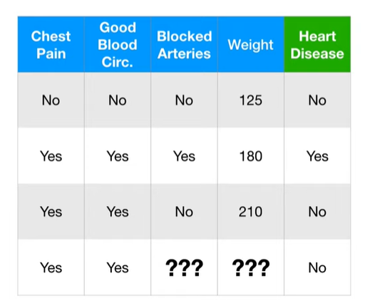

首先, 处理分类变量`Blocked arteries`. 在`Heart Idsease = No`的样本中, `Blocked arteries = No`概率是2/2=100%, 所以`No`是初始的猜测.

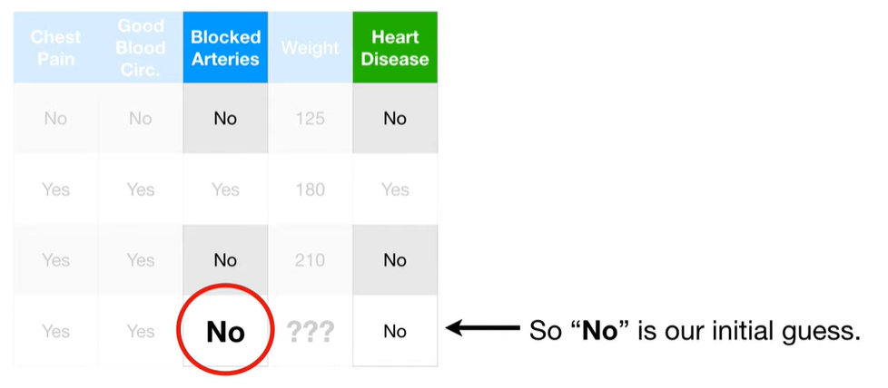

然后, 处理数值变量`weight`, 以初始猜测是`heart disease = No`样本中的平均值.

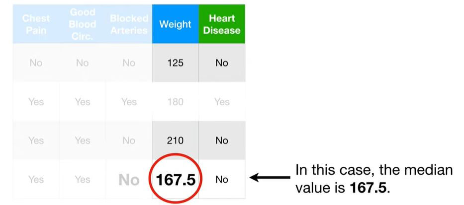

### 改善猜测
我们通过将具有缺失值的记录和相似记录来改善猜测. 

1. 步骤1: 

  不做任何处理, 创建随机森林模型, 并跑所有数据.

2. 步骤2: 构建相似度矩阵

  我们在第一棵树上, 看到样本3和样本4停在相同的叶子节点, 这就意味着他们是相似的.

  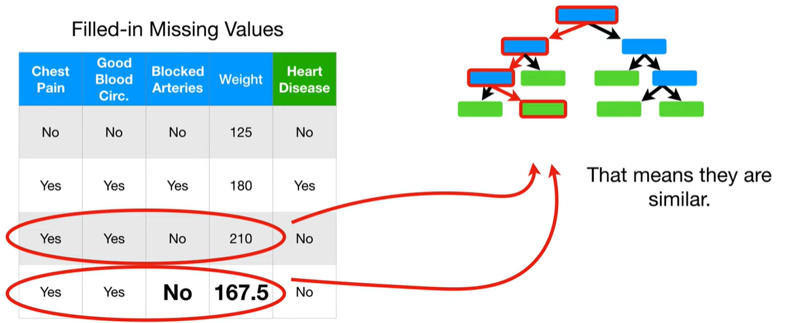

  适用近似矩阵(Proximity Matrix)来跟踪相似的样本, 其每一行是一个样本, 每一列是一个样本, 因为样本3和样本4结束再相同的叶子节点, 所以在他们的相交格子+1.

  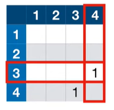

  同样的方法, 跑完所有的数据, 最终得到下图的相似矩阵:

  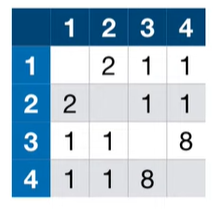

  相似矩阵中的每个值除以树的个数, 这里有10棵树, 所以都除以10:

  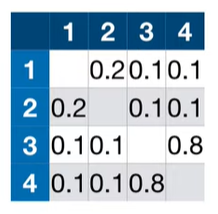

3. 步骤3: 使用近似度矩阵与分类的权重估算最终结果

  现在, 使用近似值来优化样本4的缺失值.

  对于`blocked arteries`, 计算自身的`Yes`和`No`的频率权重:

  1. $$ YES = 1/3 $$
  2. $$ NO = 2/3 $$

  计算`Yes`的近似权重频率:

  $$ YES="YES" weighted frequency \cdot \frac{Proximity of "YES"}{All Proximities} = \frac{1}{3} \cdot \frac{0.1}{0.1+0.1+0.8} = 0.03 $$

  计算`No`的近似权重频率:

  $$ NO = \frac{2}{3} \cdot \frac{0.1+0.8}{0.1+0.1+0.8} = 0.6$$

  `No`有更高的近似权重频率, 所以选择`No`

  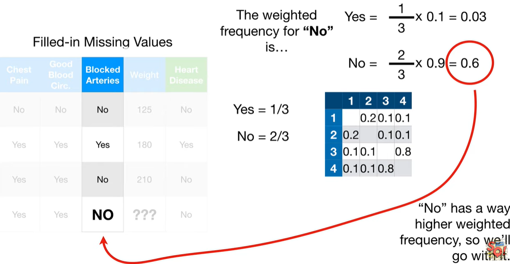

  数值变量`weight`字段, 我们使用权重平均值.

  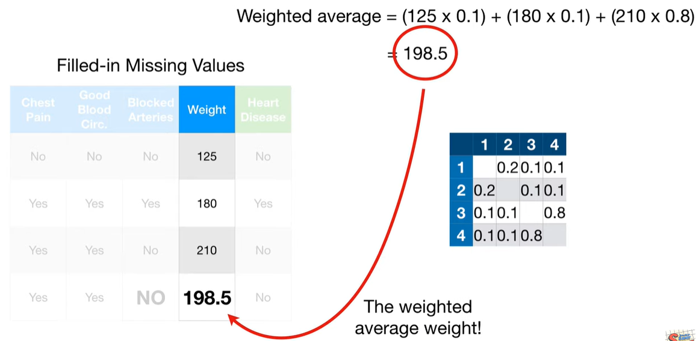

### 测试集中的缺失值

假设我们已经创建好随机森林, 来预测病人.

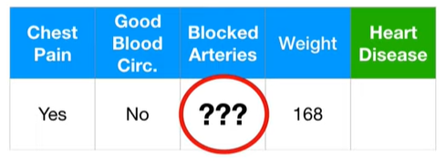

第一步, 我们复制该条记录, 并分别将目标属性赋值为`Yes`和`No`
第二步, 适用上面讲述的方法来补全缺失值

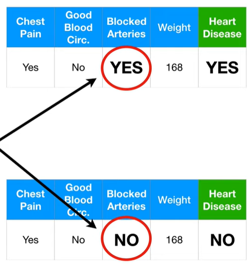

## 参考
https://www.youtube.com/watch?v=J4Wdy0Wc_xQ&t=412s
https://www.youtube.com/watch?v=sQ870aTKqiM
