# AdaBoost

## 总结
AdaBoost的特点:
  1. 子树是stump树, 仅包含一个根节点和两个叶子节点, 随机森林子树则是完整的树
  2. stump树，仅仅使用一个特征, 随机森林子树可以使用多个或全部特征
  3. 每棵子树的权重不一样, 随机森林子树权重是一样的
  4. 前一棵stump的error会影响到后一颗树, 随机森林中每棵树都是独立的

5. 过程：
  - 首先给每个样本初始化权重，等于总样本量的倒数
  - 使用每个特征分别创建stump树，并计算gini impurity，选择gini impurity最小的作为第一棵stump，并计算权重error。
  - 我们使用这个带权重的error来决定该棵树对最终结果的话语权。如果error越小，预测越准，则话语权越高
  - 前一棵树预测正确的样本的权重会衰减（后一棵树的话语权降低），预测错误的样本的权重会增加（后一颗树的话语权会升高）
6. 预测时，和随机森林一样，不过是每棵树的话语权会不一样

## 简介
AdaBoost 的全称是 Adaptive Boosting. 与随机森林等其他集成学习算法相比，AdaBoost 更加注重对难以分类样本的关注和学习，通过不断调整样本权重来提高分类性能。而随机森林则是通过随机选择特征和样本构建多个决策树，然后综合决策树的结果进行分类，其重点在于减少模型的方差。

在随机森林里, 每棵树都是完整生长的，且深度没有预先确定的最大值.

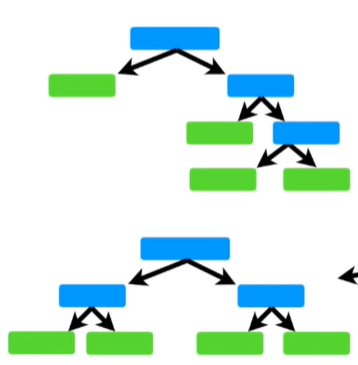

相反, Adaboost每次只创建一个节点和两个叶子节点的树桩(stump), 所以可以成为是`树桩森林`.

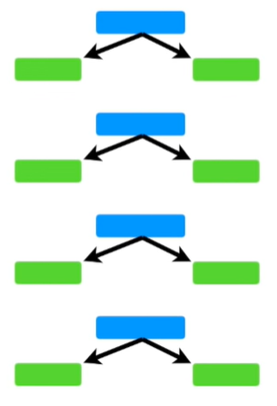

比如, 如果我们想预测`heart disease`, 一个决策树会使用所有的4个属性(Chest Pain,Blood Circulation,Blocked Arteries and Weight).

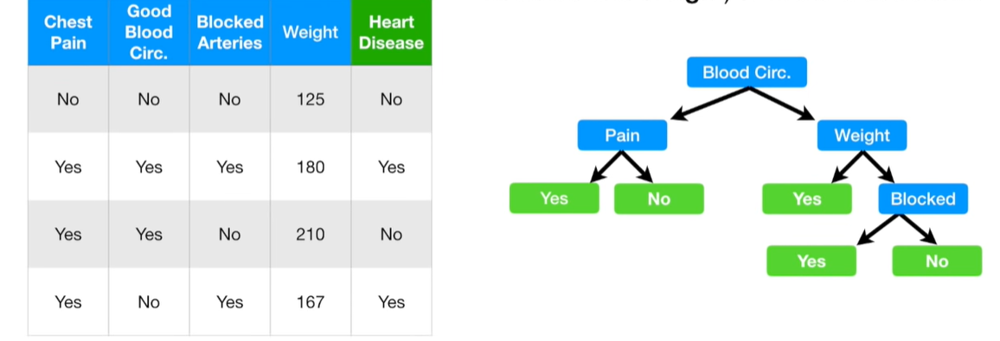

但是一个树桩一次只能使用一个属性, 树桩决策树是弱学习器(weak learners).

在随机森林中, 每个树投票权重相同. 相反在树桩森林中, 一些树桩有更大的权重.

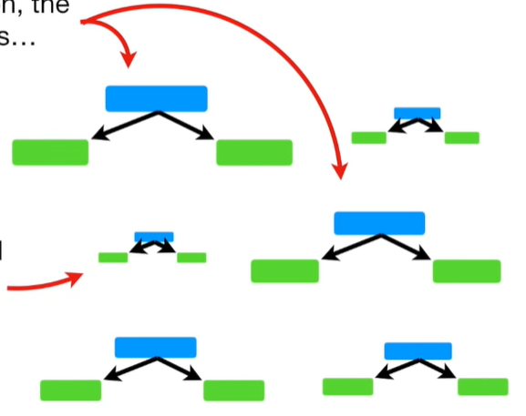

最后, 在随机森林里, 每个决策树都是独立的. 相反在随机树桩中, 前面的树桩的误差, 会影响后面的树桩.

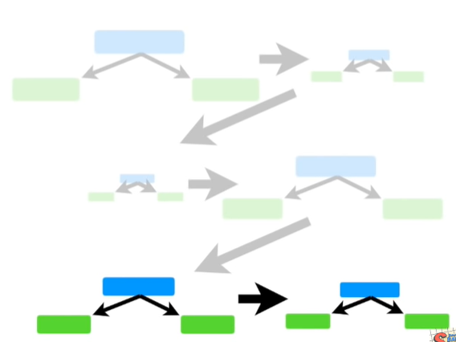

总结, AdaBoost三个特点是:

1. `AdaBoost`是集合了树桩型的弱分类器. 
2. 一些树桩有更大的投票权重.
3. 每一个树桩会将前面的错误考虑进来.

## 创建随机树桩

### 数据
使用如下图的数据: 
1. 属性:
  1. Chest Pain(胸痛)
  2. Blocked Artery(动脉阻塞)
  3. Weight(体重)
2. 目标
  Heart Disease(心脏病)

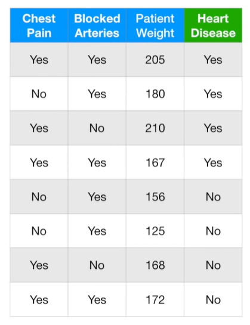

### 创建第一个树桩

首先, 我们给每个样本相同的权重:

$$\frac{1}{totalNumberOfSamples}=\frac{1}{8}$$

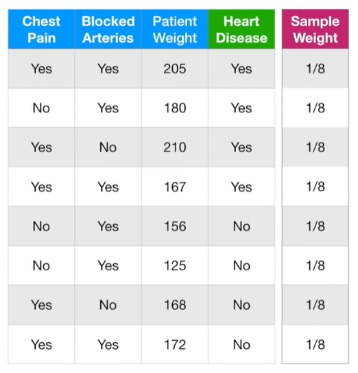

创建第一个树桩, 因为`Patient Weight`的基尼值最低, 所以以它作为第一个树桩节点.

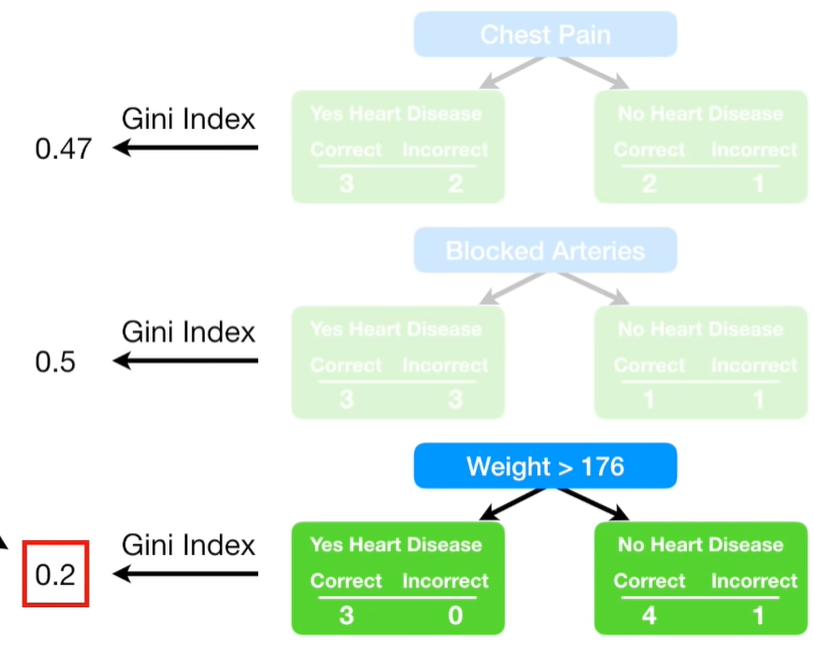

根据这个树桩的分类好坏, 决定它的投票权重. 第4个样本分类错误, 一个树桩的总错误(Total Error)是分类错误样本的权重系数和, 所以这个树桩的总错误是1/8.

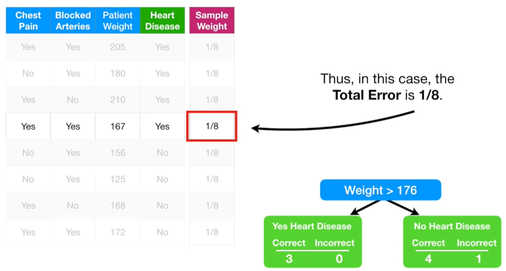

使用树桩的总错误来决定其最终分类的投票权重, 公式如下:

$$ AmountOfSay = \frac{1}{2}log(\frac{1-TotalError}{Total Error}) $$

Y轴是树桩的权重值, X轴是树桩的总错误. 当树桩表现比较好时, 总错误接近于0, 权重值会非常大; 当树桩表现比较差时, 总错误接近1, 权重值会非常大.

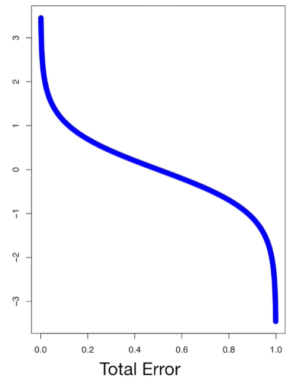

当$Patient Weight > 176$, 总错误是1/8, 所以这个树桩的最终投票权重是0.97. 

$$ AmountOfSay = \frac{1}{2}log(\frac{1-1/8}{1/8})=0.97 $$

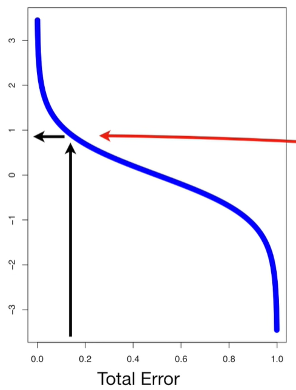

### 创建第二个树桩
接下来讨论, 后续的树桩如何将之前的树桩的错误考虑进来. 首先看我们创建的第一个树桩.

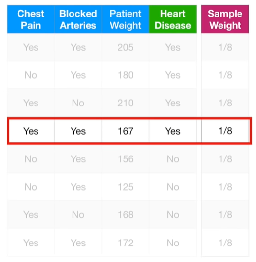

当创建第一个树桩时, 所有的样本权重都一样. 当第一个树桩, 对一个样本进行错误分类时, 我们通过提高该样本的权重, 降低其他正确分类的权重, 来让第二个树桩正确的分类.

首先, 提高错误分类样本的权重, 公式如下:

$$ NewSampleWeight = sampleWeight \cdot e^{amountOfSay}  = \frac{1}{8}e^{amountOfSay} = \frac{1}{8} \cdot e^0.97=0.33$$

$e^{amountOfSay}$图像如下:

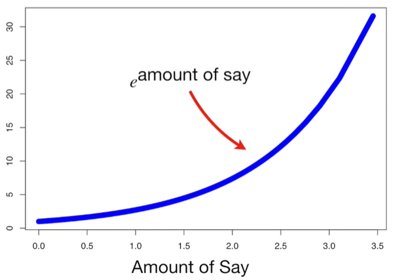

当树桩投票权重很大, 我们将较大比例放大之前的错误分类样本权重. 当树桩投票权重很小, 我们将较小比例放大之前的错误分类样本权重.

在这个例子中, 第一个树桩的投票权重是0.97, 意味着新的样本权重是0.33, 比之前的1/8大.

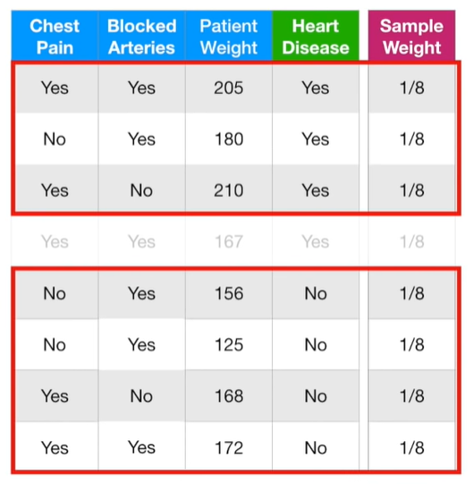

然后, 降低正确分类的的样本权重.

计算公式如下, 区别是投票权重之前有个负号.

$$ NewSampleWeight = sampleWeight \cdot e^{-amountOfSay} = \frac{1}{8}e^{-amountOfSay}=\frac{1}{8} \cdot e^{-0.97} =0.05$$

本例中, 计算结果如下:

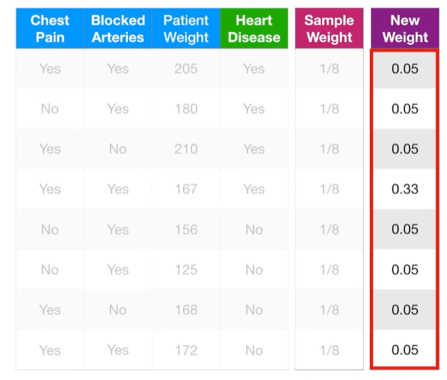

将新的样本权重, 进行01标准化, 使得加和为1

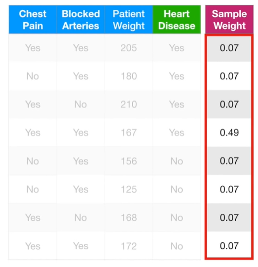

现在使用新的权重, 来创建第二棵树桩. 理论上, 我们可以使用样本权重来计算有权重的基尼指数, 来决定哪个属性作为下一个树桩的根节点. 有权重的基尼指数强调新的树桩要更准确的分类上一个树桩分类错误的样本, 因为这个样本有更大的样本权重.

有权重的基尼指数的一个可替代方法是, 做一个新的样本集, 包含重复的最大权重样本.

首先创建一个和原始数据集一样大的空数据集. 我们随机选一个0~1的数字, 该数字落在权重分布的哪个地方, 就选取哪个样本.

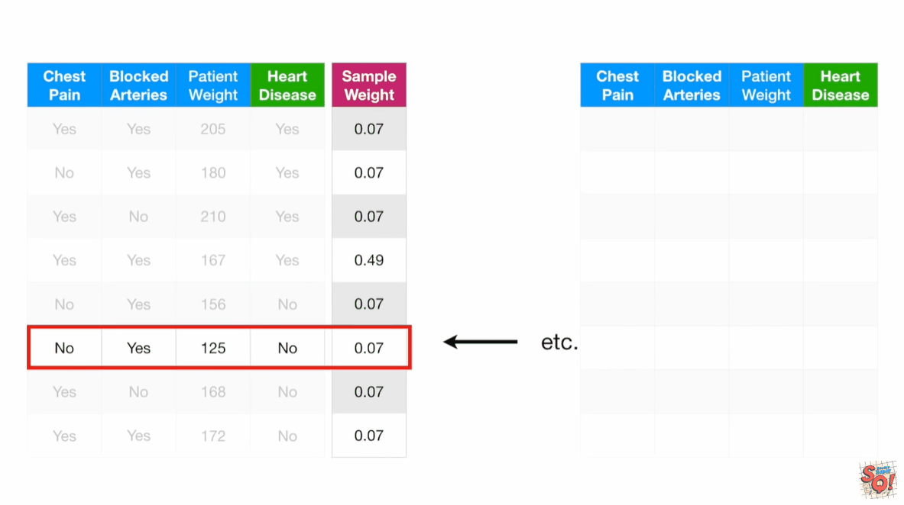

最后, 我们给新数据集的所有样本相同的权重:

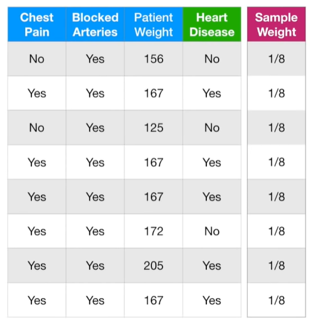

由于上一个错误分类的样本, 被多次抽中, 所以会对错误分类进行更大的惩罚.

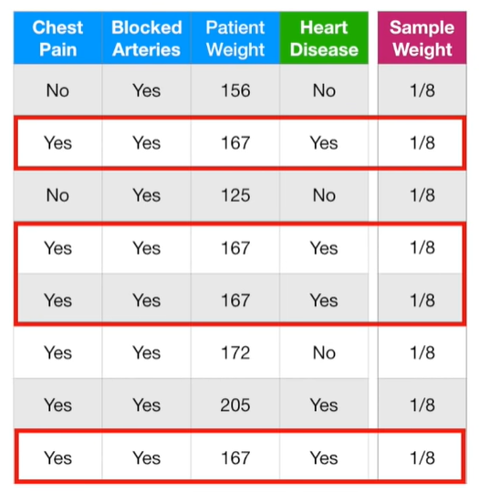

## 预测

将所有预测为Yes和No的树桩权重分别加和, 比较大小, 来决定一个样本的最终分类结果.

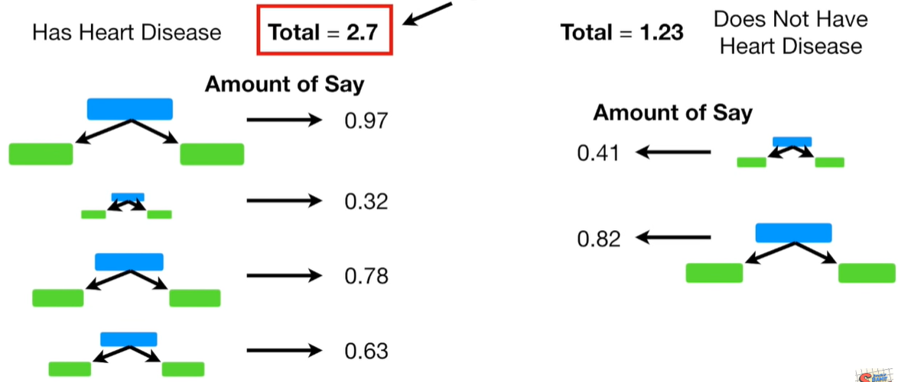

## 参考

https://www.youtube.com/watch?v=LsK-xG1cLYA&t=67s