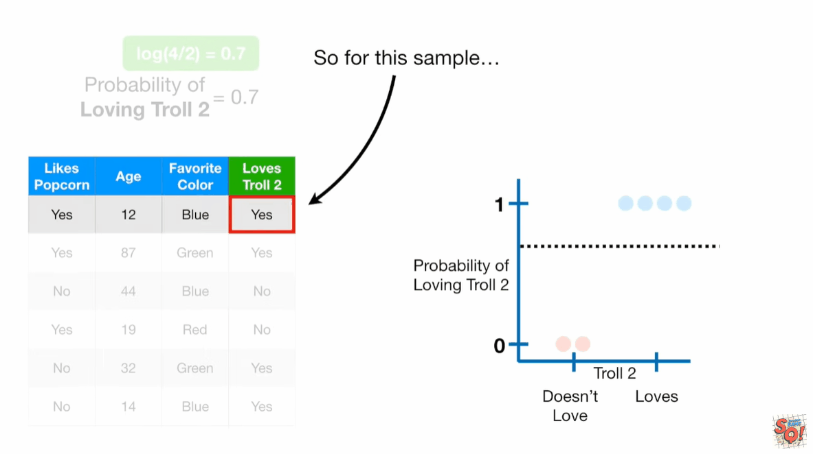
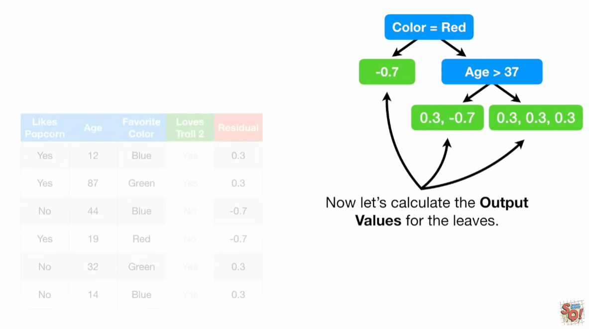
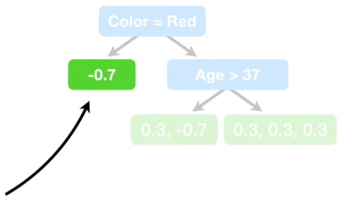
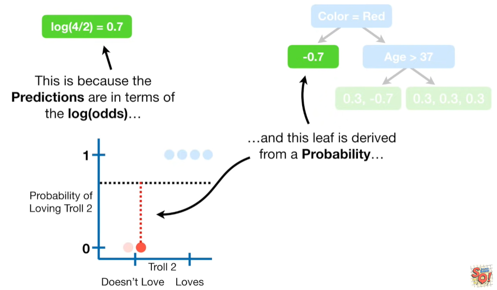
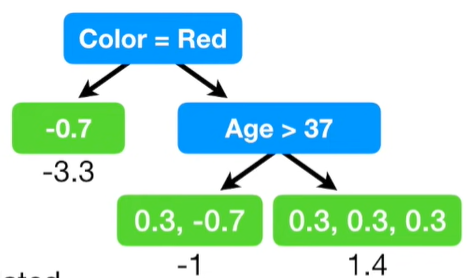
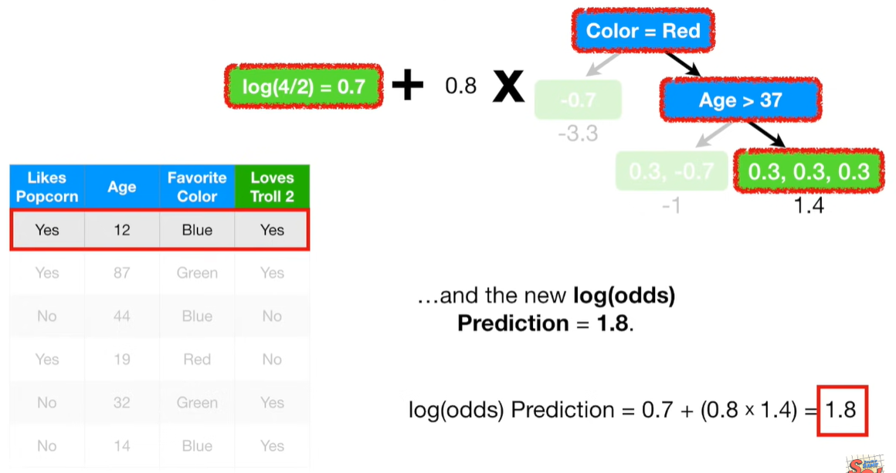
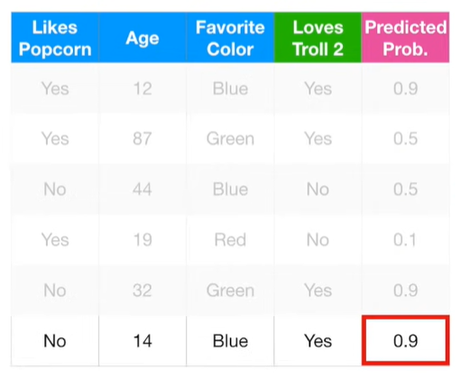
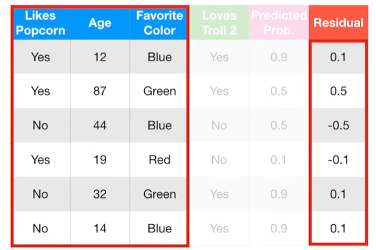
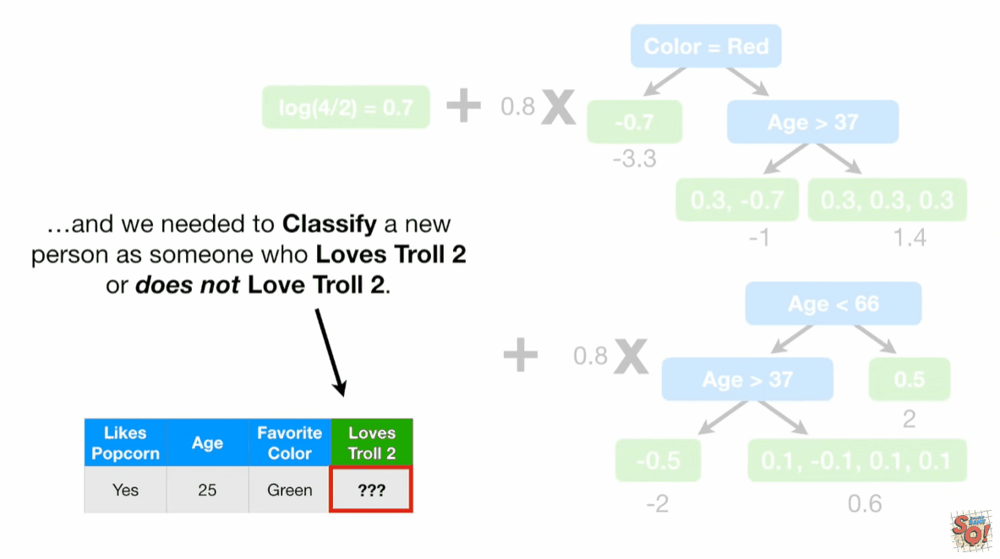

# gradientBoostClassification

在分类问题中, 我们使用`log`(odds)来计算预测的均值(类比回归问题的均值). 本例中有4人`Loves Troll 2 = Yes`, 有2人`Loves Troll 2 = No`, 所以$log\frac{4}{2}=0.7$就是第一个叶子节点的预测值.

就像逻辑回归一样, 最简单使用`log(odds)`进行分类的方法是将其转换为概率, 公式如下:

$$ ProbabilityOfLovingTroll2 = \frac{e^{log(odds)}}{1+e^{log(odds)}}  = \frac{e^{log(4/2)}}{1+e^{log(4/2)}} = 0.7 $$

计算伪残差:

$$ Residual = (observed - predicted) $$

现在建立第2棵树来预测残差. 我们限制叶子节点个数是3.

当使用梯度提升进行回归预测时, 仅包含一个残差的叶子节点的输出值就是那个残差值.

相反的, 当使用梯度提升进行分类预测时, 因为预测值是和概率相关的`log(odds)`, 所以我们不能简单的相加.

需要使用如下的公式进行转换:

$$ \frac{\sum Residual_i}{\sum(Previous Probability_i \cdot (1-Previous Probability_i))} $$

本例中计算结果为:

$$ \frac{-0.7}{0.7 \cdot (1 - 0.7)} =-3.3 $$
$$ \frac{0.3-0.7}{(0.7 * (1-0.7))+ (0.7 * (1-0.7))} = -1 $$
$$ \frac{0.3+0.3+0.3}{(0.7 * (1-0.7))+(0.7 * (1-0.7))+(0.7 * (1-0.7))} = 1.4 $$

现在接合初始叶子节点和第二棵树来更新预测结果. 给第二棵树设置学习率是0.8, 所以第一个样本的结果是:

$$ log(odds)Prediction = 0.7+(0.8*1.4)= 1.8 $$

将新的`log(odds)`值转化为概率:

$$ Probability = \frac{e^1.8}{1+e^1.8}=0.9 $$

可以看到和正确的结果更近了一步. 依次计算剩下的人:

和之前一样, 再次计算伪残差:

继续创建第3棵树..., 最终完成梯度提升算法.

## 参考
1. https://www.youtube.com/watch?v=jxuNLH5dXCs

