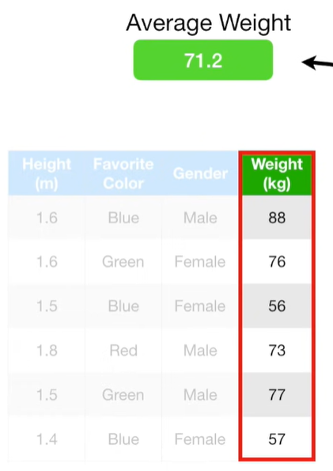
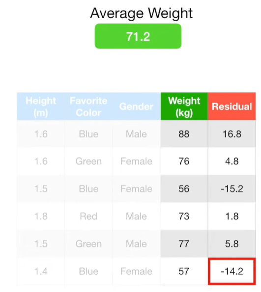
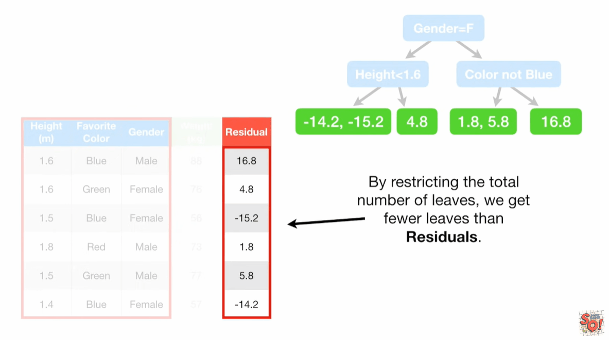
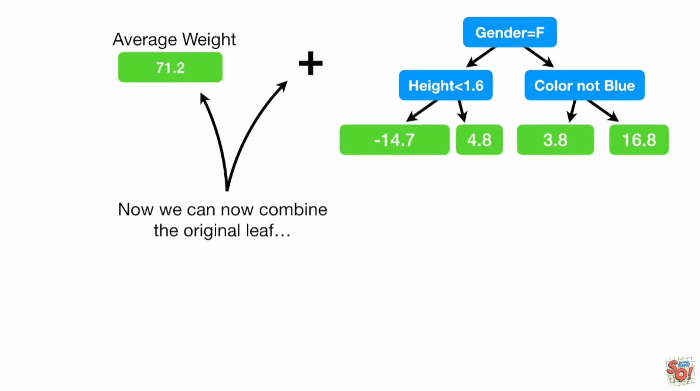
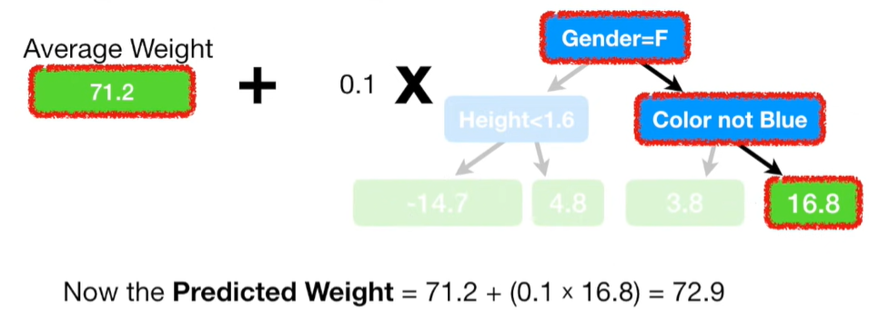
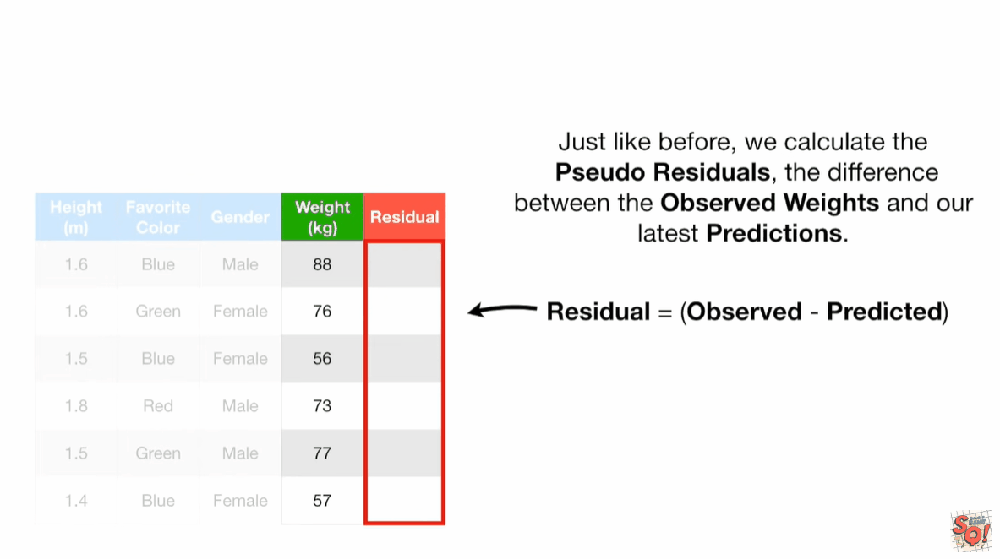
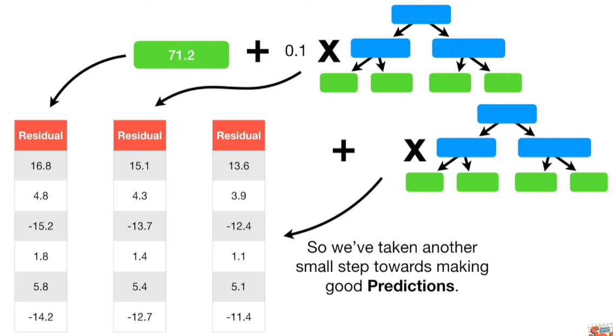

# GradientBoost

## 最佳实践
1. Gradient Boost最初会做一个单独的叶子节点，而不是tree或者stump，这个叶子节点随机猜测目标值，第一次预测是平均值
2. 将每个样本实际值，减去预测值，得到每个样本的pseudo residual
3. 然后我们建立一棵树分别预测每个样本的pseudo residual
4. 现在预测值就是最初的平均值加上这棵树的预测值（我们给这棵树的预测值加上一个权重，就是学习速率）
5. 如此循环下去

## 流程

## 数据集

1. 属性:
    1. Height(身高)
    2. Favorite Color(颜色)
    3. Gender(性别)
2. 目标:

    Weight(体重)

## 简介

`Gradient Boost`直接创建叶子节点, 而不是树或者树桩, 来预测, 比如对于体重, 预测值为平均值. 然后再创建树, 和`AdaBoost`一样, 会考虑前面树的误差, 不同点是创建的树会比树桩更大, 当然会进行限制, 而不是无限大.

在梯度提升算法里，每一棵构建出来的树通常是可以比 AdaBoost 中那种简单的树桩更大、更复杂的。梯度提升构建的树由于其最大叶子数可设置在 8 到 32 之间等情况，所以能够包含更多的节点和层次，进而可以捕捉到更多的数据特征和模式，不过同样也会受到所设定的最大叶子数的限制，避免过度复杂而导致过拟合问题。

梯度提升（Gradient Boost）每一棵新树的构建目的都是为了对前面树在预测过程中出现的偏差进行修正，试图去弥补之前的不足，从而让整体的预测效果越来越好。

在构建好每一棵新树之后，梯度提升算法还会对这棵树进行缩放（scale）操作。这个缩放的过程其实是在调整树对于最终预测结果影响力的大小，类似于给每棵树分配一个合适的 “权重”，以此来控制它在整个集成模型中所起的作用。

梯度提升会按照这样的方式（基于前一棵树的误差构建树、对树进行缩放）持续不断地构建更多的树。不过，这个过程不会无休无止地进行下去，它会有相应的停止条件。其中一种停止条件是，当构建出的树达到了你预先设定的数量要求时，算法就会停止构建新树。另一种停止条件是，当新增加的树已经无法再对模型整体的拟合效果（也就是模型对数据的预测能力，使得预测结果与真实结果尽可能接近的程度）有所改善时，算法也会停止构建新树。

## 流程

首先创建叶子节点, 预测体重, 取其均值为71.2.

接下来, 根据第一棵树的误差来创建第二棵树. 创建新的一列, 数据是第一棵树的误差是观测值减去预测值, 我们称之为伪误差(Pseudo Residual).

✨伪误差的概念来源于线性回归的残差(Residual), 增加了`Pseudo`是为了提醒我们在做的是梯度提升而不是线性回归.

$$ 88-71.2=16.8  $$

现在创建一棵树, 使用`Height`, `Favorite color`, `Gender`三个属性来预测残差.

✨注意在这个例子中, 我们使用4个叶子节点, 而在更大的数据集中, 可以使用8~32个叶子节点.

组合最初的叶子节点和新创建的树, 来预测训练集数据. 最初的叶子节点预测值是71.2, 第二棵树预测结果是16.8, 相加等于88. 和我们的观测值一样.

模型拟合训练集很好, 偏差很低, 但是方差可能会很高. 梯度提升使用学习率放缩新树的贡献来解决这个问题. 学习率的值在0~1之间. 本例中, 我们设置学习率为0.1. 所以预测体重为: 71.2 + (0.1 * 16.8) = 72.9

有了学习率后, 第二棵树的预测结果没有没有学习率的好, 但是也比最初的叶子节点好. 另外通过多次小步的预测, 在测试集上的偏差表现会好.所以我们继续创建第三棵树.

注意, 后面的树预测是前面所有树预测结果与观测值之间的残差.

## 参考

1. https://www.youtube.com/watch?v=3CC4N4z3GJc