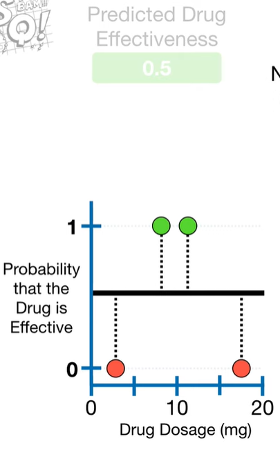
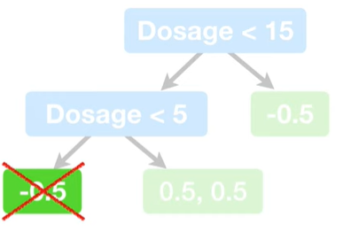
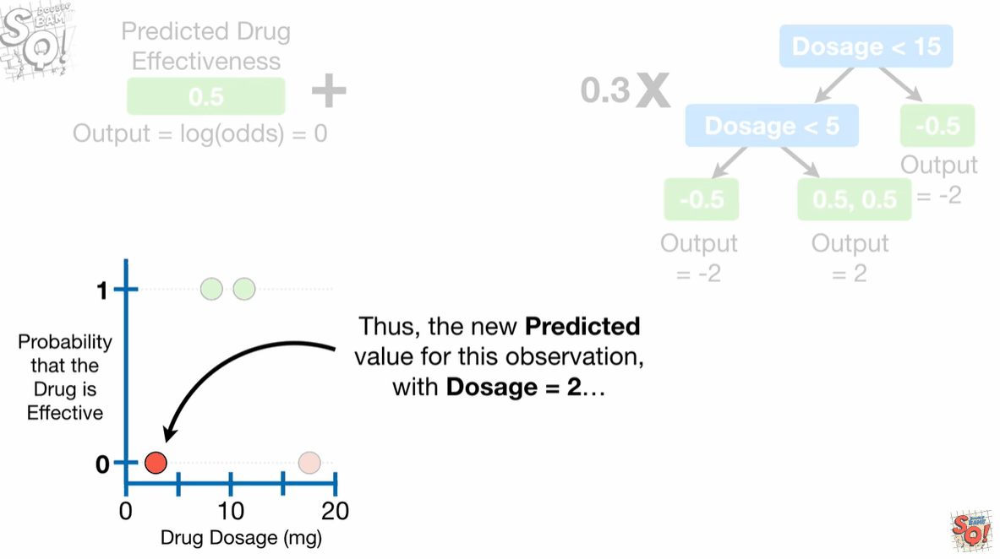

# tree_xgboost_classification

## 最佳实践
1. 初始预测值是0.5, 无论分类还是回归
2. 

xgbosst的第一步是做初始预测, 无论是分类还是回归, 默认值是0.5. 在分类中意味着不考虑药剂量(dosage)时, 默认的预测是50%有效, 50%无效.

就像在用xgboost做回归一样, 我们要拟合残差, 不同的是, 分类问题的相似度得分(similarity score)有不同的计算公式:

$$Similarity = \frac{(\sum Rusiduals_i)^2}{\sum (PreviousProbability_i * (1-PreviousProbability_i))^2+\lambda} $$

## cover

xgboost每个叶子节点有个残差个数最小的阈值, 称为cover.

分类问题中, cover的计算公式是相似度得分减去$\lambda$.

$$ \sum (PreviousProbability_i * (1-PreviousProbability_i)) $$

回归问题中, cover等价于

$$ NumberOfResiduals $$

默认, cover的最小值为1.

在回归问题中, cover没有影响树的生长. 相反, 在分类问题中, 相对复杂, 因为cover的值是由之前的概率值决定的, 例如这个节点的cover值是:

$$ cover = 0.5 * (1-0.5)  = 0.25 $$ 

由于默认的cover最小值是1, xgboost不会允许该叶子节点存在:

为了教学, 我们设置cover的值为0.

## 预测

将预测概率转换为`log(odds)`

$$ odds = \frac{p}{1-p} $$
$$ log(odds) = log(\frac{p}{1-p}) $$ 

在这个案例中: 
$$p=0.5$$

$$ log(odds) = log(\frac{p}{1-p}) = log(\frac{0.5}{1-0.5})=0 $$

新的预测值对于药剂量=2的观测点, 是初始的预测值0, 加上学习率$\eta=0.3$, 乘以输出的值-2, 结果是$log(odds)=-0.6$, 然后我们将这个值转化为概率:

$$ Probability = \frac{e^{log(odds)}}{1+e^{log(odds)}}  = 0.35$$

新的预测是0.35小于初始的0.5, 说明我们在正确的方向上移动了一步.

## 参考

1. https://www.youtube.com/watch?v=8b1JEDvenQU