# regression

## 总结

1. 使用Similarity Score计算信息增益

## 回归

XGBoost(eXtreme Gradient Boosting)是为了解决大, 复杂的数据集而设计的

X轴是药剂量(drug dosages), Y轴是药效(drug effectiveness).

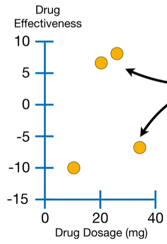

训练XGBoost的第一步是做初始的预测, 这个预测可以是任何值, 默认是0.5, 无论是做分类还是回归. 如下图, 黑实线是初始的预测值, 黑虚线是残差.

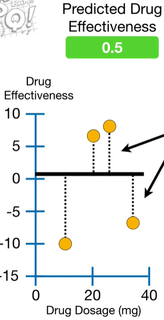

就像梯度提升一样, XGBoost使用回归树来拟合伪残差. 但是, 不同点是, 梯度提升使用的是传统的回归树, XGBoost使用的是xgboost tree.

每棵树只有一个节点, 所有的残差都在这个节点上.

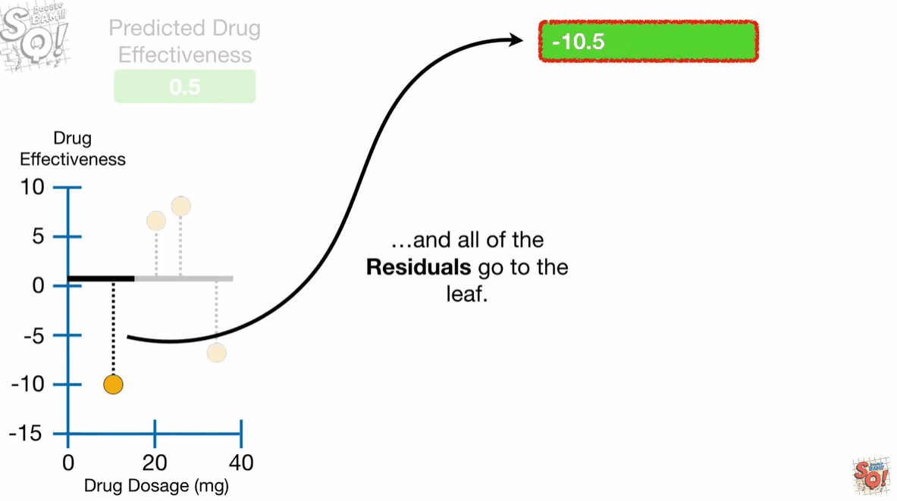

计算残差的相似得分(similarity score, 另名quality score), 计算公式如下, 令$\lambda = 0$:

$$ Similarity Score = \frac{Sum of Residuals, Squared}{Number of Residuals + \lambda} = \frac{(-10.5+6.5+7.5-7.5)^2}{4+0}=4$$

如果将残差分为2组, 能否将相似的残差分到同一组内? 首先看药量最小的两个观测点, 他们的平均值是15, 图中的红色线. 我们以红色线为边界, 将所有观测值分为2组, 然后放到不同的叶子节点中.

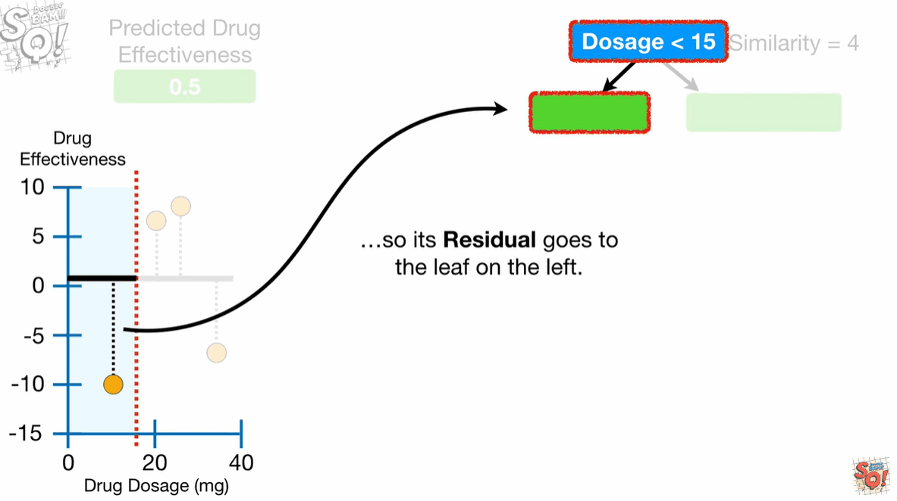

计算左叶子节点的`similarity score`

$$ Similarity Score = \frac{Sum of Residuals, Squared}{Number of Residuals + \lambda} = \frac{(-10.5)^2}{1+0}=110.25$$

计算右叶子节点的`similarity score`

$$ Similarity Score = \frac{Sum of Residuals, Squared}{Number of Residuals + \lambda} = \frac{(6.5+7.5-7.5)^2}{3+0}=14.8$$

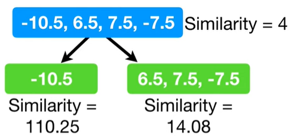

评估叶子节点聚合相同的残差相似度与根节点的差异, 称为增益(gain), 公式如下:

$$ Gain = Left_{similarity}+Right_{similarity}-Root_(similarity)  = 110.25 + 14.08 - 4 = 120.33 $$

现在完成了药剂量<15的增益计算, 然后依次计算其他分界点的增益. 计算药剂量<22.5的增益

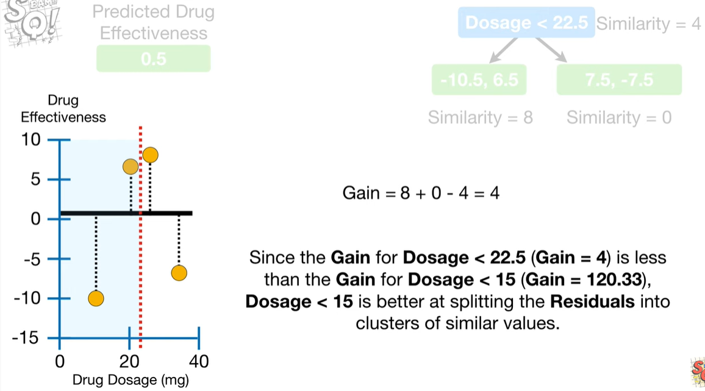

$$ Gain = Left_{similarity}+Right_{similarity}-Root_(similarity)  = 8 + 0 - 4 = 4 $$

由于药剂量<22.5的增益是4, 小于药剂量<15的增益120.33, 所以药剂量<15是更好的分界线.

计算药剂量<30的增益:

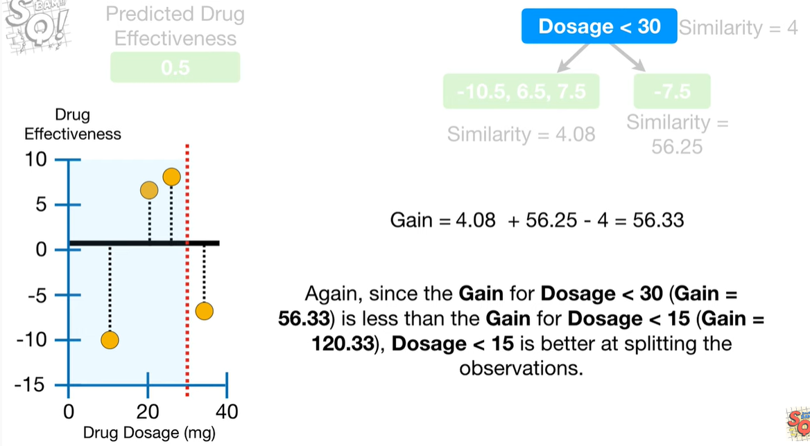

$$ Gain = Left_{similarity}+Right_{similarity}-Root_(similarity)  = 4.08 + 56.25-4 = 56.33 $$

由于药剂量<30的增益56.33, 小于药剂量<15的增益120.3, 所以药剂量<15是更好的分界线.

4个观测点, 总共可有3个分界线, 所以我们完成了所有的比较. 适用药剂量<15作为第一个分裂点.

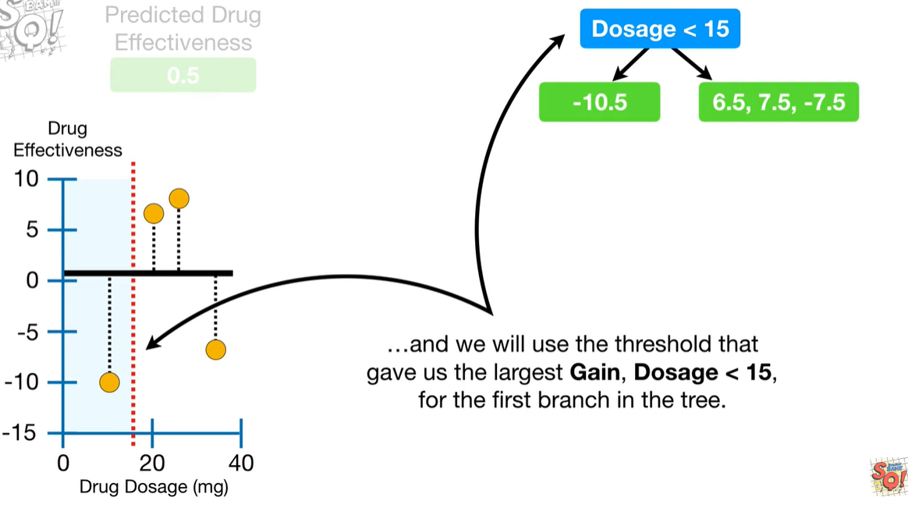

左侧叶子节点, 只有1个残差, 右侧叶子节点有3个残差, 所以右侧可以继续分裂.

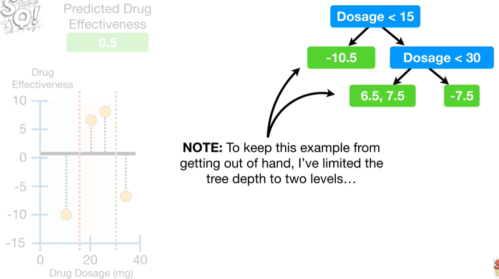

✨本例中, 限制树的深度为2, 默认是6.

## prune

通过增益值来进行剪枝. 首先, 我们设定一个参数$\gamma=130$. 从树的最低端分支比较增益值和$\gamma=130$, 如果增益值小于$\gamma$, 则删除该分列点. 如果增益值大于$\gamma$则保留该分裂点.

✨因为根节点的增益值是120, 小于设定的130. 但是我们不移除根节点.

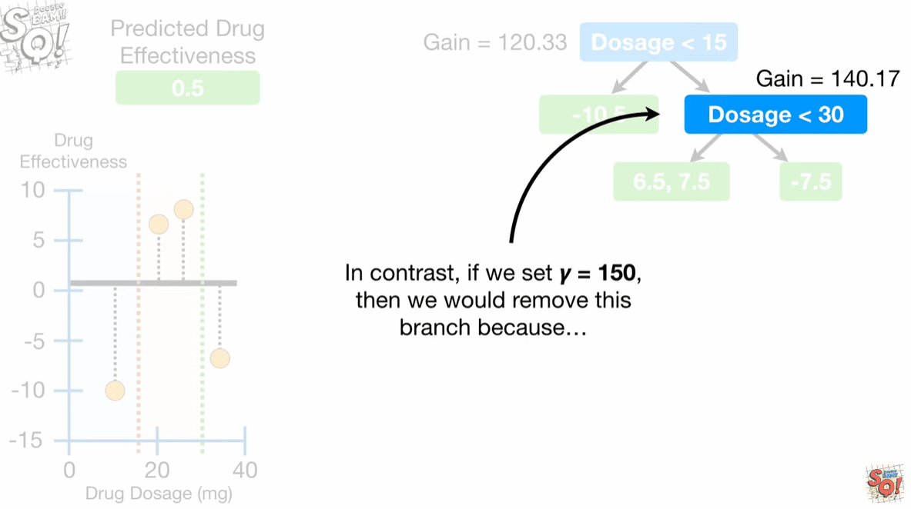

## lambda
这一次, 在计算相似度得分时, 设置$\lambda = 1$. $\lambda$是一个正则化(regularization)参数, 目的是减少预测的敏感度, 防止过拟合. 本例中根节点的相似度得分是:

$$ Similarity Score = \frac{(-10.5+6.5+6.5-7.5)}{4+1}=3.2 $$

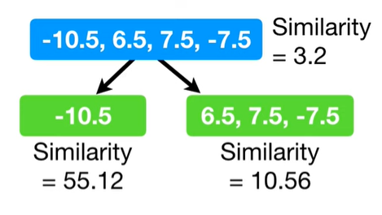

可以看到在左侧叶子节点, 只有1个残差, 相似度得分降低了50%. 相反, 根节点有4个残差, 相似度惩罚只有20%.

当$\gamma = 130$时, 
1. 在$\lambda = 0$时, 由于增益值大于$\gamma$, 所以没有进行剪枝.
2. 在$\lambda = 1$时, 由于增益值小于$\gamma$, 所以都进行了剪枝.

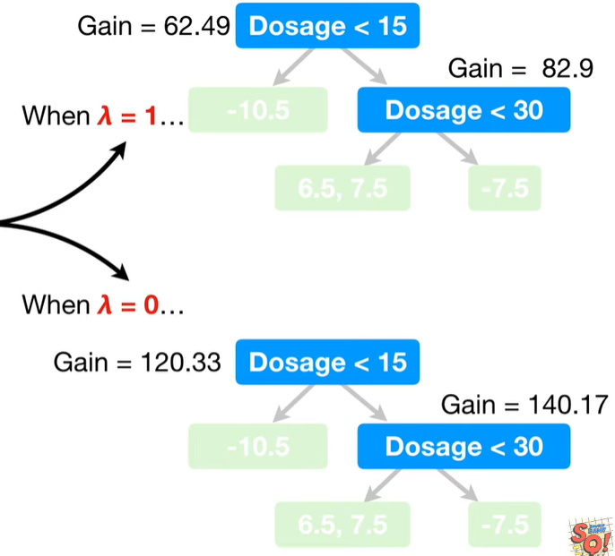

## output

计算叶子节点的输出, 公式如下:

$$ Output Values = \frac{Sum Of Residuals}{Number Of Residuals + \lambda} $$

✨ 输出值和近似得分几乎一样, 除了没有进行平方.

这个叶子节点的残差是-10.5, 共有1个残差, 则输出是:

1. $\lambda = 0$, $Output Value = \frac{-10.5}{1+0}=-10.5$
2. $\lambda = 1$, $Output Value = \frac{-10.5}{1+2}=-5.25$

当$\lambda>0$时, 将会减少预测的输出, 因此会降低独立观测点的敏感度.

## gradient

就像梯度提升一样, xgboost也是用学习率, 称为$\eta$, 默认值为0.3.

如下图, 药剂量=10的观测点, 最初的预测是0.5, 加上第1棵树的预测结果乘以学习率, 结果是-2.65. 残差变小了, 我们在正确的方向上更进了一步.

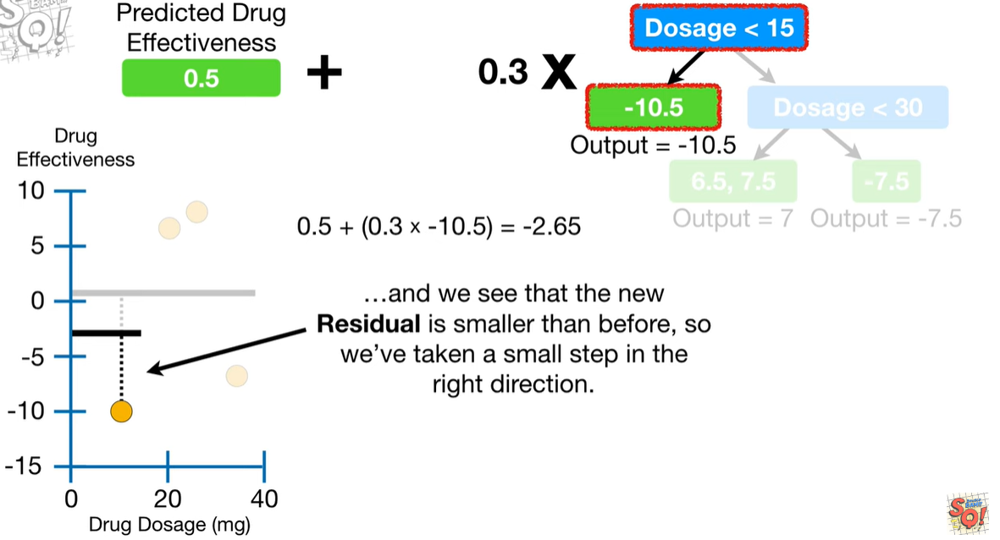

继续创建树, 直到残差值最小或者达到最大迭代的次数.

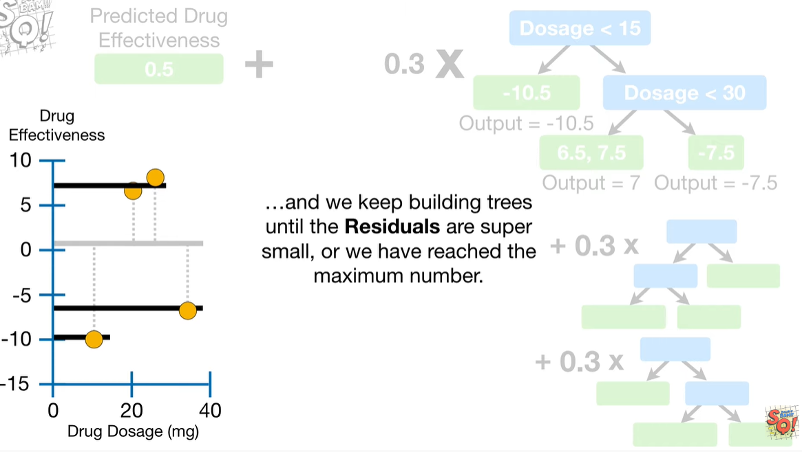

## 参考
1. https://www.youtube.com/watch?v=OtD8wVaFm6E

