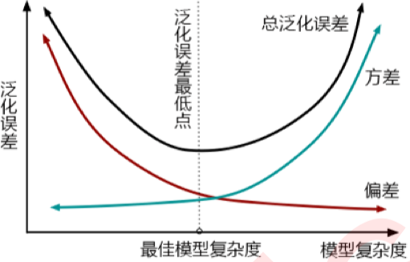

XGBoost是陈天奇于2014年提出的一套并行boost算法的工具库.


XGBoost的全称是eXtreme Gradient Boosting，既可以用于分类也可以用于回归问题中, 它是经过优化的分布式梯度提升库. 比常见的工具包快10倍以上。在数据科学方面，有大量的Kaggle选手选用XGBoost进行数据挖掘比赛，是各大数据科学比赛的必杀武器；在工业界大规模数据方面，XGBoost的分布式版本有广泛的可移植性，支持在Kubernetes、Hadoop、SGE、MPI、 Dask等各个分布式环境上运行，使得它可以很好地解决工业界大规模数据的问题。

XGBoost 是对 gradient boosting decision tree 的实现，但是一般来说，gradient boosting 的实现是比较慢的，因为每次都要先构造出一个树并添加到整个模型序列中。而 XGBoost 的特点就是计算速度快，模型表现好，这两点也正是项目的目标。表现快是因为它具有这样的设计：


1. Parallelization：训练时可以用所有的 CPU 内核来并行化建树。
1. Distributed Computing：用分布式计算来训练非常大的模型。
1. Out-of-Core Computing：对于非常大的数据集还可以进行 Out-of-Core Computing。
1. Cache Optimization of data structures and algorithms：更好地利用硬件资源。

使用xgboost库有两种方式

1. 直接使用xgboost库的建模流程

    ```python
    import xgboost as xgb

    # 第一步，读取数据
    xgb.DMatrix()

    # 第二步，设置参数
    param = {eta, gamma, max_depth, min_child_weight, max_delta_step, subsample, colsample_bytree, colsample_bylevel, colsample_bynode, lambda, alpha, tree_method string, sketch_eps, scale_pos_weight, updater, refresh_leaf, process_type, grow_policy, max_leaves, max_bin, predictor, num_parallel_tree}

    # 第三步，训练模型
    bst = xgb.train(params, dtrain, num_boost_round=10, evals=(), obj=None, feval=None, maximize=False, early_stopping_rounds=None, evals_result=None, verbose_eval=True, xgb_model=None, callbacks=None, learning_rates=None)

    # 第四步，预测结果
    bst.predict()

    ```

2. 使用xgboost库中的sklearn的API。

    ```python
    class xgboost.XGBRegressor (max_depth=3, learning_rate=0.1, n_estimators=100, silent=True, objective='reg:linear', booster='gbtree', n_jobs=1, nthread=None, gamma=0, min_child_weight=1, max_delta_step=0, subsample=1, colsample_bytree=1, colsample_bylevel=1, reg_alpha=0, reg_lambda=1, scale_pos_weight=1, base_score=0.5, random_state=0, seed=None, missing=None, importance_type='gain', **kwargs)
    ```

第一种方中的params字典中的第一个参数eta，其实就是第二种方法中的XGBRegressor里面的参数learning_rate


## 参数

### booster
在XGB中， 除了树模型，还可以选用线性模型，比如线性回归，来进行集成。虽然主流的XGB依然是树模型，但也可以 使用其他的模型。基于XGB的这种性质，有参数“booster"来控制使用怎样的弱评估器。

1. xgb.train()中的xgb_model参数:

    使用哪种弱评估器。可以输入gbtree， gblinear或dart。输入的评估器不同，使用 的params参数也不同，每种评估器都有自 己的params列表。评估器必须于param参 数相匹配，否则报错。

2. xgb.XGBRegressor()中的booster


    使用哪种弱评估器。可以输入gbtree，gblinear或dart。 gbtree代表梯度提升树，dart是Dropouts meet Multiple Additive Regression Trees，可译为抛弃提升树，在建树的过程中会抛弃一部分树，比梯度提升树有更好的防过拟合功能，输入gblinear使用线性模型。


### objective
梯度提升算法中的损失函数。如果我们的目标是进行回归预测，那我们可以选择调节后的均方误差RMSE作为我们的损失函数。如果我们是进行分类预测，那我们可以选择错误率error或者对数损失log_loss。

XGB 是实现了模型表现和运算速度的平衡的算法。普通的损失函数，比如错误率，均方误差等，都只能够衡量模型的表现，无法衡量模型的运算速度。许多模型中使用空间复杂度和时间复杂度来衡量模型的运算效 率。XGB因此引入了模型复杂度来衡量算法的运算效率。因此XGB的目标函数被写作：传统损失函数 + 模型复杂度。


$$
Obj = \sum_{i=1}^ml(y_i,\hat{y_i}) + \sum_{k=1}^K\Omega(f_k)
$$

其中:
1. $i$代表数据集中的第 $i$ 个样本
2. $m$ 表示导入第 $k$ 棵树的数据总量
3. $K$ 代表建立的所有树(n_estimators)，当只建立了 $t$  棵树的时候，式子应当为  $\sum_{k=1}^t\Omega(f_k)$。
4. 第一项代表传统的损失函数，衡量真实标签 $y_i$  与预测值 $\hat{y_i}$  之间的差异，通常是RMSE调节后的均方误差。
5. 第二项代表模型的复杂度，使用树模型的某种变换 $\Omega$ 表示，这个变化代表了一个从树的结构来衡量树模型的复杂度的式子，可以有多种定义。注意，我们的第二项中没有特征矩阵 $x_i$ 的介入。我们在迭代 每一棵树的过程中，都最小化 Obj 来力求获取最优的 $\hat{y}$ ，因此我们同时最小化了模型的错误率和模型的复杂度.


还可以从另一个角度去理解目标函数,即方差-偏差困境。在机器学习中，用来衡量模型在未知数据上的准确率的指标，叫做泛化误差（Genelization error）。一个集成模型(f) 在未知数据集(D)上的泛化误差 $E(f;D)$ ，由方差(var)，偏差(bais)和噪声 $\varepsilon$共同决定，泛化误差越小，模型就越理想。从下面的图可以看出来，方差和偏差是此消彼长的，并且模型的复杂度越高，方差越大，偏差越小。



方差可以被简单地解释为模型在不同数据集上表现出来地稳定性，而偏差是模型预测的准确度。那方差-偏差困境就可以对应到 Obj 中了:

$$
Obj = \sum_{i=1}^ml(y_i,\hat{y_i}) + \sum_{k=1}^K\Omega(f_k)
$$

其中:

1. 第一项是衡量我们模型的偏差，模型越不准确，第一项就会越大。
2. 第二项是衡量我们的方差，模型越复杂，模型的学习就会越具体，到不同数据集上的表现就会差异巨大，方差就会越大。

所以我们求解的最小值，其实是在求解方差与偏差的平衡点，以求模型的泛化误差最小，运行速度最快。我们知道树模型和树的集成模型都是学习天才，是天生过拟合的模型，因此大多数树模型最初都会出现在图像的右上方，我们必须通过剪枝来控制模型不要过拟合。现在 XGBoost的损失函数中自带限制方差变大的部分，也就是说XGBoost会比其他的树模型更加聪明，不会轻易落到图像的右上方。


在应用中，我们使用参数“objective"来确定我们目标函数的第一部分中的 $l(y_i, \hat{y_i})$ ，也就是衡量损失的部分。

1. xgb.train(): 默认binary:logistic
2. xgb.XGBRegressor(): 默认reg:linear
3. Xgb.XGBClassifier(): 默认binary:logistic

objective参数与学习任务的对应:

输入|选用的损失函数
--|--
reg:linear|使用线性回归的损失函数，均方误差，回归时使用
binary:logistic|使用逻辑回归的损失函数，对数损失log_loss，二分类时使用
binary:logistic|使用支持向量机的损失函数，Hinge Loss，二分类时使用
multi:softmax|使用softmax损失函数，多分类时使用

由于xgb中所有的参数都需要自己的输入，并且objective参数的默认值是二分类，因此我们必须手动调节。


### 正则化参数


对每一棵树，它都有自己独特的结构，这个结构即是指叶子节点的数量，树的深度，叶子的位置等等所形成的一个可以定义唯一模型的树结构。在这个结构中，我们使用 $q(x_i)$表示样本$x_i$ 所在的叶子节点，并且使用$w_{q(x_i)}$ 来表示这个样本落到第 t棵树上的第$q(x_i)$ 个叶子节点中所获得的分数，于是有：

$$
f_t(x_i) = w_{q(x_i)}
$$

这是对于每一个样本而言的叶子权重，然而在一个叶子节点上的所有样本所对应的叶子权重是相同的。设一棵树上总共包含了T个叶子节点，其中每个叶子节点的索引为j ，则这个叶子节点上的样本权重是$w_j$ 。依据这个，我们定义模型的复杂度$\Omega(f)$为（注意这不是唯一可能的定义，我们当然还可以使用其他的定义，只要满足叶子越多/深度越大， 复杂度越大的理论，可以自己决定要是一个怎样的式子）：

$$
\Omega(f) = \gamma T + 正则项(Regularization)
$$

如果使用$L2$正则项：
$$
= \gamma T + \frac 1{2} \lambda|w|^2
$$
$$
=\gamma T + \frac 1{2} \lambda \sum_{j=1}^T w_j^2
$$

如果使用$L1$正则项：
$$
= \gamma T + \frac 1{2} \alpha|w|
$$
$$
=\gamma T + \frac 1{2} \alpha \sum_{j=1}^T |w_j|
$$
还可以两个一起使用：
$$
=\gamma T + \frac 1{2} \alpha \sum_{j=1}^T |w_j| + \frac 1{2} \lambda \sum_{j=1}^T w_j^2
$$


这个结构中有两部分内容，一部分是控制树结构的$\gamma T$ ，另一部分则是我们的正则项。叶子数量 可以代表整个树结构，这是因为在XGBoost中所有的树都是CART树（二叉树），所以我们可以根据叶子的数量判断出树的深度，而 $\gamma$是我们自定的控制叶子数量的参数。
至于第二部分正则项，类比一下岭回归和Lasso的结构，参数 $\alpha$ 和 $\lambda$ 的作用其实非常容易理解，他们都是控制正则化强度的参数，我们可以二选一使用，也可以一起使用加大正则化的力度。当 $\alpha$ 和 $\lambda$  都为0的时候，目标函数就是普通的梯度提升树的目标函数。
来看正则化系数分别对应的参数：


1. xgb.train()
    1. alpha, 默认0，取值范围[0, $+\infty$]
    2. lambda, 默认1，取值范围[0, $+\infty$]
2. xgb.XGBRegressor()
    1. reg_alpha,默认0，取值范围[0, $+\infty$]
    2. reg_lambda,默认1，取值范围[0, $+\infty$]


对于两种正则化如何选择的问题，从XGB的默认参数来看，优先选择的是L2正则化。在实际应用中，正则化参数往往不是调参的最优选择，如果真的希望控制模型复杂度，通常会调整 $\gamma$  而不是调整这两个正则化参数，因此不必过于在意这两个参数最终如何影响了模型效果。对于树模型来说，还是剪枝参数地位更高更优先。如果希望调整 $\lambda$ 和 $\gamma$ ，我们往往会使用网格搜索来帮助我们。


### 让树停止生长：gamma

从目标函数和结构分数之差 的式子中来看， $\gamma$ 是我们每增加一片叶子就会被剪去的惩罚项。增加的叶子越多，结构分数之差会被惩罚越重，所以 $\gamma$ 又被称之为是“复杂性控制”（complexity control），所以 $\gamma$ 是我们用来防止过拟合的重要参数。实践证明，  $\gamma$是对梯度提升树影响最大的参数之一，其效果丝毫不逊色于n_estimators和防止过拟合的神器max_depth。同时， $\gamma$ 还是我们让树停止生长的 重要参数。
可以直接通过设定$\gamma$  的大小来让XGB中的树停止生长。 $\gamma$ 因此被定义为，在树的叶节点上进行进一步分枝所 需的最小目标函数减少量，$\gamma$ 设定越大，算法就越保守，树的叶子数量就越少，模型的复杂度就越低。

1. xgb.train(): gamma,默认0，取值范围[0, $+\infty$]
2. xgb.XGBRegressor(): gamma,默认0，取值范围[0, $+\infty$]

### 过拟合：剪枝参数与回归模型调参


作为天生过拟合的模型，XGBoost应用的核心之一就是减轻过拟合带来的影响。作为树模型，减轻过拟合的方式主要 是靠对决策树剪枝来降低模型的复杂度，以求降低方差。影响重大的参数还有以下的专用于剪枝的参数：

| 参数含义                                                     | xgb.train()              | xgb.XGBRegressor()       |
| ------------------------------------------------------------ | ------------------------ | ------------------------ |
| 树的最大深度                                                 | max_depth，默认6         | max_depth，默认6         |
| 每次生成树时随机抽样特征的比例                               | colsample_bytree，默认1  | colsample_bytree，默认1  |
| 每次生成树的一层时 随机抽样特征的比例                        | colsample_bylevel，默认1 | colsample_bylevel，默认1 |
| 每次生成一个叶子节点时 随机抽样特征的比例                    | colsample_bynode，默认1  | N.A.                     |
| 一个叶子节点上所需要的最小 即叶子节点上的二阶导数之和 类似于样本权重 | min_child_weight，默认1  | min_child_weight，默认1  |


这些参数中，树的最大深度是决策树中的剪枝法宝，算是最常用的剪枝参数，不过在XGBoost中，最大深度的功能与 参数 $\gamma$ 相似，因此如果先调节了$\gamma$ ，则最大深度可能无法展示出巨大的效果。当然，如果先调整了最大深度，则 $\gamma$ 也有可能无法显示明显的效果。通常来说，这两个参数中我们只使用一个，不过两个都试试也没有坏处。
三个随机抽样特征的参数中，前两个比较常用。在建立树时对特征进行抽样其实是决策树和随机森林中比较常见的一 种方法，但是在XGBoost之前，这种方法并没有被使用到boosting算法当中过。Boosting算法一直以抽取样本（横向 抽样）来调整模型过拟合的程度，而实践证明其实纵向抽样（抽取特征）更能够防止过拟合。
参数min_child_weight不太常用，它是一片叶子上的二阶导数$h_i$ 之和，当样本所对应的二阶导数很小时，比如说为 0.01，min_child_weight若设定为1，则说明一片叶子上至少需要100个样本。本质上来说，这个参数其实是在控制叶子上所需的最小样本量，因此对于样本量很大的数据会比较有效。如果样本量很小（比如使用的波士顿房价数据集，则这个参数效用不大）。就剪枝的效果来说，这个参数的功能也被 $\gamma$替代了一部分，通常来说会试试看这个参数，但这个参数不是优先选择。
通常当我们获得了一个数据集后，我们先使用网格搜索找出比较合适的n_estimators和eta组合，然后使用gamma或者max_depth观察模型处于什么样的状态（过拟合还是欠拟合，处于方差-偏差图像的左边还是右边?），最后再决定是否要进行剪枝。通常来说，对于XGB模型，大多数时候都是需要剪枝的。


### 样本不均衡

调节样本不平衡的参数scale_pos_weight，这个参数非常类似于之前随机森林和支持向量机中 我们都使用到过的class_weight参数，通常我们在参数中输入的是负样本量与正样本量之比$\frac {sum(negative instances)}{sum(positive instances)}$

1. xgb.train(): scale_pos_weight，默认1
2. xgb.XGBClassifier(): scale_pos_weight，默认1


## 参考
1. https://mayuanucas.github.io/xgboost-lightgbm/


