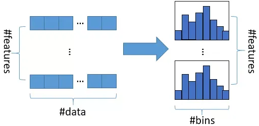
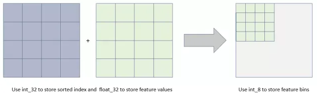
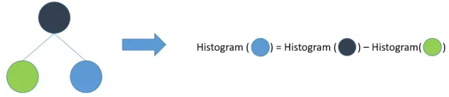
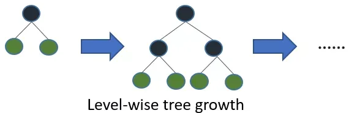
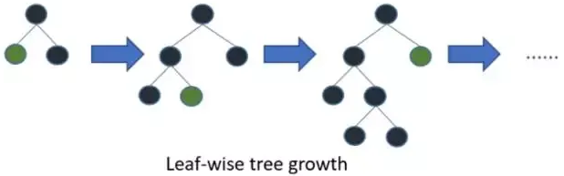
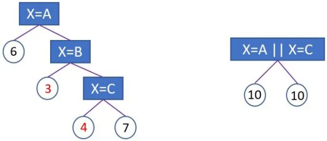
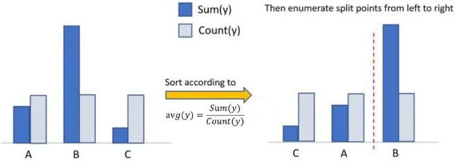
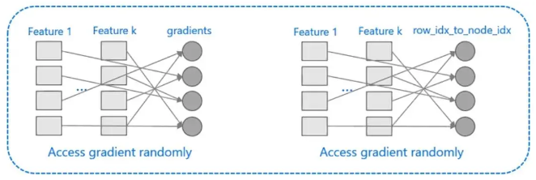
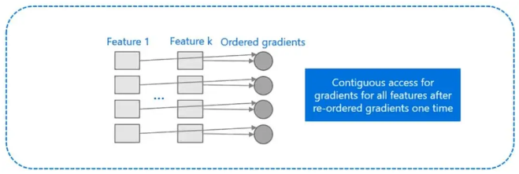

LightGBM（Light Gradient Boosting Machine）是一个实现GBDT算法的框架，支持高效率的并行训练，并且具有更快的训练速度、更低的内存消耗、更好的准确率、支持分布式可以快速处理海量数据等优点。

GBDT在每一次迭代的时候，都需要遍历整个训练数据多次。如果把整个训练数据装进内存则会限制训练数据的大小；如果不装进内存，反复地读写训练数据又会消耗非常大的时间。尤其面对工业级海量的数据，普通的GBDT算法是不能满足其需求的。LightGBM提出的主要原因就是为了解决GBDT在海量数据遇到的问题，让GBDT可以更好更快地用于工业实践。

XGBoost的思想:

首先，对所有特征都按照特征的数值进行预排序。其次，在遍历找到一个特征上的最好分割点。最后，在找到一个特征的最好分割点后，将数据分裂成左右子节点。

XGBoost的缺点: 
1. 首先，空间消耗大。这样的算法需要保存数据的特征值，还保存了特征排序的结果，这就需要消耗训练数据两倍的内存。
2. 其次，时间上也有较大的开销，在遍历每一个分割点的时候，都需要进行分裂增益的计算，消耗的代价大。
3. 最后，对cache优化不友好。在预排序后，特征对梯度的访问是一种随机访问，并且不同的特征访问的顺序不一样，无法对cache进行优化。

LightGBM的优化:

1. 基于Histogram的决策树算法。
2. 单边梯度采样 Gradient-based One-Side Sampling(GOSS)：使用GOSS可以减少大量只具有小梯度的数据实例，这样在计算信息增益的时候只利用剩下的具有高梯度的数据就可以了，相比XGBoost遍历所有特征值节省了不少时间和空间上的开销。
3. 互斥特征捆绑 Exclusive Feature Bundling(EFB)：使用EFB可以将许多互斥的特征绑定为一个特征，这样达到了降维的目的。
4. 带深度限制的Leaf-wise的叶子生长策略：大多数GBDT工具使用低效的按层生长 (level-wise) 的决策树生长策略，因为它不加区分的对待同一层的叶子，带来了很多没必要的开销。实际上很多叶子的分裂增益较低，没必要进行搜索和分裂。LightGBM使用了带有深度限制的按叶子生长 (leaf-wise) 算法。
5. 直接支持类别特征(Categorical Feature)
6. 支持高效并行
7. Cache命中率优化

## 算法优化

### 基于Histogram的决策树算法

1. 首先确定对于每一个特征需要多少个箱子（bin）并为每一个箱子分配一个整数
2. 然后将浮点数的范围均分成若干区间，区间个数与箱子个数相等，将属于该箱子的样本数据更新为箱子的值
3. 最后用直方图（#bins）表示

特征离散化具有很多优点，如存储方便、运算更快、鲁棒性强、模型更加稳定等。对于直方图算法来说最直接的有以下两个优点：
1. 内存占用更小：也就是说XGBoost需要用32位的浮点数去存储特征值，并用32位的整形去存储索引，而 LightGBM只需要用8位去存储直方图
2. 计算代价更小： 预排序算法XGBoost每遍历一个特征值就需要计算一次分裂的增益，而直方图算法LightGBM只需要计算直方图bin的个数

✨当然，Histogram算法并不是完美的。由于特征被离散化后，找到的并不是很精确的分割点，所以会对结果产生影响。但在不同的数据集上的结果表明，离散化的分割点对最终的精度影响并不是很大，甚至有时候会更好一点。原因是决策树本来就是弱模型，分割点是不是精确并不是太重要；较粗的分割点也有正则化的效果，可以有效地防止过拟合；即使单棵树的训练误差比精确分割的算法稍大，但在梯度提升（Gradient Boosting）的框架下没有太大的影响。

### 直方图做差加速

一个叶子的直方图可以由它的父亲节点的直方图与它兄弟的直方图做差得到，在速度上可以提升一倍。通常树分裂，需要遍历该叶子上的所有数据，但直方图做差仅需遍历直方图的k个桶。

### 带深度限制的 Leaf-wise 算法

抛弃了大多数GBDT工具使用的按层生长 (level-wise) 的决策树生长策略，而使用了带有深度限制的按叶子生长 (leaf-wise) 算法。

XGBoost 采用 Level-wise 的增长策略，该策略遍历一次数据可以同时分裂同一层的叶子，容易进行多线程优化，也好控制模型复杂度，不容易过拟合。但实际上Level-wise是一种低效的算法，因为它不加区分的对待同一层的叶子，实际上很多叶子的分裂增益较低，没必要进行搜索和分裂，因此带来了很多没必要的计算开销。

LightGBM采用Leaf-wise的增长策略，该策略每次从当前所有叶子中，找到分裂增益最大的一个叶子，然后分裂，如此循环。因此同Level-wise相比，Leaf-wise的优点是：在分裂次数相同的情况下，Leaf-wise可以降低更多的误差，得到更好的精度；Leaf-wise的缺点是：可能会长出比较深的决策树，产生过拟合。因此LightGBM会在Leaf-wise之上增加了一个最大深度的限制，在保证高效率的同时防止过拟合。

### 单边梯度采样算法(Gradient-based One-Side Sampling, GOSS)

GOSS算法从减少样本的角度出发，排除大部分小梯度的样本，仅用剩下的样本计算信息增益，它是一种在减少数据量和保证精度上平衡的算法。

AdaBoost中，样本权重是数据重要性的指标。然而在GBDT中没有原始样本权重，不能应用权重采样。幸运的是，我们观察到GBDT中每个数据都有不同的梯度值，对采样十分有用。即梯度小的样本，训练误差也比较小，说明数据已经被模型学习得很好了，直接想法就是丢掉这部分梯度小的数据。然而这样做会改变数据的分布，将会影响训练模型的精确度，为了避免此问题，提出了GOSS算法。

GOSS首先将要进行分裂的特征的所有取值按照绝对值大小降序排序（XGBoost一样也进行了排序，但是LightGBM不用保存排序后的结果），选取绝对值最大的$a * 100\%$个数据。然后在剩下的较小梯度数据中随机选择$b * 100\%$个数据。$b * 100\%$接着将这个数据乘以一个常数$\frac{1-a}{b}$，这样算法就会更关注训练不足的样本，而不会过多改变原数据集的分布。最后使用这$(a+b)*100\%$个数据来计算信息增益。

### 互斥特征捆绑算法

高维度的数据往往是稀疏的，这种稀疏性启发我们设计一种无损的方法来减少特征的维度。通常被捆绑的特征都是互斥的（即特征不会同时为非零值，像one-hot），这样两个特征捆绑起来才不会丢失信息。如果两个特征并不是完全互斥（部分情况下两个特征都是非零值），可以用一个指标对特征不互斥程度进行衡量，称之为冲突比率，当这个值较小时，我们可以选择把不完全互斥的两个特征捆绑，而不影响最后的精度。互斥特征捆绑算法（Exclusive Feature Bundling, EFB）指出如果将一些特征进行融合绑定，则可以降低特征数量。

## 工程优化

### 直接支持类别特征

对于决策树来说并不推荐使用 one-hot 编码，尤其当类别特征中类别个数很多的情况下，会存在以下问题：

1. 会产生样本切分不平衡问题，导致切分增益非常小（即浪费了这个特征）。使用 one-hot编码，意味着在每一个决策节点上只能使用one vs rest（例如是不是狗，是不是猫等）的切分方式。例如，动物类别切分后，会产生是否狗，是否猫等一系列特征，这一系列特征上只有少量样本为1，大量样本为0 ，这时候切分样本会产生不平衡，这意味着切分增益也会很小。较小的那个切分样本集，它占总样本的比例太小，无论增益多大，乘以该比例之后几乎可以忽略；较大的那个拆分样本集，它几乎就是原始的样本集，增益几乎为零。比较直观的理解就是不平衡的切分和不切分没有区别。

2. 会影响决策树的学习。因为就算可以对这个类别特征进行切分，独热编码也会把数据切分到很多零散的小空间上，如下图左边所示。而决策树学习时利用的是统计信息，在这些数据量小的空间上，统计信息不准确，学习效果会变差。但如果使用下图右边的切分方法，数据会被切分到两个比较大的空间，进一步的学习也会更好。下图中, 左边是进行onehot编码后分裂, 在每个类别点上都进行分裂; 右边是未进行onehot编码的分裂, 只在是否满足X=A且X=C时进行一次分裂.

LightGBM优化了对类别特征的支持，可以直接输入类别特征，不需要额外的onehot展开。LightGBM采用 many-vs-many 的切分方式将类别特征分为两个子集，实现类别特征的最优切分。假设某维特征有k个类别，则有$2^{(k-1)}-1$种可能, 时间复杂度为$O(2^k)$，LightGBM 基于 Fisher的《On Grouping For Maximum Homogeneity》论文实现了$O(klogk)$的时间复杂度。

算法流程如下图所示，在枚举分割点之前，先把直方图按照每个类别对应的label均值进行排序；然后按照排序的结果依次枚举最优分割点。从下图可以看到，$\frac{Sum(y)}{Count(y)}$为类别的均值。当然，这个方法很容易过拟合，所以LightGBM里面还增加了很多对于这个方法的约束和正则化。

在Expo数据集上的实验结果表明，相比onehot展开的方法，使用LightGBM支持的类别特征可以使训练速度加速8倍，并且精度一致。更重要的是，LightGBM是第一个直接支持类别特征的GBDT工具。

## 支持高效并行

### 特征并行
XGBoost特征并行的主要思想是不同机器在不同的特征集合上分别寻找最优的分割点，然后在机器间同步最优的分割点。这种特征并行方法有个很大的缺点：就是对数据进行垂直划分，每台机器所含数据不同，划分结果需要通过通信告知每台机器。

LightGBM 则不进行数据垂直划分，而是在每台机器上保存全部训练数据，在得到最佳划分方案后可在本地执行划分而减少了不必要的通信。具体过程如下图所示。

### 数据并行

传统的数据并行策略主要为水平划分数据，让不同的机器先在本地构造直方图，然后进行全局的合并，最后在合并的直方图上面寻找最优分割点。这种数据划分有一个很大的缺点：通讯开销过大。

LightGBM在数据并行中使用分散规约 (Reduce scatter) 把直方图合并的任务分摊到不同的机器，降低通信和计算，并利用直方图做差，进一步减少了一半的通信量。

### 投票并行

大致步骤为两步：

1. 本地找出 Top K 特征，并基于投票筛选出可能是最优分割点的特征；
2. 合并时只合并每个机器选出来的特征

### Cache命中率优化

XGBoost对cache优化不友好，如下图所示。在预排序后，特征对梯度的访问是一种随机访问，并且不同的特征访问的顺序不一样，无法对cache进行优化。同时，在每一层长树的时候，需要随机访问一个行索引到叶子索引的数组，并且不同特征访问的顺序也不一样，也会造成较大的cache miss。

而 LightGBM 所使用直方图算法对 Cache 天生友好：

1. 首先，所有的特征都采用相同的方式获得梯度（区别于XGBoost的不同特征通过不同的索引获得梯度），只需要对梯度进行排序并可实现连续访问，大大提高了缓存命中率；
2. 其次，因为不需要存储行索引到叶子索引的数组，降低了存储消耗，而且也不存在 Cache Miss的问题。

## 参考
1. https://cloud.tencent.com/developer/article/1651704
2. https://mp.weixin.qq.com/s/zejkifZnYXAfgTRrkMaEww
3. https://www.wangqu.work/blog/LightGBM.html

