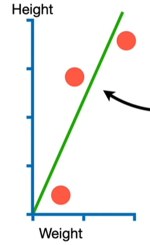
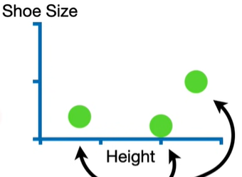
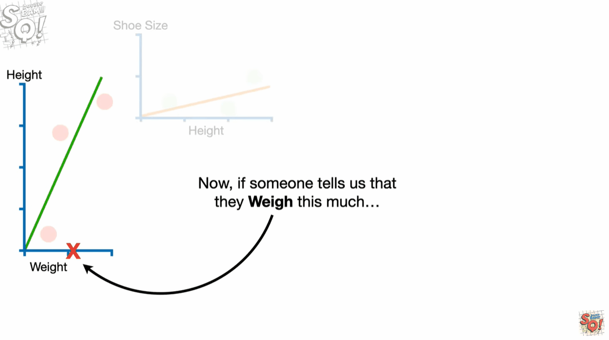

# chainrule

Imagine we collected weight and height measurements from 3 people, and we a fit line to the data.

Imagine we collected height and shoe size measurements, and we fit a line to the data.

Now, if someone tells us weight, then we can predict their height and we can use the predicted height to predict shoe size.And if we change the value for weight, we see a change in shoe size.

Now let's focus on this green line that represents the relationship between weight and height.We see that for every 1 unit increase in weight, there is a 2 unit increase in height.In other words the slope of the line is $\frac{2}{1} = 2$. And since the slope is 2, the derivative, the change in height with respect to a change in weight is 2.
$$ \frac{dHeight}{dWeight}=2 $$
The equation for height is:
$$Height = \frac{dHeight}{dWeight} \times Weight$$

Now let's focus on the orange line that represents re relationship between height and shoe size.In this case, we see that for every 1 unit increase in height there is a 1/4 unit increase in shoe size.The slope is $\frac{1/4}{1}=\frac{1}{4}$. Since the slope is 1/4, the derivative with respect to a change in height is 1/4.
$$\frac{dSize}{dHeight} = \frac{1}{4}$$
the equation for shoe size is:
$$ShoeSize = \frac{dSizze}{dHeight} \times Height = \frac{1}{4} \times Height $$

Now because Weight can predict Height, and Height can preditc shoe size, we can plug the equation for height into the equation for shoe size.
$$ShoeSize=\frac{dSize}{dHeight} \times \frac{dHeight}{dWeight} \time weight$$

Now if we want to determine exactly how shoe size changes with respect to changes in weight, we take the derivative of shoe size with respect to weight.
$$\frac{dSize}{dWeight}$$
And the derivative of the equation for shoe size, with respect to weight is just the product of the two derivatives.
$$\frac{dSize}{dWeight} = \frac{dSzie}{dHeight} \times \frac{dHeight}{dWeight}$$
This relationshipe is the essence of the chain rule
$$\frac{dSize}{dWeight} = \frac{dSzie}{dHeight} \times \frac{dHeight}{dWeight}=\frac{1}{4} \times 2 = \frac{1}{2}$$
And that means that for every 1 unit increase in weight, there is a 1/2 unit increase in shoe size.

refs:
https://www.youtube.com/watch?v=wl1myxrtQHQ&list=PLblh5JKOoLUIxGDQs4LFFD--41Vzf-ME1&index=2