# forward

we're going to use this super simple dataset and show how this neural network creates this green squiggle.
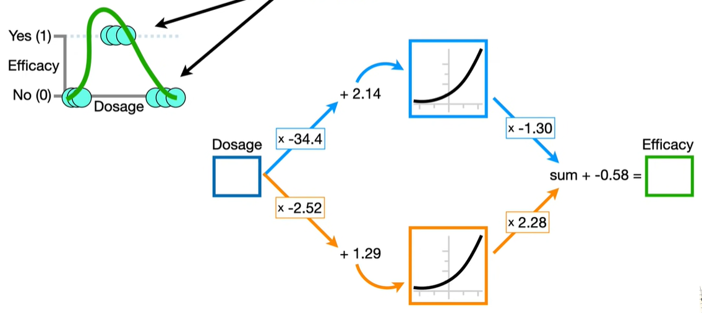
let's just talk about what neural network is.
A neural network consists of nodes
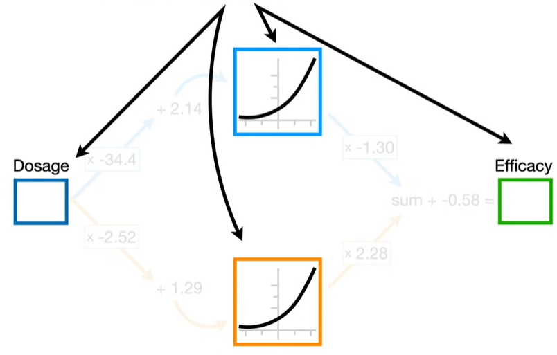
and connections between the nodes
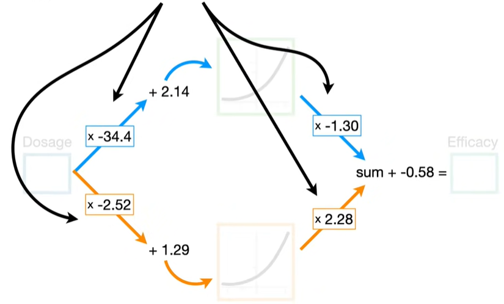
NOTE: there are many common bent or curved lines(softplus,Rectified Linear Unit,sigmoid) that we can choose for a neural network.The curved or bent lines are called activation functions.So we'll use softplus activation function.
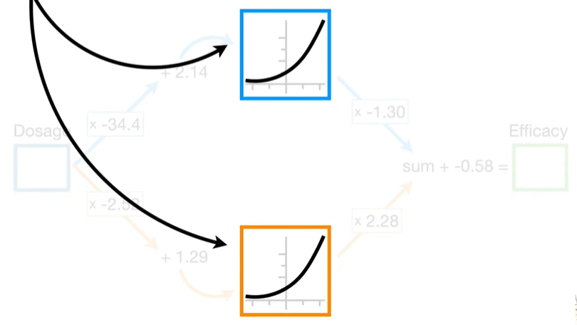
NOTE: this specific neural network is about as simple as they get.It only has 1 input node where we plug in the dosage only 1 output node to tell us the predicted effectiveness and only 2 nodes between the input and output nodes.in this network only has 1 hidden layer with 2 nodes.

NOTE:To keep the math simple, let's assume dosages go from 0(low) to 1(high).

The first thing we are going to do is plug the lowest dosage 0, into the neural network.

## connection
Now to get from the input node to the top node in the hidden layer this connection multiplies the dosage by -34.4 and then adds 2.14 and the result is an x-axis coordinate for the activation function.
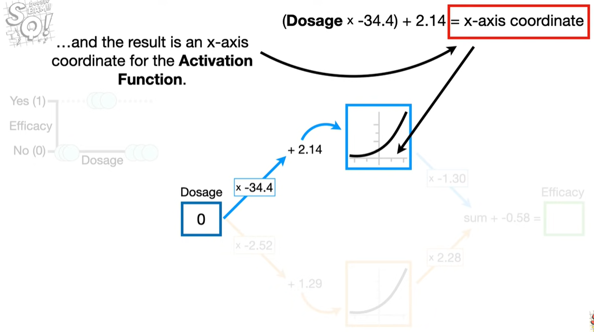
$$l(x) =  w \times -34.4 + 2.14$$
we plug $dosage = 0$ in:
$$l(0) =  (0 \times -34.4) + 2.14 = 2.14 $$

To get the corresponding y-axis value we plug 2.14 into the activation function(softplus function)
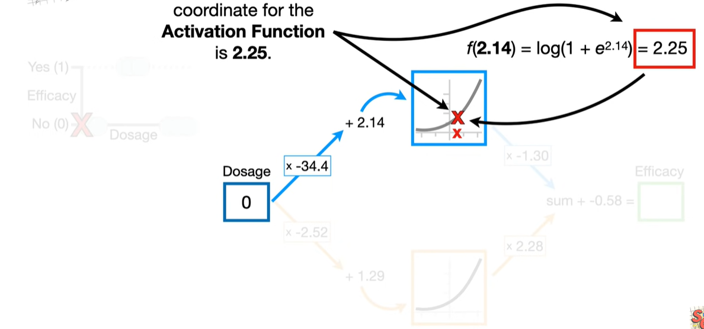
$$ f(x)=log(1+e^x) $$
$$ f(2.14)=log(1+e^{2.14}) = 2.25 $$
NOTE:In statistics, machine learning and most programming languages, $log()$ implies the natural log(ln), or the log base e.
put the result(2.25) as a blue dot for when dosage = 0.
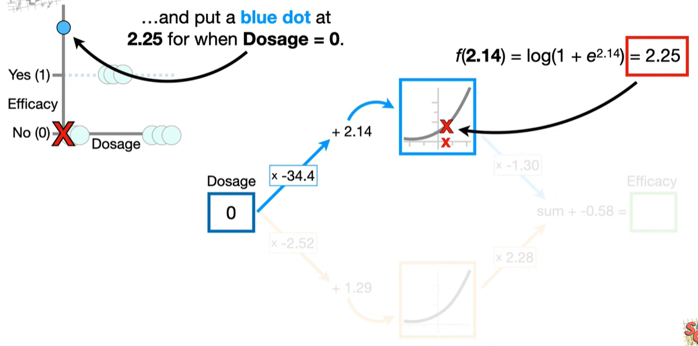
And if we continue to increase the dosage values all the way to 1, we get this blue curve.
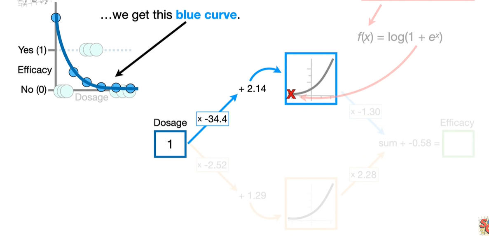

Now we scale the y-axis values for the blue curve by -1.30. For example, when dosage = 0, the current y-axis coordinate for the blue curve is 2.25. So we multiply 2.25 by -1.30 and get -2.93 and -2.93 corresponds to this position on the y-axis.
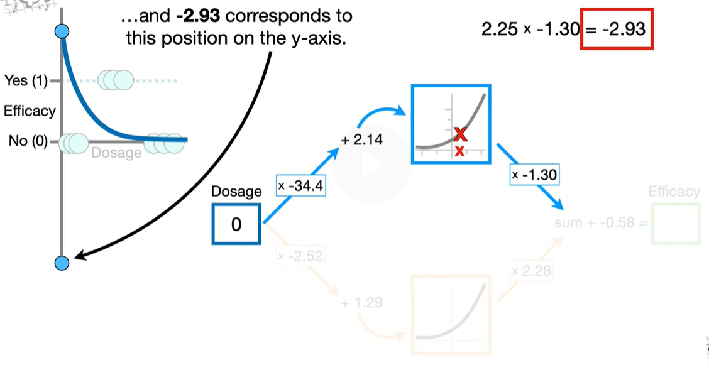

Likewise, we multiply all of the other y-axis coordinates on the blue curve by -1.30 and end up with new blue curve.
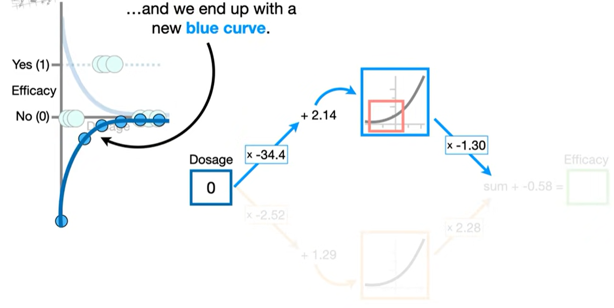

Now, let's focus on the connection from the input node to the bottom node in the hidden layer.just like before, we scale the y-axis coordinates on the orange curve.
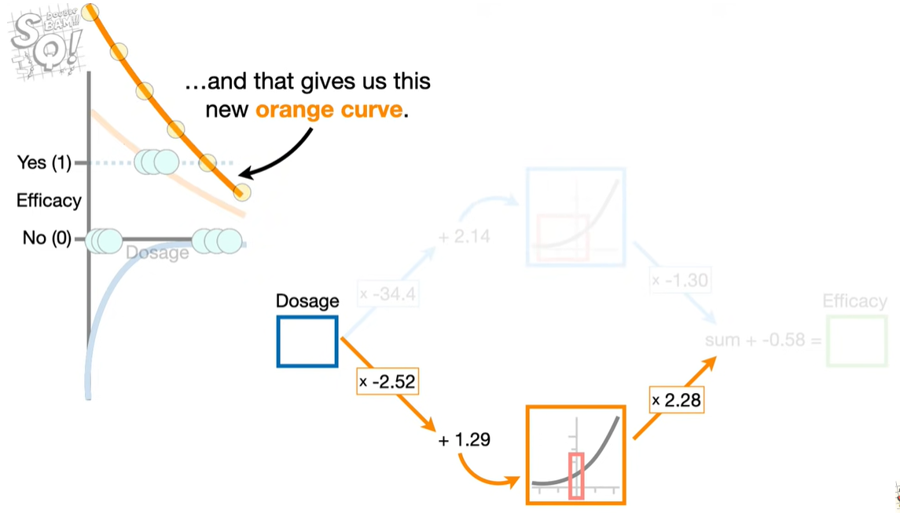

Now the neural network tells us to add the y-axis coordinates from the blue curve to the orange curve and that gives us the green squiggle.
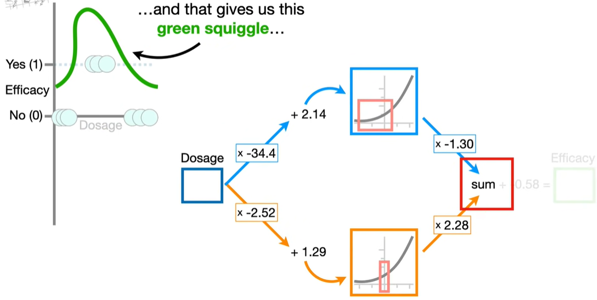

then finally, we subtract 0.58 from the y-axis values on the green squiggle and we have a green squiggle that fits the data.
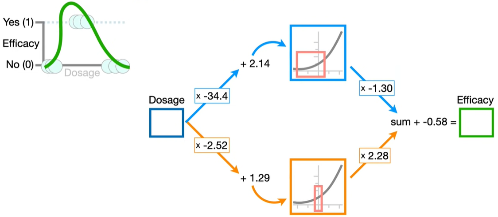

## why neural network
The reason is that way back in the 1940s and 50s when neural networks were invented, they thought the nodes were vaguely like neurons
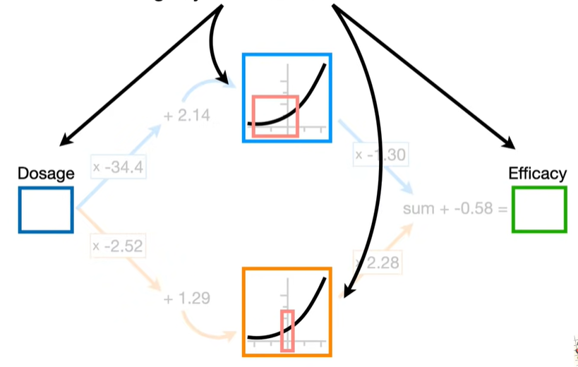
and the connections between the nodes were sort of like synapses.
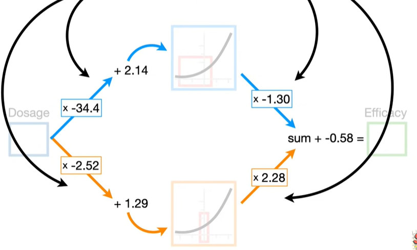

