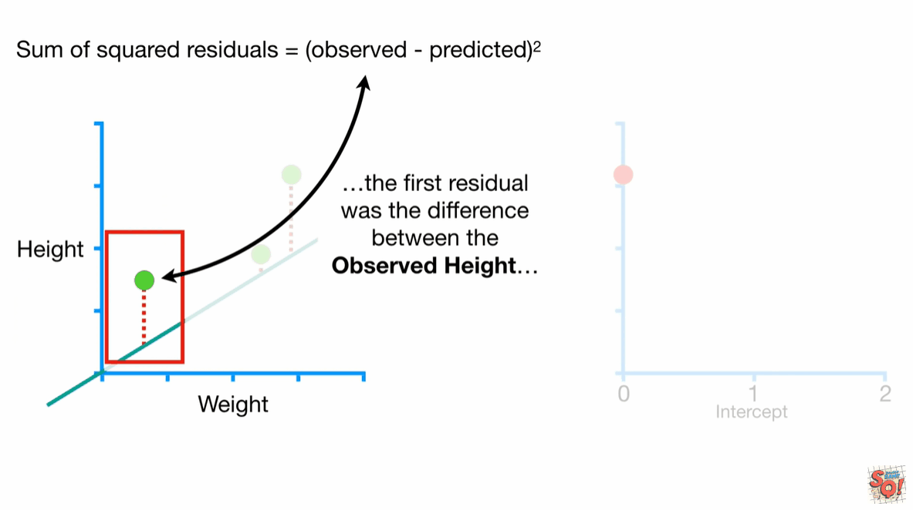
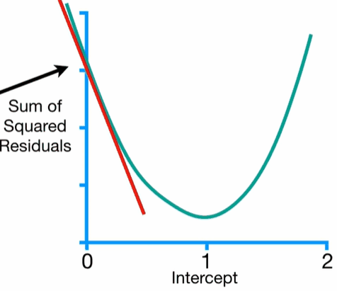
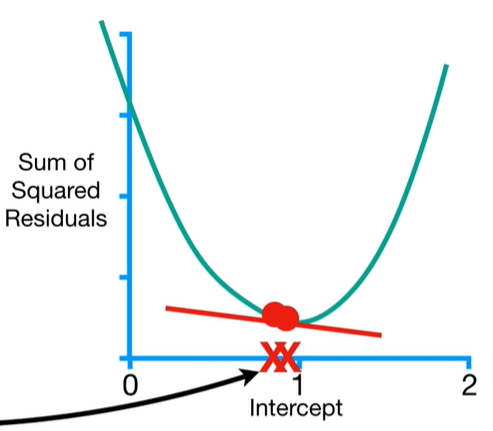
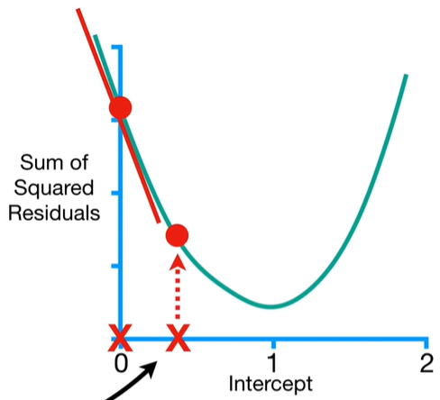
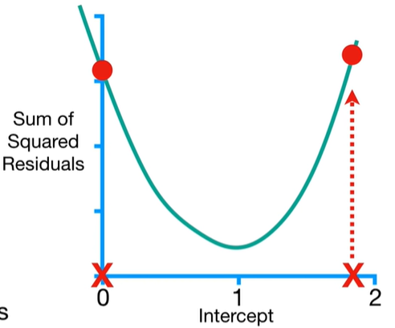
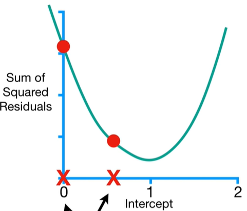
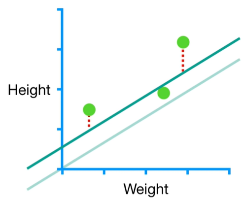
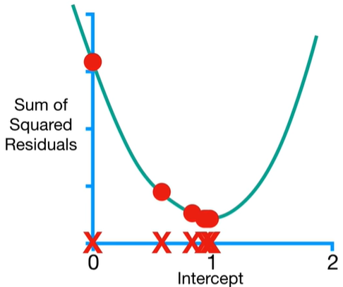

# gradientDescent

$$Predicted Height = intercept + slope x weight$$

let's learn how gradient descent can fit a line to data by finding the optimal values for the intercept and the slope.we'll start by using gradient descent to find the intercept.So for now, let's just plug in the least squares estimate for the slope, 0.64.
$$Predicted Height = intercept + 0.64 x weight$$
The first thing we do is pick a random value for intercept.In this case, we'll use 0, but any number will do.
$$Predicted Height = 0 + 0.64 x weight$$
In this example, we will evaluate how well this line fits the data with the sum of the squared residuals.In machinelearn lingo, the sum of the squared residuals is a type of loss function.

When we calculated the sum of the squared residuals, the first residual is the difference between the observed height,1.4,and the predicted height which came from the equation for this line so we replace predicted height with the equation for the line.Since this individual weights 0.5,we replace weight with 0.5.Then we can calculate second...

$$ SumOfSquaredResiduals = (1.4-(intercept + 0.64 \times 0.5))^2 $$
$$(1.9-(intercept + 0.64 \times 2.3))^2 $$
$$(3.2-(intercept + 0.64 \times 2.9))^2 $$

Thus, we now have an equation for this curve and we can take the derivative of this function and determine the slope at any value for the intercept.

$$ \frac{d}{d intercept}SumOfSquaredResiduals = \frac{d}{d intercept}(1.4-(intercept + 0.64 \times 0.5))^2 $$
$$+\frac{d}{d intercept}(1.9-(intercept + 0.64 \times 2.3))^2 $$
$$+\frac{d}{d intercept}(3.2-(intercept + 0.64 \times 2.9))^2 $$

$$ \frac{d}{d intercept}SumOfSquaredResiduals = -2(1.4-(intercept + 0.64 \times 0.5)) $$
$$+-2(1.9-(intercept + 0.64 \times 2.3)) $$
$$+-2(3.2-(intercept + 0.64 \times 2.9)) $$

NOTE:If we use least squares to solve for the optimal value for the intercept, we would simply find where the slope of the curve = 0.
In contrast, gradient descent finds the minimums value by taking steps from an initial guess until it reaches the best value.This makes gradient decent very useful when it is not possible to solve for where the derivative = 0 and this is why gradient descent can be used in so many different situations.

Remember, we start by setting the intercept to a random number,0.So we plug 0 into the derivative and we get -5.7.

$$ \frac{d}{d intercept}SumOfSquaredResiduals = -2(1.4-(0 + 0.64 \times 0.5)) $$
$$+-2(1.9-(0 + 0.64 \times 2.3)) $$
$$+-2(3.2-(0 + 0.64 \times 2.9)) $$
$$= -5.7 $$
So when the intercept = 0, the slope of the curve = -5.7.
NOTE:The closer we get to the optimal value for the intercept, the closer the slope of the curve gets to 0.This means that when the slope of the curve is close to 0, then we should take baby steps, because we are close to the optimal value.

and when the slope is far from 0, then we should take big steps, because we are far from the optimal value.

However,if we take a super huge step,then we would increase the sum of the squared residuals.

Gradient descent determines the step size by multiplying the slope by a small number called the learning rate.When the intercept = 0, the step size = -0.57.
$$StepSize=-5.7 \times 0.1 = -0.57 $$
With the step size we can calculate a new intercept.

$$NewIntercept =OldIntercept -StepSize = 0-(-0.57)=0.57   $$
we move much closer to the optimal value for the intercept.

Going back to the original data and the original line, with the intercept = 0, we can see how much the residuals shrink when the intercept = 0.57.

Then we can going on...Notice how each step gets smaller and smaller the closer we get to the bottom of the curve.
After 6 steps, the gradient decent estimate for the intercept is 0.95. The leaste squares estimate for the intercept is also 0.95.

ref:
https://www.youtube.com/watch?v=sDv4f4s2SB8