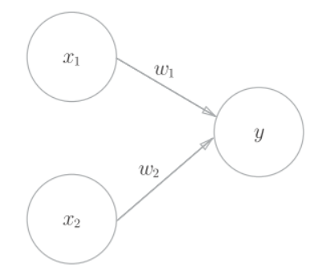
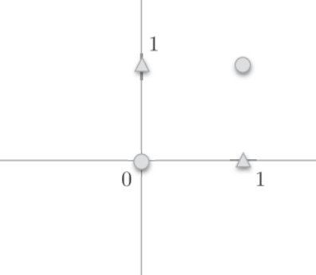
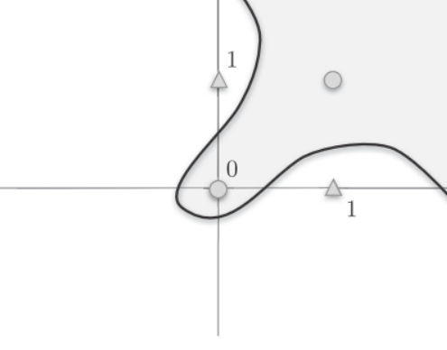
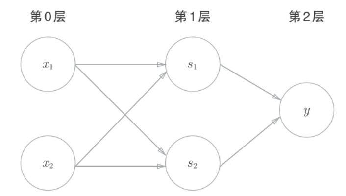

# perceptron


感知机的输入和输出信号只有个1/0两种取值.
$$
y=\begin{cases} 
1 &(w_1x_1,w_2x_2 \leq \theta) \\
0 &(w_1x_1,w_2x_2 > \theta)
\end{cases}
$$
$x_1,x_2$是输入信号, $y$是输出信号, $w_1,w_2$是权重.○是神经元. 输入信号在神经元内与权重相乘$(w_1x_1,w_2x_2)$,权重越大, 对应信号的重要性越高.
之后计算总和, 当超过某个阈值$\theta$时, 输出1, 这时称神经元被激活.



## 简单逻辑电路

### 与门(AND gate)
与门是两个输入一个输出的门电路, 在两个输入均为1时, 输出1, 其他时候输出0.

$x_1$|$x_2$|$y$
--|--|--
0|0|0
1|0|0
0|1|0
1|1|1

当设置$(w_1,w_2,\theta)=(0.5,0.5,0.7)$时, 可以实现与门. 此外$(0.5,0.5,0.8)\&(1,1,1)$都能满足与门的设定.
### 与非门(NAND gate)
NAND是Not AND, 就是颠倒了与门的输出
$x_1$|$x_2$|$y$
--|--|--
0|0|1
1|0|1
0|1|1
1|1|0

可以用$(w_1,w_2,\theta)=(-0.5,-0.5,-0.5)$这样的组合

### 或门(OR gate)
或门是只要有一个输入信号是1, 输出就为1
$x_1$|$x_2$|$y$
--|--|--
0|0|0
1|0|1
0|1|1
1|1|1


#### python实现与门:
```python
import numpy as np


def AND(x1, x2):
    w1, w2, theta = 0.5, 0.5, 0.7
    tmp = x1*w1 + x2*w2
    if tmp <= theta:
        return 0
    elif tmp > theta:
        return 1

if __name__ == '__main__':
    for xs in [(0, 0), (1, 0), (0, 1), (1, 1)]:
        y = AND(xs[0], xs[1])
        print(str(xs) + " -> " + str(y))

## (0, 0) -> 0
## (1, 0) -> 0
## (0, 1) -> 0
## (1, 1) -> 1

```


我们将$\theta$换成$b$, 于是可得:
$$
y=\begin{cases} 
0 &(b+w_1x_1+w_2x_2 \leq 0) \\
1 &(b+w_1x_1+w_2x_2 > 0)
\end{cases}
$$
虽然有符号不同, 但是两个重视表达的内容是完全相同的. $b$被称为偏置,$w_1,w_2$被称为权重, 感知机计算输入信号和权重的乘积, 然后加上偏置, 如果这个值大于0则输出1, 否则输出0.
python实现:
```python
import numpy as np


def AND(x1, x2):
    x = np.array([x1, x2])
    w = np.array([0.5, 0.5])
    b = -0.7
    tmp = np.sum(w*x) + b
    if tmp <= 0:
        return 0
    else:
        return 1
```

偏置和权重的作用是不一样的:
- 权重($w_1,w_2$)是控制输入信号重要性的参数
- 偏置($b$)是调整神经元被激活容易程度的参数, 若$b$为-0.1, 则输入信号的加权总和超过0.1, 神经元就会被激活.


### 异或门(XOR gate)
异或门是仅当$x_1,x_2$一方为1时, 输出为1.

$x_1$|$x_2$|$y$
--|--|--
0|0|0
1|0|1
0|1|1
1|1|0
我们无法通过简单的$(w_1,w_2,b)$设置来实现异或门.
如下图, 我们无法将○和△使用一条直线分开:


○和△无法用一条直线分开，但是如果将“直线”这个限制条件去掉，就可以实现了.

曲线分割而成的空间称为**非线性空间**，由直线分割而成的空间称为**线性空间**.

#### 异或门的实现
感知机可以通过叠加实现异或门

$x_1$|$x_2$|$s_1$|$s_2$|$y$
--|--|--|--|--
0|0|1|0|0
1|0|1|1|1
0|1|1|1|1
1|1|0|1|0

1. 先通过`NAND`计算$s_1$
2. 再通过`OR`计算$s_2$
3. 最后通过`AND`计算$y$

```python
def XOR(x1, x2):
    s1 = NAND(x1, x2)
    s2 = OR(x1, x2)
    y = AND(s1, s2)
    return y
```


