# propagation


## 计算图

苹果单价100元, 买2个, 消费税是10%, 计算支付金额.
计算公式为:`100*2*(1+0.1)=100*2*1.1`

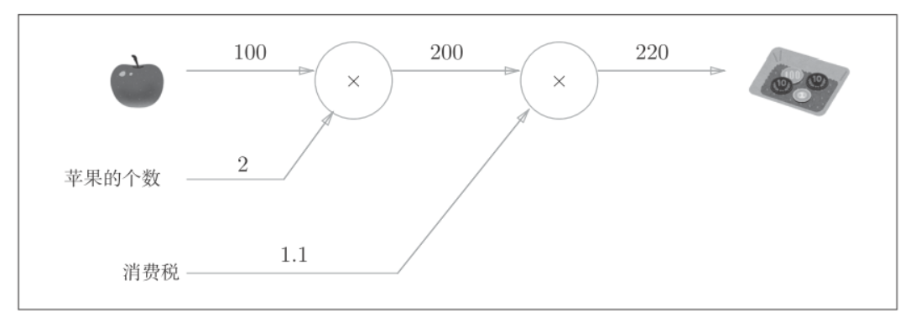

苹果价格上涨, 会在多大程度上影响最终的支付金额, 即求支付金额关于苹果的价格的导数. 设苹果的价格为$x$, 支付金额为$L$, 则相当于求$\frac{\partial L}{\partial x}$, 这个导数的值表示当苹果的价格稍微上涨时, 支付金额会增加多少.

支付金额关于苹果的价格的导数的值, 可以通过计算图的反向传播来求, 如下图:
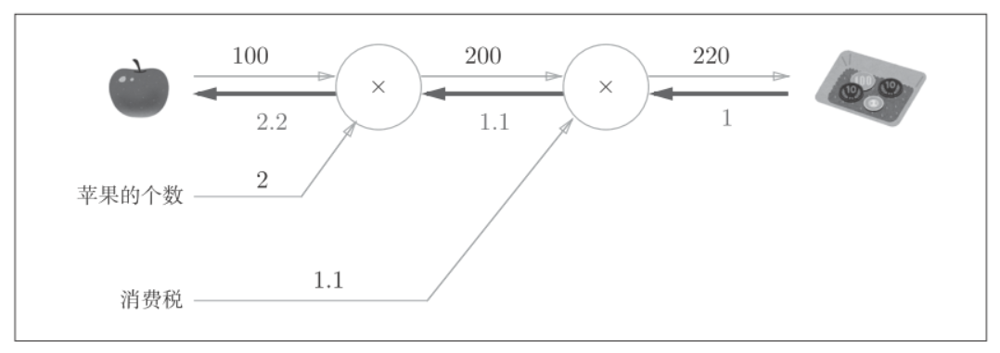
反向传播使用与正方向相反的箭头表示, 反向传播传递"局部导数", 将导数值写在箭头下方. 在这个例子中, 反向传播从右向左传递导数的值(1->1.1->2.2), 从这个结果中可知, 支付金额关于苹果价格的导数的值是2.2. 意味着, 如果苹果的价格上涨1元, 最终的支付金额会增加2.2元, 严格的说, 如果苹果的价格增加某个微小的值, 则最终的支付金额将增加那个微小值的2.2倍.


## 链式法则(chain rule)
反向传播的原理是链式法则.

### 计算图的反向传播
假设存在$y=f(x)$的计算:
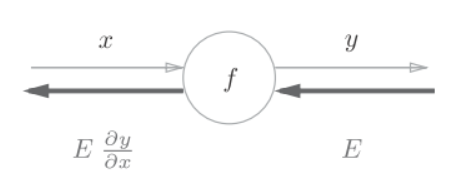
反向传播的计算顺序是将信号E乘以节点的局部导数$\frac{\partial y}{\partial x}$, 然后将结果传递给下一个节点. 这里的局部导数就是正向传播$y=f(x)$的导数, 也就是y关于x的导数$\frac{\partial y}{\partial x}$. 比如, 假设$y=f(x)=x^2$, 则局部导数就是$\frac{\partial y}{\partial x}=2x$. 把这个局部导数,乘以上层传过来的值(本例中为E), 然后传递给前面的节点.

### 链式法则
复合函数是由多个函数构成的函数, 比如$z=(x+y)^2$是由$z=t^2, t= x+y$两个式子构成的, 链式法则是关于符合函数的导数的性质, 定义为:
如果某个函数由复合函数表示, 则该复合函数的导数可以用构成复合函数的各个函数的导数的成绩表示.
像上面的例子: $\frac{\partial z}{\partial x}$(z关于x的导数)可以用$\frac{\partial z}{\partial t}$(z关于t的导数)和$\frac{\partial t}{\partial x}$的乘积.
$$\frac{\partial z}{\partial x}=\frac{\partial z}{\partial t}\frac{\partial t}{\partial x}$$
其中等式左边, 就是等式右边$\partial t$抵消后的结果.
用链式法则求上面公式的导数$\frac{\partial z}{\partial x}$, 需要先求局部导数(偏导数):
$$\frac{\partial z}{\partial t}=2t$$
$$\frac{\partial t}{\partial x}=1$$
最终可得
$$\frac{\partial z}{\partial x}=\frac{\partial z}{\partial t}\frac{\partial t}{\partial x}=2t\cdot 1=2(x+y)$$


### 链式法则和计算图
用`**2`节点表示平方运算, 将上式表示为计算图.
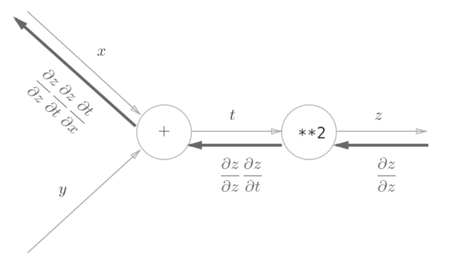
反向传播的计算顺序是, 先将节点的输入信号乘以节点的局部导数, 然后再传递给下一个节点. 比如, 反向传播时, `**2`节点的输入是$\frac{\partial z}{\partial z}$, 将其乘以局部导数$\frac{\partial z}{\partial t}$(因为正向传播时输入是t, 输出是z, 所以这个节点的局部导数是$\frac{\partial z}{\partial t}$), 然后传递给下一个节点.
反向传播最开始的信号$\frac{\partial z}{\partial z}$在前面的数学公式中没有出现, 是因为$\frac{\partial z}{\partial z}=1$, 在刚才对策式子中被省略了.
计算后的结果如图:
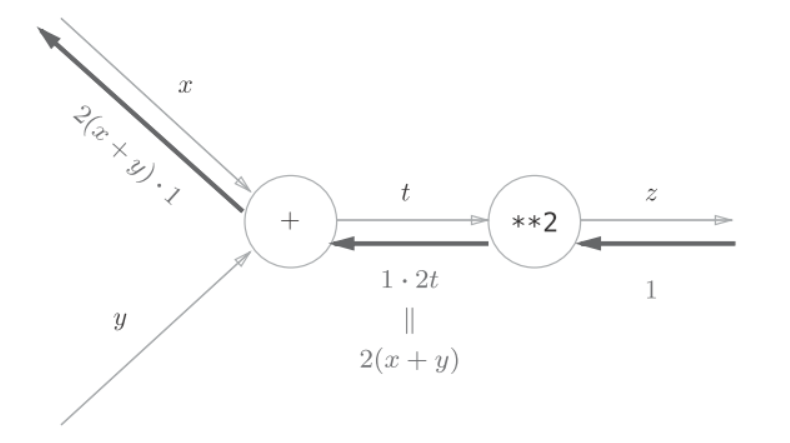


### 加法节点的反向传播
以$z=x+y$为例, 它的导数为:
$\frac{\partial z}{\partial x}=1$
$\frac{\partial z}{\partial y}=1$

反向传播将从上游传过来的导数($\frac{\partial L}{\partial z}$)乘以1, 然后向下游传播, 因为加法节点的反向传播只乘以1, 所以输入的值会原封不动的流向下一个节点.

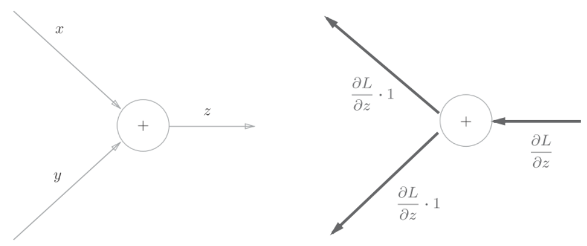
看一个具体的例子, 比如`10+5=15`, 反向传播时, 上游传来值1.3:
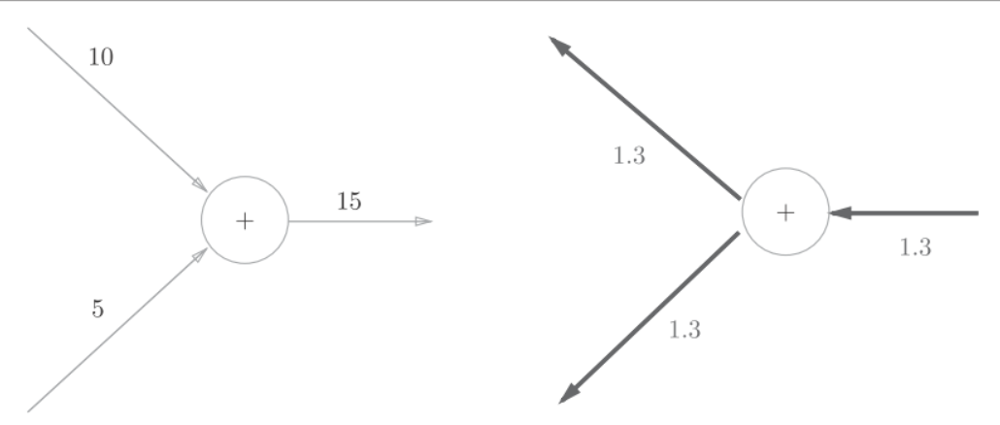


### 乘法节点的反向传播
以$z=xy$为例, 它的导数为:
$\frac{\partial z}{\partial x}=y$
$\frac{\partial z}{\partial y}=x$
乘法的反向传播将上游的值乘以正向传播时的输入信号另一个因子. 比如, 正向传播时信号是x的话, 反向传播时则是y; 正向传播时信号是y的话, 反向传播时则是x.
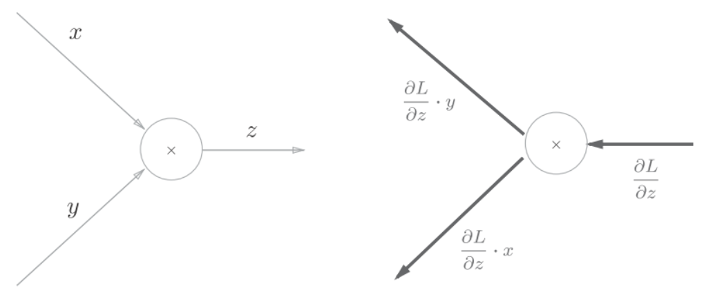
看一个具体的例子, 有`10*5=50`, 反向传播时, 从上游传来值1.3:
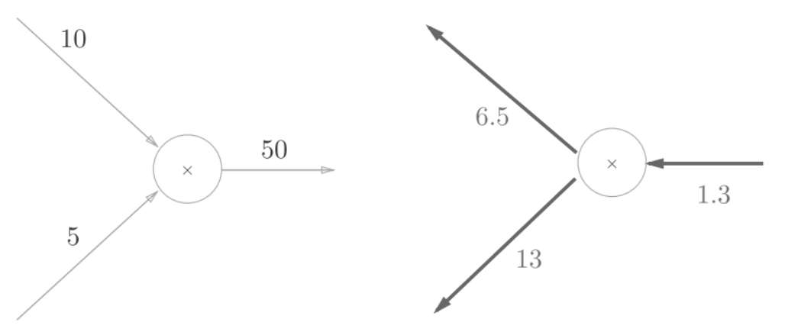
因为乘法的反向传播会乘以输入信号的另外一个因子, 所以可以按`1.3*5=6.5`和`1.3*10=13`计算.
加法的反向传播只是将上游的值传给下游, 并不需要正向传播的输入信号. 但是乘法的反向传播需要正向传播时的输入信号值. 因此, 实现乘法节点的反向传播时, 要保存正向传播的输入信号.


### 苹果的例子
要理解苹果的价格, 个数, 消费税3个变量各自如何影响最终支付的金额. 这个问题相当于:
1. 支付金额关于苹果的价格的导数
2. 支付金额关于苹果的个数的导数
3. 支付金额关于苹果的消费税的导数
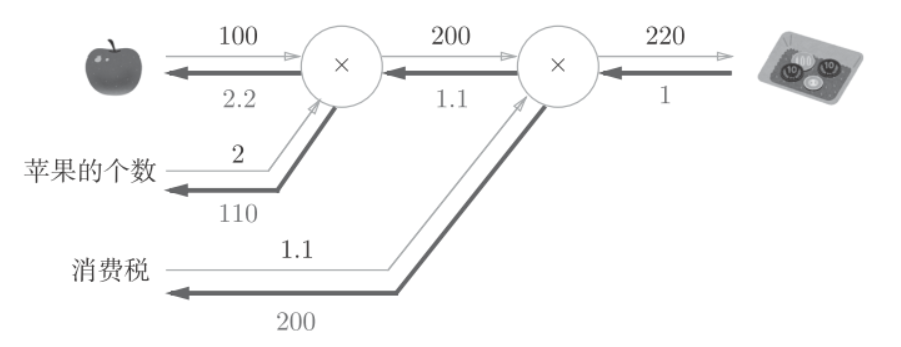
1. 苹果价格的导数是2.2
2. 苹果个数的导数是110
3. 消费税的导数是200


### python实现

#### 乘法层(MulLayer)
```python
class MulLayer:
    def __init__(self):
        self.x = None
        self.y = None
    def forward(self, x, y):
        self.x = x
        self.y = y
        out = x * y
        return out
    def backward(self, dout):
        dx = dout * self.y # 翻转x和y
        dy = dout * self.x
        return dx, dy
```
`__init__()`会初始化变量x和y, 既正向传播的输入值.
`forward()`接收x和y两个参数, 将它们相乘后输出.
`backward()`将从上游传来的导数`dout`乘以正向传播的另一个因子, 然后传递给下游

正向传播, 具体例子:
```python
apple = 100
apple_num = 2
tax = 1.1
## layer
mul_apple_layer = MulLayer()
mul_tax_layer = MulLayer()
## forward
apple_price = mul_apple_layer.forward(apple, apple_num)
price = mul_tax_layer.forward(apple_price, tax)
print(price) # 220
```

反向传播, 具体例子:
```python
## backward
dprice = 1
dapple_price, dtax = mul_tax_layer.backward(dprice)
dapple, dapple_num = mul_apple_layer.backward(dapple_price)
print(dapple, dapple_num, dtax) # 2.2 110 200
```


#### 加法层(AddLayer)
```python
class AddLayer:
    def __init__(self):
        pass
    def forward(self, x, y):
        out = x + y
        return out
    def backward(self, dout):
        dx = dout * 1
        dy = dout * 1
        return dx, dy
```
` __init__()`加法层不需要输入信号, 所以什么也没运行
`forward()`接受x和y两个参数, 将它们相加后输出
`backward()`将上游传来的导数`dout`原封不动的传递给下游


#### 结合加法层和乘法层
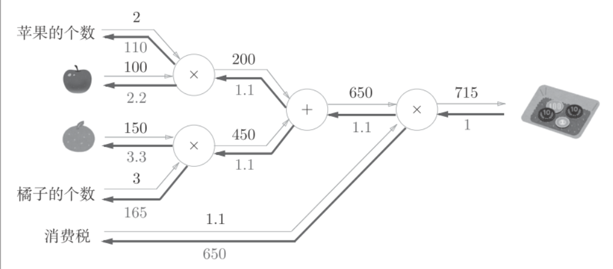

```python
apple = 100
apple_num = 2
orange = 150
orange_num = 3
tax = 1.1
## layer
mul_apple_layer = MulLayer()
mul_orange_layer = MulLayer()
add_apple_orange_layer = AddLayer()
mul_tax_layer = MulLayer()
## forward
apple_price = mul_apple_layer.forward(apple, apple_num) #(1)
orange_price = mul_orange_layer.forward(orange, orange_num) #(2)
all_price = add_apple_orange_layer.forward(apple_price, orange_price) #(3)
price = mul_tax_layer.forward(all_price, tax) #(4)
## backward
dprice = 1
dall_price, dtax = mul_tax_layer.backward(dprice) #(4)
dapple_price, dorange_price = add_apple_orange_layer.backward(dall_price) #(3)
dorange, dorange_num = mul_orange_layer.backward(dorange_price) #(2)
dapple, dapple_num = mul_apple_layer.backward(dapple_price) #(1)
print(price) # 715
print(dapple_num, dapple, dorange, dorange_num, dtax) # 110 2.2 3.3 165 650
```

### 激活函数层

#### ReLU层
激活层函数ReLU（Rectified Linear Unit）表示:
$$
y=
\begin{cases}
x, & (x>0) \\
0, & (x \leq 0)
\end{cases}
$$

可以求出$y$关于$x$的导数:
$$
\frac{\partial y}{\partial x}=
\begin{cases}
1, & (x>0) \\
0, & (x \leq 0)
\end{cases}
$$

如果正向传播时的输入x大于0, 反向传播会将上游的 值原封不动的传给下游. 反过来, 如果正向传播时的x小于等于0, 则反向传播中传给下游的信号将停在此处.

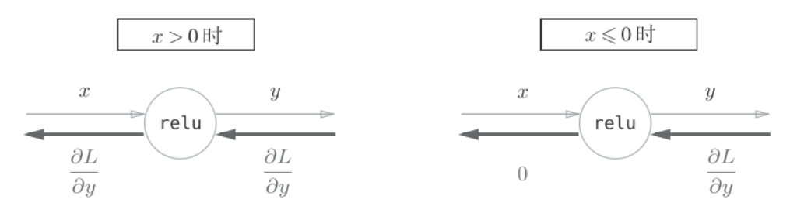

```python
class Relu:
    def __init__(self):
        self.mask = None
    def forward(self, x):
        self.mask = (x <= 0)
        out = x.copy()
        out[self.mask] = 0
        return out
    def backward(self, dout):
        dout[self.mask] = 0
        dx = dout
        return dx
```
`mask`变量是由True/False组成的Numpy数组, 它会把正向传播时的输入x的元组中小于等于0的地方保存为True, 大于0的元素保存为False.
如果正向传播时的输入值小于等于0, 则反向传播的值为0. 因此反向传播中会使用正向传播时保存的mask, 将从上游传来的dout的mask中的元素为True的地方设为0.
ReLU层的作用就像电路中的开关一样. 正向传播时, 有电流通过的话, 将开关设为ON; 没有电流通过的话, 就像开关设为OFF. 反向传播时, 开关为ON的话, 电流会直接通过; 开关为OFF的话, 则不会有电流.


#### Sigmoid层
$$y=\frac{1}{1+exp(-x)}$$
用计算图表示如下:
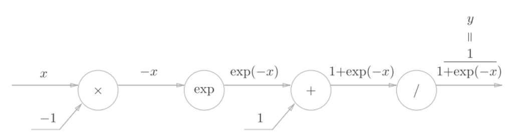

分析反向传播的流程:
1. 步骤1
`/`节点表示$y=\frac{1}{x}$, 导数可以解析性的表示为:
$$\frac{\partial y}{\partial x}=-\frac{1}{x^2}=-y^2$$
反向传播时, 会将上游的值乘以$-y^2$(正向传播的输出的平方乘以-1后的值)后,再传给下游, 计算图如下所示:

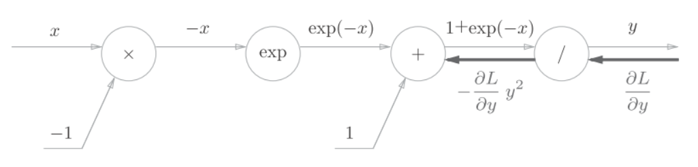


2. 步骤2
`+`节点将上游的值原封不动地传给下游

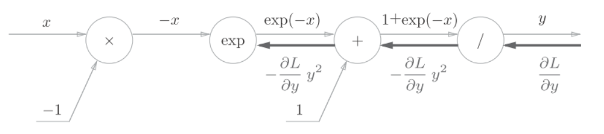

3. 步骤3
`exp`节点表示`y=exp(x)`, 它的导数为$\frac{\partial y}{\partial x}=exp(x)$

计算图中, 上游的值乘以正向传播时的输出(这个例子中是`exp(-x)`)后, 再传给下游:

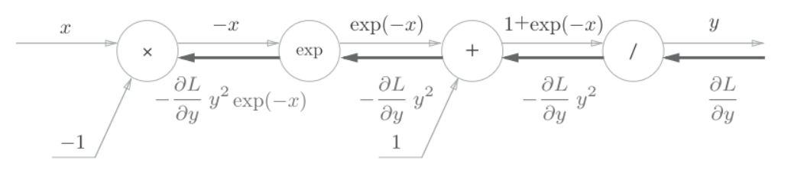

4. 步骤4
`x`节点将正向传播时的值反转后, 做乘法运算, 因此乘以-1

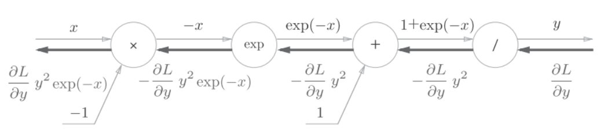

结合上述步骤有:

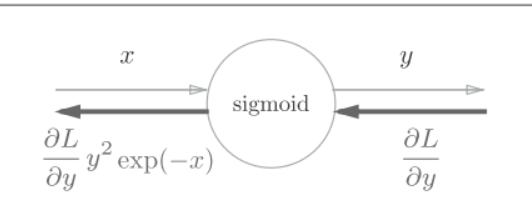

而进一步可以将上述的结果转换为:
$$
\begin{split} 
\frac{\partial L}{\partial y}y^2exp(-x)&=\frac{\partial L}{\partial y}\frac{1}{(1+exp(-x))^2}exp(-x) \\ 
&=\frac{\partial L}{\partial y}\frac{1}{1+exp(-x)}\frac{exp(-x)}{1+exp(-x)}\\ 
&=\frac{\partial L}{\partial y}y(1-y)\\ 
\end{split}
$$

上述公式可以简化为:


python实现Sigmoind层:

```python
class Sigmoid:
    def __init__(self):
        self.out = None
    def forward(self, x):
        out = 1 / (1 + np.exp(-x))
        self.out = out
        return out
    def backward(self, dout):
        dx = dout * (1.0 - self.out) * self.out
        return dx
```


### Affine/Softmax层的实现

### Affine层实现
affine层可以表示为$X \cdot W + B = Y$.

$X,W,B$分别是形状为$(2,),(2,3),(3,)的多维数组$. $Y$经过激活函数转换后传入下一层

affine层计算图:


python实现affine层:
```python
X = np.random.rand(2)   # 输入
W = np.random.rand(2,3) # 权重
B = np.random.rand(3)   # 偏置
X.shape # (2,)
W.shape # (2, 3)
B.shape # (3,)
Y = np.dot(X, W) + B
```

以矩阵为对象的反向 传播, 按element-wise计算时, 和以标量为对象的计算相同. 但可以使用矩阵运算来求导:

$$\frac{\partial L}{\partial X}=\frac{\partial L}{\partial Y}\cdot W^T$$
$$\frac{\partial L}{\partial W}=X^T \cdot \frac{\partial L}{\partial Y}$$

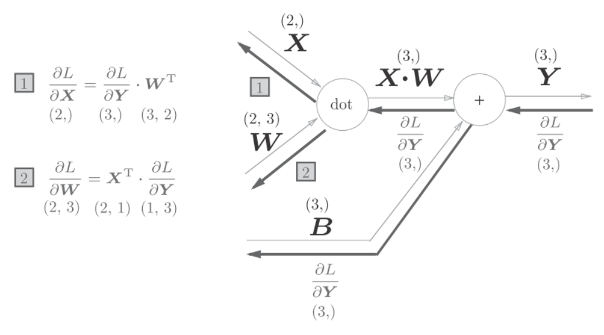

注意$X$和$\frac{\partial L}{\partial X}$形状相同, $W$和$\frac{\partial L}{\partial W}形状相同.
$$X=(x_0,x_1,...,x_n)$$
$$\frac{\partial L}{\partial X}=\left(\frac{\partial L}{\partial x_0},\frac{\partial L}{\partial x_1}...,\frac{\partial L}{\partial x_n}\right)$$


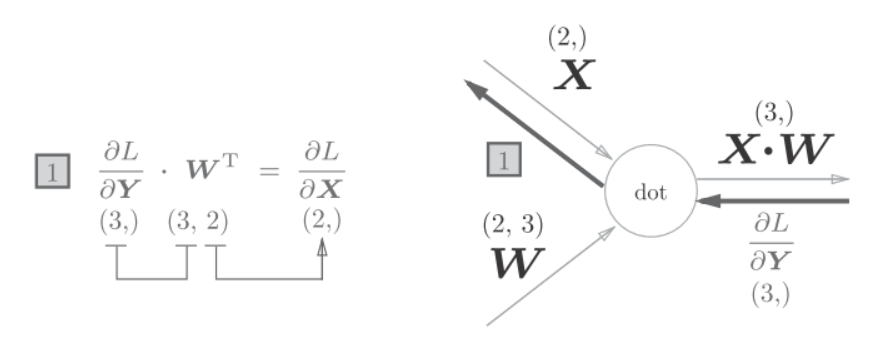


#### 批量版本的affine层
前面的输入$X$是以单个数据为对象的, Affine也以是多个数据的形式, 既mini-batch.
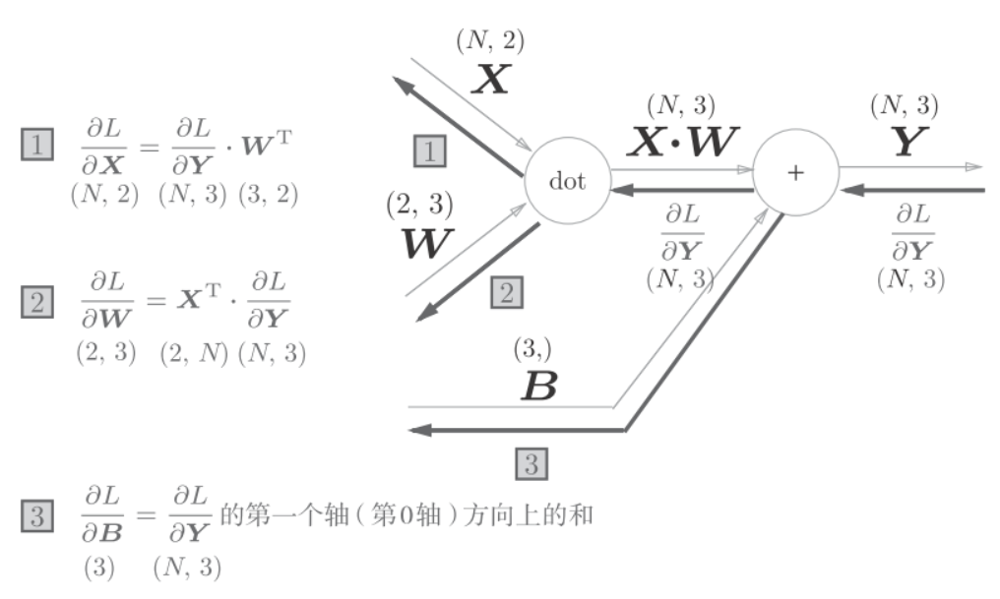

现在$X$的输入形状是(N,2).
python实现:
```python
class Affine:
    def __init__(self, W, b):
        self.W = W
        self.b = b
        self.x = None
        self.dW = None
        self.db = None
    def forward(self, x):
        self.x = x
        out = np.dot(x, self.W) + self.b
        return out
    def backward(self, dout):
        dx = np.dot(dout, self.W.T)
        self.dW = np.dot(self.x.T, dout)
        self.db = np.sum(dout, axis=0)
        return dx
```


### Softmax-with-Loss层
神经网络中进行处理有推理(inference)和学习(learn)两个阶段. 推理过程通常不使用softmax层, 而是将最后一个affine层的输出作为识别结果, 最大值即为最终的分类.
考虑到softmax也包含了损失函数的交叉熵误差(cross entropy error), 所以称为"softmax-with-loss"层.
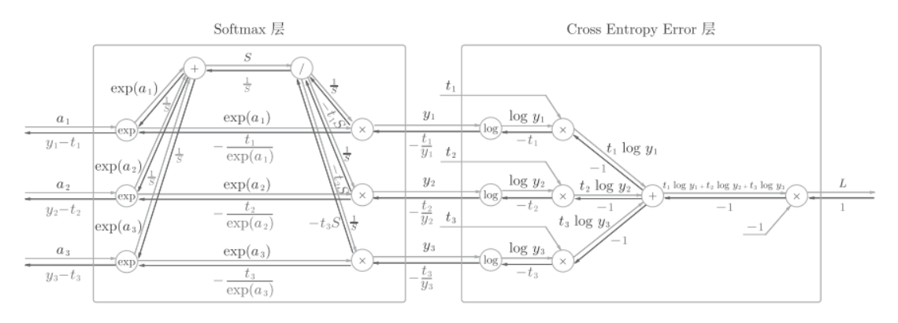

softmax函数记为softmax层, 交叉熵误差记为Cross Entropy Error层. 这里假设要进行3类分类, 从前面的层接收3个输入(得分). 如上图所示, Softmax层将输入$(a_1,a_2,a_3)$正规化, 输出$(y_1,y_2,y_3)$. Cross Entropy Error层接收Softmax的输入$(y_1,y_2,y_3)$和教师的标签$(t_1,t_2,t_3)$, 从这些数据中输出损失$L$.

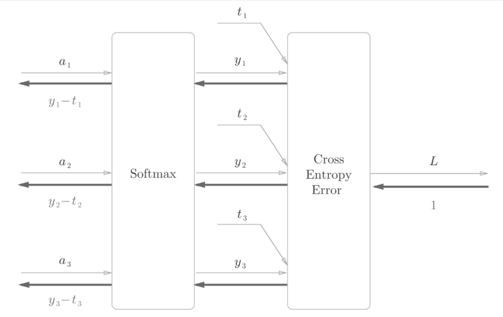

python实现Softmax-with-Loss层:
```python
class SoftmaxWithLoss:
    def __init__(self):
        self.loss = None # 损失
        self.y = None    # softmax的输出
        self.t = None    # 监督数据（one-hot vector）
    def forward(self, x, t):
        self.t = t
        self.y = softmax(x)
        self.loss = cross_entropy_error(self.y, self.t)
        return self.loss
    def backward(self, dout=1):
        batch_size = self.t.shape[0]
        dx = (self.y - self.t) / batch_size
        return dx

```