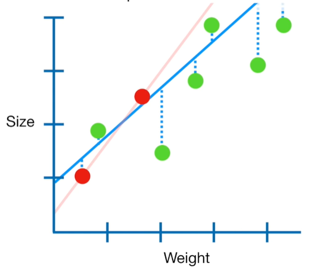

# regularization

Let's start by collecting `weight` and `size` measurements from a bunch of mice.Since these data look relatively linear, we will use linear regression, AKA least squares, to model the relationship between weight and size.In others words, we find the line that results in the minimum sum of squared residuals.

Ultimately, we end up with this equation for the line:$Size = 0.9 + 0.75 * weight$. The line has two parameters: a y-axis intercept(0.9) and a slope(0.75).
When we have a lot of measurements, we can be fairly confident that the `Least Squares` line accurately reflects the relationship between `Size` and `Weight`. But what if we only have two measurements? We fit a new line(red) with least squares. Since the new line overlaps the two data points, the minimum sum of squares residuals = 0.Ultimately, we end up with this equation for the new line:$Size=0.4+1.3*weight$

NOTE: Here are the original data and the original line(grey) for comparison.Let's call the two red dots the training data, and the remaining green dots the testing data.

The sum of the squared residuals for just the two red points, the training data, is small(in this case it is 0),but the sum of the squared residuals for the green points, the testing data, is large and that means that the new line(red) has high variance.

The main idea behind `ridge regression` is to find a new line(blue) that doesn't fit the training data as well

Now let's dive into the nitty-gritty and learn how ridge regression works.
When least squares determines values for the parameters in this equation:
$$ Size = y-axis Intercept + slope \cdot weight $$
it minimizes the sum of the squared residuals.
In contrast, when ridge regression determines values for the parameters in this equation
$$ Size = y-axis Intercept + slope \cdot weight $$
it minimizes the sum of the squared residuals plus $\lambda \cdot slope^2$
To get a better idea of what's going on, lets plug in some numbers.
Let's start by plugging in the numbers that correspond to the least squares fit. The sum of squared of the least squares fit is 0(because the line overlaps the data points) and the slope is 1.3 and let $\lambda = 1$
$$ Size = 0.4 + 1.4 \cdot weight $$

$$ residual + \lambda \codt slope^2  = 0 + 1 \cot 1.3^2 = 1.69$$
Now let's see what happens when we plug in numbers for the ridge regression line
$$ Size = 0.9 + 0.8 * weight $$
$$ residual + \lambda \codt slope^2  = 0.3^2 + 0.1^2 + 1 * 0.8 ^2 = 0.74$$
Because $0.74<1.69$, if we wanted to minimize the som the squared residuals plus the ridge regression penalty, we would choose the ridge regression line over the least squares line.Without the small amount of bias that the penalty creates, the least squares fit has a large amount of variance.In contrast, the ridge regression line,which has the small amount of bias due to the penalty, has less variance.

$\lambda$ can be any value from 0 to positive infinity. Now let's see what happens as we increase the value for $\lambda$. So the larger $\lambda$ gets, our predictions for `size` become less and less sensitive to `weight`.

So how do we decide what value to give $\lambda$?
We just try a bunch of values for $\lambda$ and use cross validation, typically 10-fold cross validation, to determine which one results in the lowest variance.

refs:
https://www.youtube.com/watch?v=Q81RR3yKn30