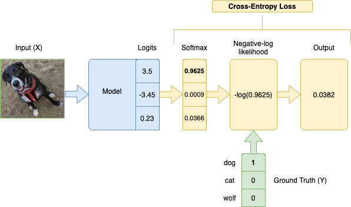
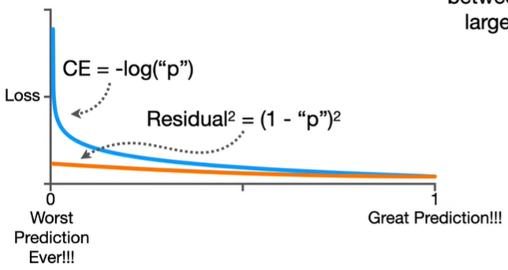

# crossEntropy

Categorical Cross-Entropy Loss Function applies the Softmax Activation Function to a model's output (logits) before applying the Negative Log-Likelihood function.

$$ P = softmax(O)$$
$$-\sum^N_{i=1}=y_i \times log(p_i)$$

where $N$ is the number of classes, $Y$ is the ground truth labels, and $O$ is the model outputs. Since $Y$ is one-hot encoded(in pytorch, just implement by $y[labels]$, so we can use lables as y, and do not need one hot), the labels that don't correspond to the ground truth will be multiplied by 0, so we effectively take the log of only the prediction for the true label.

why we called it "cross", because we use $y_i$, the label, $\times$, $log(p_i)$, the prediction.




```python
import torch
import numpy as np
from torch import nn, tensor

torch.set_printoptions(sci_mode=False)
dog_class_index = 0
label = tensor([dog_class_index])
logits = tensor([[3.5, -3.45, 0.23]])

nll = nn.CrossEntropyLoss()(logits, label)
'''
tensor(0.0382)
'''

softmax_probs = nn.Softmax(dim=1)(logits)
nll = torch.nn.NLLLoss(reduction='none')(np.log(softmax_probs), torch.tensor([0]))
'''
tensor(0.0382)
'''
```


## softmax loss vs cross entropy loss
If the prediction for one label is really good, it will be close to 1 and if the prediction is really terrible, it will be close to 0.We can plug in values for "p", from 0 to 1, into the cross entropy function and plot the output.The y-axis is the loss, which measure of the how bad the prediction is.When we use cross entropy, as the prediction gets worse and worse, the loss kind of explodes and gets really, really big.

In contrast, if we plug values for "p", from 0 to 1, into the squared residual, the change in Loss between 0 and 1 is not as large as it is for cross entropy.




refs:
https://notesbylex.com/negative-log-likelihood.html
https://notesbylex.com/categorical-cross-entropy-loss.html
https://www.youtube.com/watch?v=6ArSys5qHAU