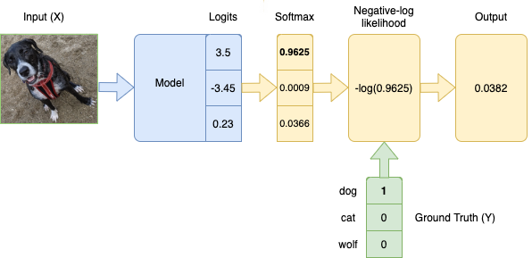

# nll

Negative log-likelihood is a loss function used in multi-class classification. In practice, the softmax function is used in tandem with the negative log-likelihood (NLL).
$$L(y) = -log(y)$$
where y is a prediction corresponding to the true label, after the Softmax Activation Function was applied. The loss for a mini-batch is computed by taking the mean or sum of all items in the batch.



```python
import torch
import numpy as np
torch.set_printoptions(sci_mode=False)
labels = [0]
logits = torch.tensor([[3.5, -3.45, 0.23]])
softmax_probs = torch.nn.Softmax(dim=1)(logits)
nll = -np.log(softmax_probs[range(len(labels)), labels]) # range(len(labels))是样本的id
'''
tensor([0.0382])
'''
nll = torch.nn.NLLLoss(reduction='none')(np.log(softmax_probs), torch.tensor(labels))
'''
tensor([0.0382])
'''
```


refs:
https://ljvmiranda921.github.io/notebook/2017/08/13/softmax-and-the-negative-log-likelihood/
https://notesbylex.com/negative-log-likelihood.html