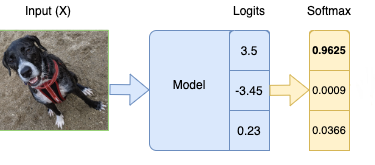

# softmax

$$ \sigma(\overrightarrow z)_i = \frac{e^{z_i}}{\sum^k_j e^{z_j}} $$
softmax formula symbols expained
symbols | explained
--|--
$\overrightarrow z$|The input vector to the softmax function, made up of ($z_0, ... z_k$)
$z_i$|the elements of the input vector to the softmax function
$\sum^k_j e^{z_j}$|The term on the bottom of the formula is the normalization term. It ensures that all the output values of the function will sum to 1
$k$|The number of classes in the multi-class classifier.
given a three-class example below, the scores $y_i$ are computed from the forward propagation of the network. We then take the softmax and obtain the probabilities as shown:




```python
import torch
torch.set_printoptions(sci_mode=False)
logits = torch.tensor([[3.5, -3.45, 0.23]])
softmax_probs = torch.nn.Softmax(dim=1)(logits)
'''
tensor([[    0.9625,     0.0009,     0.0366]])
'''
```


refs:
https://ljvmiranda921.github.io/notebook/2017/08/13/softmax-and-the-negative-log-likelihood/
https://deepai.org/machine-learning-glossary-and-terms/softmax-layer