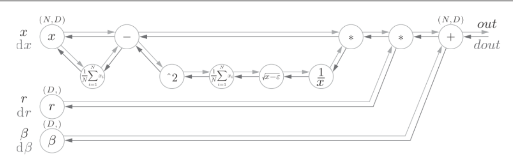

# batchnorm

可以通过设置合适的权重值, 增加激活值分布的广度. 通过Batch Normalization也可以强制性地调整激活值的分布.它的主要作用是:
- 可以加快学习速度
- 不那么依赖初始值
- 抑制过拟合
Batch Norm是放在Affine层之后. 以mini-batch为单位, 按mini-batch进行正规化. 就是进行数据分布的均值0, 方差为1的正规化.
$$\mu_B \leftarrow \frac{1}{m}\sum_{i=1}^m x_i$$
$$\sigma^2_B \leftarrow \frac{1}{m}\sum_{1=1}^m(x_i-\mu_B)^2$$
$$\hat{x}_i \leftarrow \frac{x_i-\mu_B}{\sqrt {\sigma_B^2+\epsilon}}$$

对mini-batch的m个输入数据的集合 $B={x_1,x_2,...,x_m}$,求均值$\mu_B$和方差$\sigma_B^2$. 然后, 对输入数据进行均值为0, 方差为1的正规化.
接着, BatchNorm层会对正规化后的数据进行缩放和平移的变换:
$$y_i \leftarrow \gamma\hat{x}_i+\beta$$
$\gamma$和$\beta$是参数, 一开始$\gamma=1,\beta=0$, 然后通过学习调整到合适的值.
下图是BatchNorm的正向传播:
