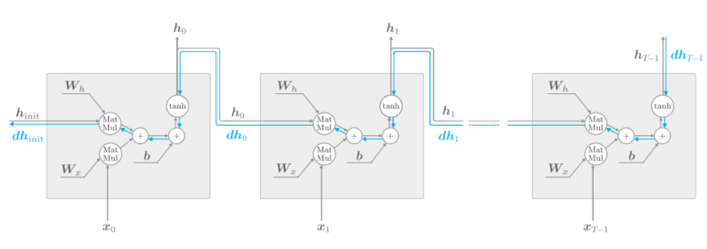
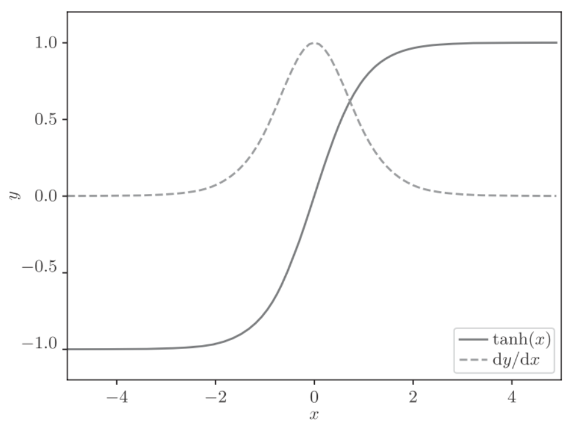
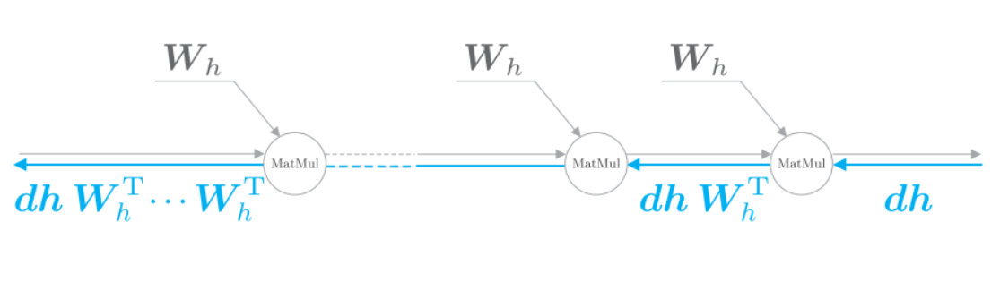
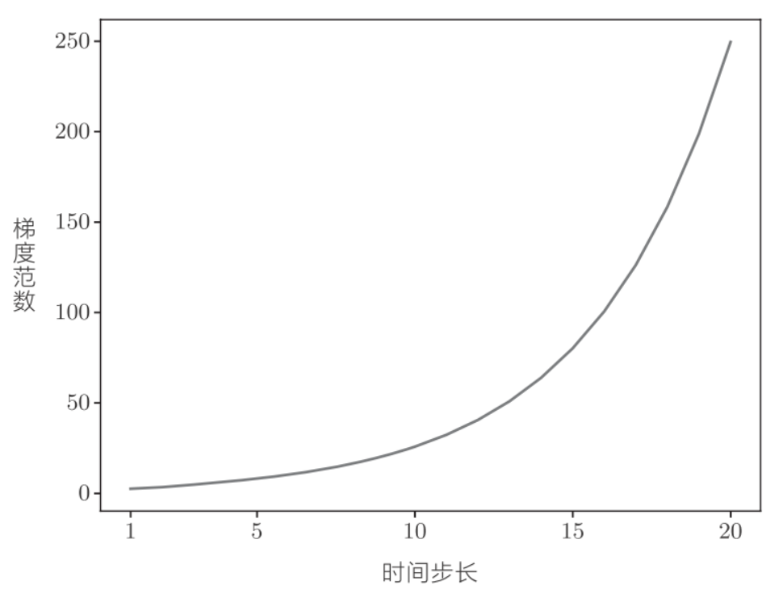
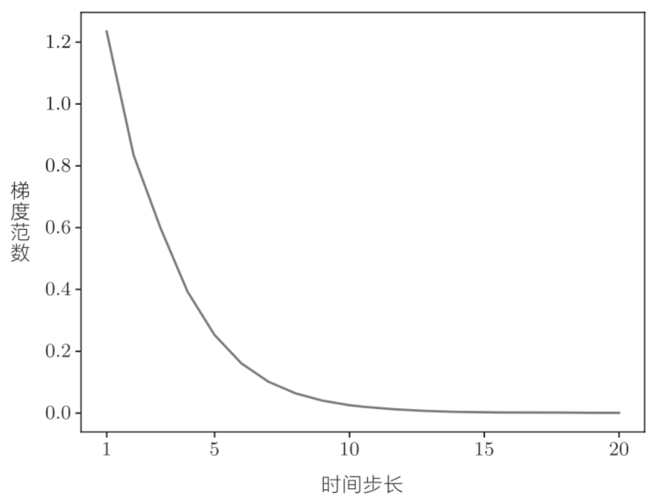

# gradproblem



这里考虑长度为T的时序数据, 时间方向上的梯度, 可以反向传播经历了tanh, "+", MatMul运算.
"+"的反向传播会将上游的穿戴的梯度原样传给下游, 因此梯度值不变.


## "tanh"
当$y=tanh(x)$时, 导数是$\frac{dy}{dx}=1-y^2$, 如下图:

虚线是导数, 可以看出, 它的值小于1, 并且随着x远离0, 它的值在变小. 当反向传播的梯度过tanh节点时, 它的值会越来越小. 因此如果经过tanh函数T次, 则梯度也会减小T次

## MatMul
这里我们忽略tanh的计算

从上游传来的梯度为$dh$, 此时通过MatMul节点的反向传播通过矩阵乘积$dhW_h^T$计算梯度. 之后, 根据时序数据的时间步长, 将计算重复相应次数. 注意, 每次矩阵乘积计算都是使用相同的权重$W_h$.

通过python来实验, 反向传播时梯度的值通过MatMul节点时的变化.
```python
import numpy as np
import matplotlib.pyplot as plt
N = 2  # mini-batch的大小
H = 3  # 隐藏状态向量的维数
T = 20  # 时序数据的长度
dh = np.ones((N, H))
np.random.seed(3)  # 为了复现，固定随机数种子
Wh = np.random.randn(H, H)
norm_list = []
for t in range(T):
    dh = np.dot(dh, Wh.T)
    norm = np.sqrt(np.sum(dh**2)) / N
    norm_list.append(norm)
```
`np.ones()`初始化`dh`.然后根据反向传播的MatMul节点的数量更新`dh`相应次数, 并将各步的`dh`的大小添加到`norm_list`中.`dh`的大小是`mini-batch`中的平均`L2`范数.


如图, 梯度的大小随着时间步长呈指数级增加, 这就是梯度爆炸(exploding gradients). 梯度爆炸会导致溢出, 出现`NaN`之类的值.

下面实现梯度消失, 将`Wh`的值改一下.
```python
## Wh = np.random.randn(H, H)      # before
Wh = np.random.randn(H, H) * 0.5  # after
```

如图, 梯度的大小随着时间步长呈指数级减小, 这就是梯度消失(vanishing gradients). 梯度消失会导致权重不能被更新, 模型无法学习长期的依赖关系.

如果`Wh`是标量, 当`Wh`大于1时, 梯度呈现指数级增加, 当`Wh`小于1时, 梯度呈指数级减小.
如果`Wh`是矩阵时, 矩阵的奇异值将成为指标. 奇异值表示数据的离散程度, 根据奇异值是否大于1, 可以预测梯度大小的变化. 如果奇异值的最大值大于1, 则梯度很有可能会呈现指数级增加, 如果奇异值的最大值小于1, 则梯度会呈指数级减小. 奇异值大小只是必要条件, 分充分条件.

## 梯度爆炸对策
解决梯度爆炸的方法是,梯度裁剪(gradients clipping), 伪代码:
$$ if ||\hat{g}|| \geq threshold;$$
$$ \hat{g}=\frac{threshold}{||\hat{g}||}\hat{g}$$
这里假设可以将神经网络用到的所有参数的梯度整合成一个, 并用符号$\hat{g}$表示. 贾昂阈值设置为threshold. 如果梯度的L2范数$||\hat{g}$大于或等于阈值, 就按照上面的方法修正梯度.
python实现:
```python
import numpy as np
dW1 = np.random.rand(3, 3) * 10
dW2 = np.random.rand(3, 3) * 10
grads = [dW1, dW2]
max_norm = 5.0
def clip_grads(grads, max_norm):
    total_norm = 0
    for grad in grads:
        total_norm += np.sum(grad ** 2)
    total_norm = np.sqrt(total_norm)
    rate = max_norm / (total_norm + 1e-6)
    if rate < 1:
        for grad in grads:
            grad *= rate
clip_grads(grads, max_norm)
```
参数 `grads` 是梯度的列表，`max_norm` 是阈值，


## 梯度消失对策
使用lstm