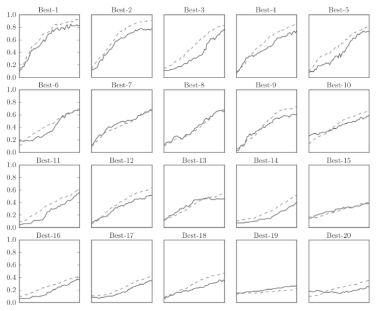

# hyperpara


超参数(hyper-parameter)是指各层的神经元数量,batch大小,参数更新的学习率等.


## 验证数据
我们将数据集分为训练数据和测试数据, 训练数据用于学习, 测试数据用来评估泛化能力.

我们要对超参数设置各种各样的值以进行验证. 需要注意: 不能使用测试数据集评估超参数的性能. 因为使用测试数据调整超参数, 超参数的值会对测试数据发生过拟合. 换句话说, 用测试数据确认超参数的值的"好坏", 会导致超参数的值被调整为只拟合测试数据, 泛化能力就会降低.

因此, 调整超参数时, 必须使用超参数专用的确认数据, 我们称为验证数据(validation data).


## 超参数的最优化
进行超参数的最优化时, 是指一开始先大致设定一个范围，从这个范围中随机选出一个超参数（采样），用这个采样到的值进行识别精度的评估；然后，多次重复该操作，观察识别精度的结果.

最初使用$(10^{-3},10^3)$随机采样进行超参数验证. 权重衰减系数的初始范围为$(10^{-8},10^{-10})$; 学习率的初始范围为$(10^{-6},10^{-2})$:
```python
weight_decay = 10 ** np.random.uniform(-8, -4)
lr = 10 ** np.random.uniform(-6, -2)
```
多次使用各种超参数的值重复进行学习, 观察合乎逻辑的超参数在哪.如图:

可以看到best前5学习都很顺利, 结果如下:
```python
Best-1 (val acc:0.83) | lr:0.0092, weight decay:3.86e-07
Best-2 (val acc:0.78) | lr:0.00956, weight decay:6.04e-07
Best-3 (val acc:0.77) | lr:0.00571, weight decay:1.27e-06
Best-4 (val acc:0.74) | lr:0.00626, weight decay:1.43e-05
Best-5 (val acc:0.73) | lr:0.0052, weight decay:8.97e-06
```
可以看出学习率在0.001到0.01, 权重衰减系数在$10^{-8}到10^{-6}$之间时学习可以顺利进行.