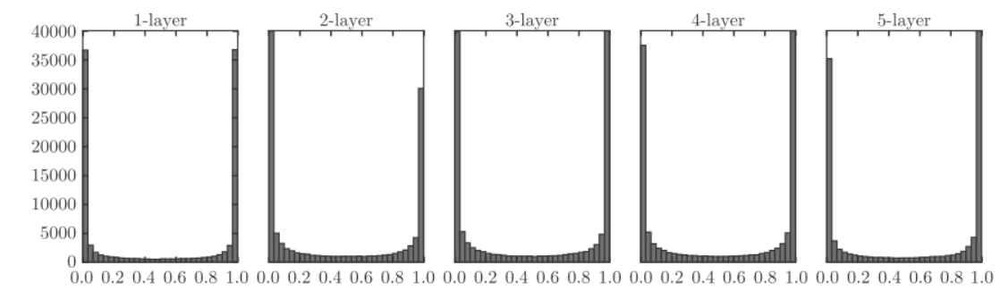
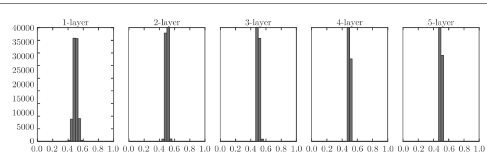
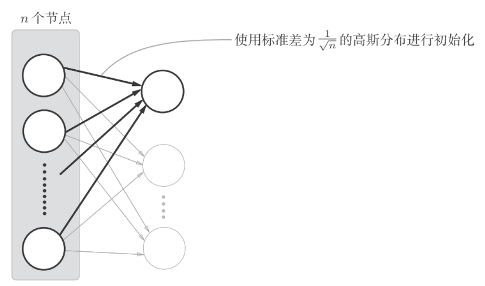
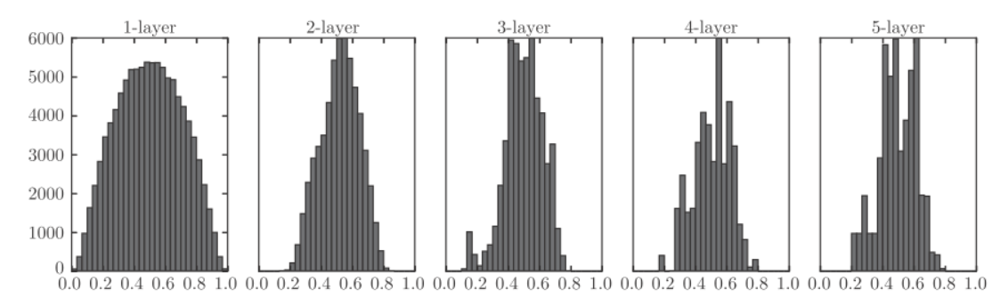
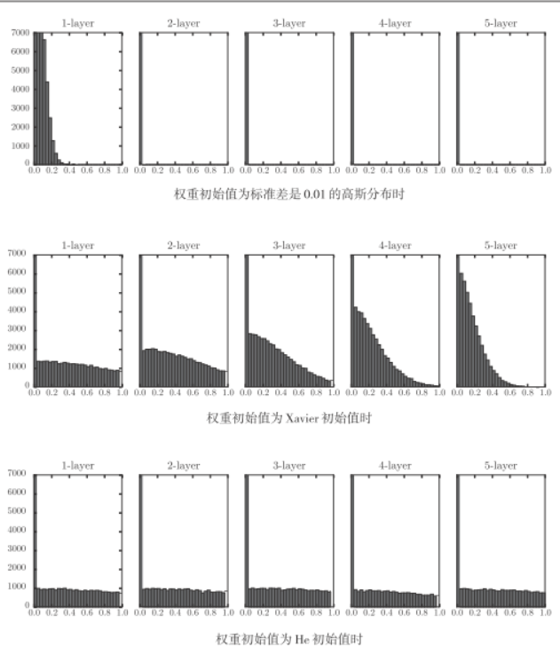

# initweight


权重的初始值设置非常重要, 决定了学习能否成功.

## 可以设置为0嘛
权重衰减是一种以减小权重参数的值为目的进行学习的方法. 通过减小权重参数的值来抑制过拟合的发生.

为什么不能将权重值设置为0呢? 严格地来说, 为什么不能将权重初始值设成一样的值呢?

因为在误差反向传播过程中, 所有的权重值都会进行相同的更新. 权重被更新为相同的值, 并拥有了重复的值, 这使得神经网络拥有许多不同的权重的意义丧失了. 为了防止"权重均一化", 必须随机生成初始值.


## sigmoid的权重初始值
向一个层神经网络(激活函数使用sigmoid函数)传入随机数据, 用直方图绘制各层激活值的数据分布.

python实现:
```python
import numpy as np
import matplotlib.pyplot as plt
def sigmoid(x):
    return 1 / (1 + np.exp(-x))
x = np.random.randn(1000, 100) # 1000个数据
node_num = 100        # 各隐藏层的节点（神经元）数
hidden_layer_size = 5 # 隐藏层有5层
activations = {}      # 激活值的结果保存在这里
for i in range(hidden_layer_size):
    if i != 0:
        x = activations[i-1]
    w = np.random.randn(node_num, node_num) * 1
    z = np.dot(x, w)
    a = sigmoid(z)   # sigmoid函数
    activations[i] = a
```

假设神经网络有5层, 每层有100个神经元, 激活函数使用sigmoid. 然后用高斯分布随机生成1000个数据(每个数据有5个特征)作为输入数据. 各层的激活值的结果保存在activations变量中.
绘制直方图:
```python
## 绘制直方图
for i, a in activations.items():
    plt.subplot(1, len(activations), i+1)
    plt.title(str(i+1) + "-layer")
    plt.hist(a.flatten(), 30, range=(0,1))
plt.show()
```


上图中, 可以看到各层的激活值偏向(0,1)分布. 这里使用的sigmoid函数式S型函数, 醉着输出不断的靠近0或1, 它的导数值逐渐接近0. 因此, 偏向0和1的数据分布会造成反向传播中梯度值不断变小, 最后消失. 这个问题称为梯度消失(gradient vanishing).


将权重的标准差设为0.01, 进行相同的实验. 只需替代一下代码:
```python
## w = np.random.randn(node_num, node_num) * 1
w = np.random.randn(node_num, node_num) * 0.01
```


这次呈集中在0.5附近的分布. 因为不像刚才的例子那样偏向0和1, 所以不会发生梯度消失的问题. 

但是又出现了另外一个问题:激活值的分布有所偏向, 说明在表现力上会有很大的问题. 因为如果有多个神经元都输出几乎相同的值, 那它们就没有存在的意义了. 比如, 如果100个神经元都输出几乎相同的值, 那么也可以由1个神经元来表达基本相同的事情. 因此, 激活值在分布上有所偏向会出现"表现力受限"的问题.

各层的激活值的分布都要求有适当的广度, 因为通过在各层间传递多样性的数据, 神经网络可以进行高效的学习. 反过来, 如果传递的是由所偏向的数据, 就会出现梯度消失或者"表现力受限"的问题, 导致学习可能无法顺利的进行.

推荐使用"Xavier初始值"来初始化参数, Xavier的论文中, 为了使各层的激活值呈现出具有相同广度的分布, 推导了合适的权重尺度. 结论是如果前一层的节点数为n, 则初始值使用标准差为$\frac{1}{\sqrt n}的分布.



前一层的节点数越多, 设定为目标节点的初始值的权重尺度就越小.
使用Xavier初始值进行实验, 只需替换如下代码即可:
```python
node_num = 100 # 前一层的节点数
w = np.random.randn(node_num, node_num) / np.sqrt(node_num)
```


呈现了比之前更广度的分布, 所以sigmoid函数的表现力不受限制.


## tanh
后面的层的分布呈稍微歪斜的形状, 如果用tanh函数代替 sigmoid 函数, 稍微歪斜的问题就能得到改善. 


## ReLU的权重初始值
Xavier 初始值是以激活函数是线性函数为前提而推导出来的, sigmoid 函数和tanh 函数左右对称，且中央附近可以视作线性函数. 但当激活函数使用ReLU时, 一般推荐ReLU专用的初始值, 由Kaiming He推荐的, 称为"He初始值":
当前一层的节点为n时, He初始值使用标准差为$\sqrt \frac{2}{n}$的高斯分布, 直观上可以理解: 因为ReLU的负值区域的值为0, 为了使它更有广度, 所以需要2倍的系数.
不同初始值的比较:

- 当"std=0.01"时, 各层的激活值非常小, 神经网络上传递的是非常小的值, 说明逆向传播时权重的梯度也同样很小. 实际上学习基本上没有进展.
- 当初始值为Xavier时, 随着层的加深, 偏向一点点变大. 实际身上, 层加深后, 激活值的偏向变大, 学习时会出现梯度消失的问题.
- 当初始值为He时, 各层中分布的广度相同. 由于即使层加深, 数据的广度也能保持不变, 逆向传播时, 也会传递合适的值.

