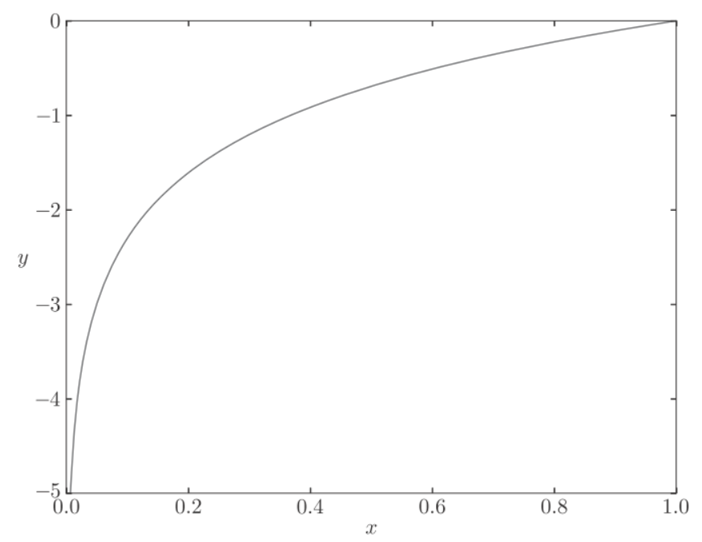

# learning


图像问题不同的解决思路:
[1.png](1.png)
深度学习的优势是构建`end-to-end`的方式, 是通用的解决问题的模式


## 损失函数(loss function)
损失函数表示当前的网络权重对监督数据有多大程度的不拟合, 一般使用均方误和交叉熵误差.

## 均方误(MSE)
均方误差(mean squared error)
$E=\frac{1}{2}\sum_k(y_k-t_k)^2$
$y_k$表示神经网络的输出, $t_k$表示监督数据, $k$表示数据的维数, 如在手写数字识别例子中$y_k,t_k$为
```python
y = [0.1, 0.05, 0.6, 0.0, 0.05, 0.1, 0.0, 0.1, 0.0, 0.0]
t = [0, 0, 1, 0, 0, 0, 0, 0, 0, 0]
```
数组元素的索引达标了数字的分类(0,1,2,3), $y$是softmax函数输出, 可理解为"0"的概率是0.1, "1"的概率是0.05等等. $t$是监督数据, 正确的标签设为1, 其他均为0. 这种方法也称为one-hot表示.

```python
def mean_squared_error(y, t):
    return 0.5 * np.sum((y-t)**2)
```

使用均方差函数:
```python
## 设“2”为正确解
t = [0, 0, 1, 0, 0, 0, 0, 0, 0, 0]

## 例1：“2”的概率最高的情况（0.6）
y = [0.1, 0.05, 0.6, 0.0, 0.05, 0.1, 0.0, 0.1, 0.0, 0.0]
mean_squared_error(np.array(y), np.array(t))  # 0.097500000000000031

## 例2：“7”的概率最高的情况（0.6）
y = [0.1, 0.05, 0.1, 0.0, 0.05, 0.1, 0.0, 0.6, 0.0, 0.0]
mean_squared_error(np.array(y), np.array(t))  # 0.59750000000000003
```


## 交叉熵误差(cross entropy error)
公式:
$E=-\sum_kt_k\log y_k$
`log`表示以`e`为底数的自然对数$log_e$. $y_k$是神经网络的输出, $t_k$是正确的标签. 
$t_k$中只有正确的标签为1, 其他均为0(one-hot), 因此只计算对应正确标签的输出的自然对数. 比如, 假设正确标签的索引是"2", 与之对应的神经网络的输出为0.6, 则交叉熵误差是-log0.6=0.51. 也就是说, 交叉熵误差的值是正确标签所对应的输出结果决定的.


python实现:
```python
def cross_entropy_error(y, t):
    delta = 1e-7
    return -np.sum(t * np.log(y + delta))
```

参数y和t是`ndarray`, 函数在计算`np.log`时, 加上了一个微小值delta. 这是因为, 当出现`np.log(0)`时, 会变成负无限大(-inf).

使用交叉熵误差

```python
t = [0, 0, 1, 0, 0, 0, 0, 0, 0, 0]
y = [0.1, 0.05, 0.6, 0.0, 0.05, 0.1, 0.0, 0.1, 0.0, 0.0]
cross_entropy_error(np.array(y), np.array(t))  # 0.51082545709933802

y = [0.1, 0.05, 0.1, 0.0, 0.05, 0.1, 0.0, 0.6, 0.0, 0.0]
cross_entropy_error(np.array(y), np.array(t))  # 2.3025840929945458
```


## mini-batch学习
计算损失函数时必须将所有的训练数据作为对象, 也就是说，如果训练数据有100个的话，我们就要把这100个损失函数的总和作为学习的指标。
前面介绍的损失函数的例子中考虑的都是针对单个数据的损失函数。如果要求所有训练数据的损失函数的总和, 则交叉熵误差为:
$$E=-\frac{1}{N}\sum_n\sum_kt_{nk}logy_{nk}$$
假设数据有N个, $t_{nk}$表示第n个数据的第k个元素的值. 这个公式是把单个数据的损失函数扩大到了N分数据, 然后除以N进行正规化.
MNIST 数据集的训练数据有 60000 个, 如果以全部数据为对象求损失函数的和, 计算需要花费大量的时间, 我们从中选取一部分数据, 作为全部数据的`近似`, 称这样一批数据为`mini-batch`


python实现　mini-batch版交叉熵误差:

```python
def cross_entropy_error(y, t):
    if y.ndim == 1:
        t = t.reshape(1, t.size)
        y = y.reshape(1, y.size)
    batch_size = y.shape[0]
    return -np.sum(t * np.log(y + 1e-7)) / batch_size
```
y是神经网络的输出, t是监督数据. y的维度为1时, 既求单个数据的交叉熵误差时, 需要改变数据的形状. 并且, 当输入为mini-batch时, 要用batch的个数进行正规化, 计算平均交叉熵误差


## 学习算法实现

神经网络的学习步骤:
1. mini-batch
从训练数据中随机选出一部分数据, 这部分数据称为mini-batch, 目标是减少mini-batch的损失函数的值

2. 计算梯度
为了减少mini-batch的损失函数的值, 需要求出各个权重参数的梯度, 梯度表示损失函数的值减小的最多的方向

3. 更新参数
将权重参数沿梯度方向进行微小的更新

重复以上步骤, 直到损失函数最小.

因为这里使用的数据是随机选择的mini batch数据, 所以又称为随机梯度下降法(SGD, stochastic gradient descent), 随机是指随机选择的意思, 随机梯度下降法是对随机选择的数据进行的梯度下降法

python实现2层神经网络的类

```python
class TwoLayerNet:
    def __init__(self, input_size, hidden_size, output_size,
                 weight_init_std=0.01):
        # 初始化权重
        self.params = {}
        self.params['W1'] = weight_init_std * \
                            np.random.randn(input_size, hidden_size)
        self.params['b1'] = np.zeros(hidden_size)
        self.params['W2'] = weight_init_std * \
                            np.random.randn(hidden_size, output_size)
        self.params['b2'] = np.zeros(output_size)
    def predict(self, x):
        W1, W2 = self.params['W1'], self.params['W2']
        b1, b2 = self.params['b1'], self.params['b2']
        a1 = np.dot(x, W1) + b1
        z1 = sigmoid(a1)
        a2 = np.dot(z1, W2) + b2
        y = softmax(a2)
        return y
    # x:输入数据, t:监督数据
    def loss(self, x, t):
        y = self.predict(x)
        return cross_entropy_error(y, t)
    def accuracy(self, x, t):
        y = self.predict(x)
        y = np.argmax(y, axis=1)
        t = np.argmax(t, axis=1)
        accuracy = np.sum(y == t) / float(x.shape[0])
        return accuracy
    # x:输入数据, t:监督数据
    def numerical_gradient(self, x, t):
        loss_W = lambda W: self.loss(x, t)
        grads = {}
        grads['W1'] = numerical_gradient(loss_W, self.params['W1'])
        grads['b1'] = numerical_gradient(loss_W, self.params['b1'])
        grads['W2'] = numerical_gradient(loss_W, self.params['W2'])
        grads['b2'] = numerical_gradient(loss_W, self.params['b2'])
        return grads
```

变量|描述
--|--
params|保存神经网络的参数的字典型变量（实例变量）。params['W1'] 是第1层的权重，params['b1'] 是第1层的偏置。params['W2'] 是第2层的权重，params['b2'] 是第2层的偏置
grads|保存梯度的字典型变量（numerical_gradient() 方法的返回值）。grads['W1'] 是第1层权重的梯度，grads['b1'] 是第1层偏置的梯度。grads['W2'] 是第2层权重的梯度，grads['b2'] 是第2层偏置的梯度

方法|描述
--|--
`__init__(self,  input_size, hidden_size, output_size)`|初始化, 输入层神经元, 隐藏层神经元, 输出层神经元
`predict(self, x)`|推理预测, 参数X是图像数据
`loss(self, x, t)`|计算损失函数的值, 参数 x 是图像数据，t 是正确解标签
`accuracy(self, x, t)`|计算识别精准度
`numerical_gradient(self, x, t)`|计算权重参数的梯度
`gradient(self, x, t)`|numerical_gradient() 的高速版


## 进行训练
epoch是一个单位。一个epoch表示学习中所有训练数据均被使用过一次时的更新次数。比如，对于 10000 笔训练数据，用大小为 100笔数据的mini-batch进行学习时，重复随机梯度下降法100次，所有的训练数据就都被“看过”了, 此时100次就是一个epoch。


python实现:
```python
import numpy as np
from dataset.mnist import load_mnist
from two_layer_net import TwoLayerNet
(x_train, t_train), (x_test, t_test) = load_mnist(normalize=True, one_hot_laobel = True)
train_loss_list = []
train_acc_list = []
test_acc_list = []
## 平均每个epoch的重复次数
iter_per_epoch = max(train_size / batch_size, 1)
## 超参数
iters_num = 10000
batch_size = 100
learning_rate = 0.1
network = TwoLayerNet(input_size=784, hidden_size=50, output_size=10)
for i in range(iters_num):
    # 获取mini-batch
    batch_mask = np.random.choice(train_size, batch_size)
    x_batch = x_train[batch_mask]
    t_batch = t_train[batch_mask]
    # 计算梯度
    grad = network.numerical_gradient(x_batch, t_batch)
    # grad = network.gradient(x_batch, t_batch) # 高速版!
    # 更新参数
    for key in ('W1', 'b1', 'W2', 'b2'):
        network.params[key] -= learning_rate * grad[key]
    loss = network.loss(x_batch, t_batch)
    train_loss_list.append(loss)
    # 计算每个epoch的识别精度
    if i % iter_per_epoch == 0:
        train_acc = network.accuracy(x_train, t_train)
        test_acc = network.accuracy(x_test, t_test)
        train_acc_list.append(train_acc)
        test_acc_list.append(test_acc)
        print("train acc, test acc | " + str(train_acc) + ", " + str(test_acc))

```