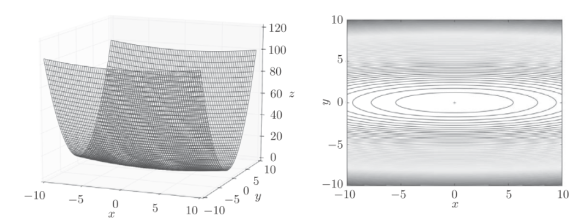
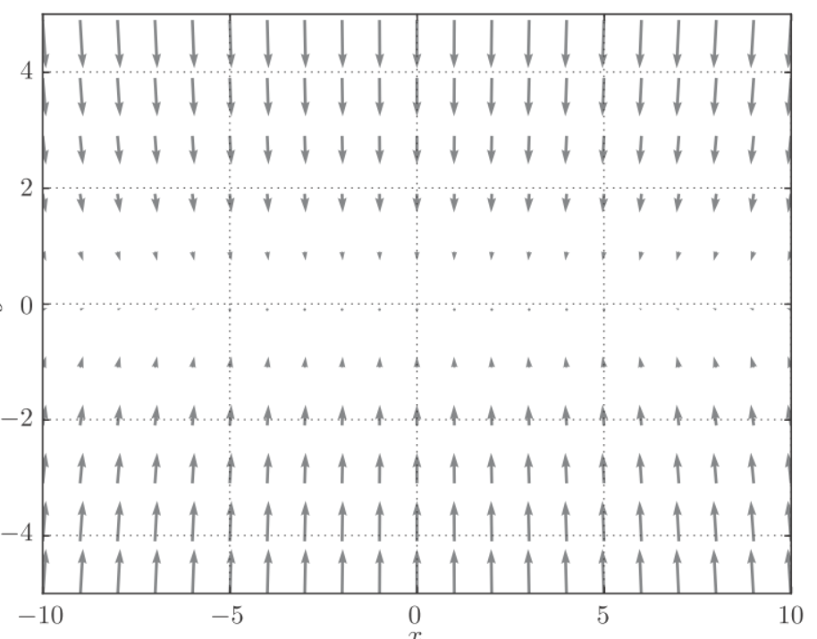
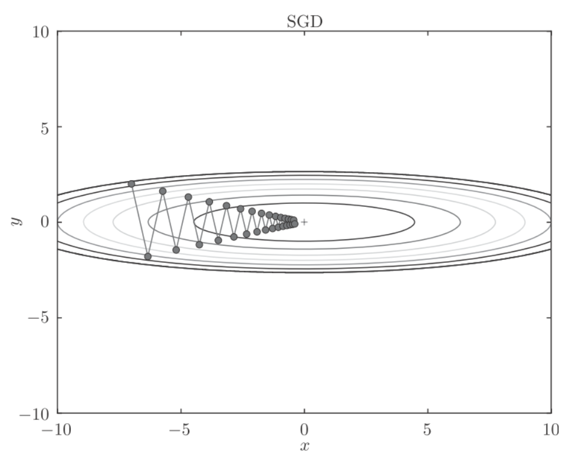
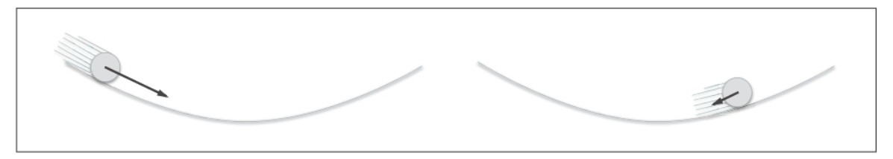
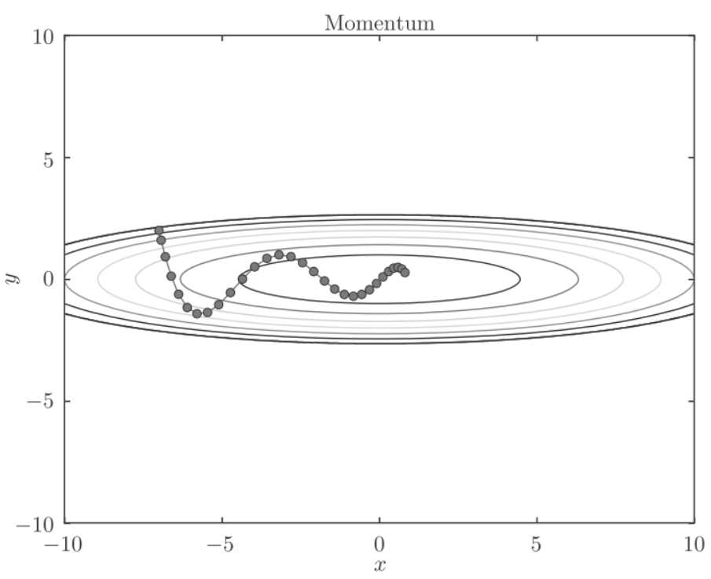
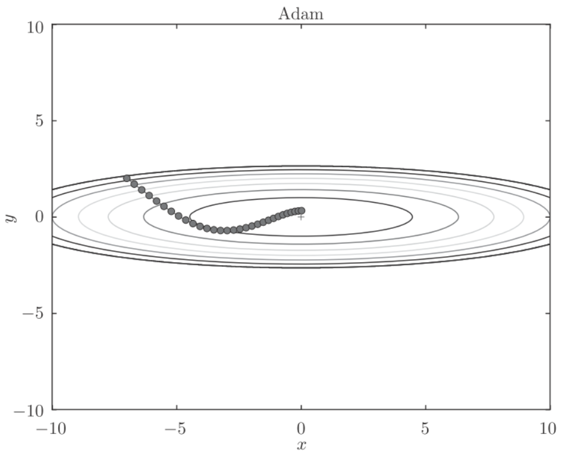

# optimizer


## 参数更新
神经网络的学习的目的是找到使损失函数的值尽可能小的参数, 这个过程称为最优化(optimization).


## SGD
使用参数的梯度, 沿着梯度的方向更新参数, 并且重复这个步骤多次, 从而逐渐靠近最优参数, 这个过程称为随机梯度下降法(stochastic gradient descent, SGD).
公式可以写成
$$W \leftarrow W - \eta\frac{\partial L}{\partial W} $$

这里吧需要更新的权重参数记为$W$, 把损失函数关于$W$的梯度记为$\frac{\partial L}{\partial W}$. $\eta$表示学习率. $\leftarrow$表示用右边的值更新左边的值.

python实现SGD:
```python
class SGD:
    def __init__(self, lr=0.01):
        self.lr = lr
    def update(self, params, grads):
        for key in params.keys():
            params[key] -= self.lr * grads[key]
```

参数lr表示learning rate, 是一个固定值. 参数`params`保存权重参数, 参数`grads`保存梯度.

具体应用:
```python
network = TwoLayerNet(...)
optimizer = SGD()
for i in range(10000):
    ...
    x_batch, t_batch = get_mini_batch(...) # mini-batch
    grads = network.gradient(x_batch, t_batch)
    params = network.params
    optimizer.update(params, grads)
    ...
```
这里引入`optimizer`表示进行优化的人, 此处由SGD承担这个角色. 我们只需要将参数和梯度的信息传递给optimizer.

## SGD的缺点
虽然SGD简单, 但是在解决某些问题时可能没有效率.考虑如下公式:
$$f(x,y)=\frac{1}{20}x^2+y^2$$
该函数是向x轴方向延伸的"碗"状函数, 等高线呈向x轴方向延伸的椭圆状.

而它的梯度如下图所示:

这个梯度的特征是, y轴方向上打, x轴方向上小. 换句话说就是y轴方向的坡度大, 而x轴方向的坡度小. 虽然最小值在$(x,y)=(0,0)$处, 但是很多梯度并没有指向$(0,0)$.

如下图, 假设从$(x,y)=(-7.0,2.0)$处开始搜索, SGD呈"之"字形移动, 相当的低效.




## Momentum
Momentum是动量的意思, 公式如下:
$$v \leftarrow \alpha v - \eta\frac{\partial L}{\partial W} $$
$$W \leftarrow W + v$$
$W$表示需要更新的权重参数, $\frac{\partial L}{\partial W}$表示梯度, $\eta$表示学习率. $v$对应物理上的速度. 公式表达了物体在梯度方向上的受力, 在这个力的作用下, 物体的速度增加这一物理法则.
$\alpha v$表示物体不受任何力时, 物体逐渐衰减的力, 对应地面摩擦力或空气阻力.

如图:


python实现:
```python
class Momentum:
    def __init__(self, lr=0.01, momentum=0.9):
        self.lr = lr
        self.momentum = momentum
        self.v = None
    def update(self, params, grads):
        if self.v is None:
            self.v = {}
            for key, val in params.items():
                self.v[key] = np.zeros_like(val)
        for key in params.keys():
            self.v[key] = self.momentum*self.v[key] - self.lr*grads[key]
            params[key] += self.v[key]
```
$v$会保存物体的速度, 初始化时, $v$中什么都不保存, 但当第一次调用`update`时, `v`会以字典型变量的形式保存与参数结构相同的数据.

和SGD相比, "之"字形的"程度"减轻了. 这时因为虽然x轴方向上受到的力非常小, 但是一直在同一方向受力, 所以同一个方向会有一定的加速. 反过来, 虽然在y轴方向受到的力很大, 但是因为交互地受到正方向和反方向的力, 它们会相互低效, 所以y轴方向的速度不稳定. 和SGD相比, 会更快地朝x轴方向靠近.



## AdaGrad
在学习过程中, 学习率的值很重要. 学习率过小,会导致花费过多的时间, 反过来, 学习率过大, 则会导致学习发散而不能正确的进行.
学习率衰减(learning rate decay)的方法, 即随着学习的进行, 使学习率逐渐减小. 一开始多学, 然后逐渐少学的方法, 在神经网络中经常用到.
逐渐减少学习率的想法, 相当于将"全体"参数的学习率值一起降低, 而AdaGrad进一步发展了这个想法, 针对"一个一个"的参数, 赋予其"定制"的值.
AdaGrad会为参数的每个元素适当第调整学习率, (AdaGrad, Ada来自英文单词Adaptive, 适当的意思), 公式表示为:
$$h \leftarrow h+ \frac{\partial L}{\partial W} \cdot \frac{\partial L}{\partial W} $$
$$W \leftarrow W - \eta \frac{1}{\sqrt h}\frac{\partial L}{\partial W} $$

$W$表示要更新的权重参数
$\frac{\partial L}{\partial W}$表示损失函数关于$W$的梯度
$\eta$表示学习率
$h$保存了以前所有梯度值的平方和, 然后在更新参数时, 通过乘以$\frac{1}{\sqrt h}$, 调整学习的尺度. 这意味着, 参数的元素中变动较大(被大幅度更新)的元素的学习率将变小. 也就是说,按参数的元素进行学习率衰减，使变动大的参数的学习率逐渐减小。

[6.png](6.png)
函数的取值高效第向着最小值移动. 由于y轴方向上的梯度较大, 因此刚开始变动较大, 但是后面会根据这个较大的变动按比例进行调整, 减小更新的步伐. 因此y轴方向上的更新程度被减弱, "之"字形的变动程度有所衰减.


python实现:
```python
class AdaGrad:
    def __init__(self, lr=0.01):
        self.lr = lr
        self.h = None
    def update(self, params, grads):
        if self.h is None:
        self.h = {}
        for key, val in params.items():
            self.h[key] = np.zeros_like(val)
    for key in params.keys():
        self.h[key] += grads[key] * grads[key]
        params[key] -= self.lr * grads[key] / (np.sqrt(self.h[key]) + 1e-7)
```
最后一行加上了`1e-7`, 是为了防止将0作为除数的情况.


## adam
Momentum 参照小球在碗中滚动的物理规则进行移动，AdaGrad 为参数的每个元素适当地调整更新步伐。将这两个融合到一起就是Adam方法.

Adam会设置三个超参数:
1. 学习率
2. 一次momentum系数$\beta_1=0.9$
3. 二次momentum系数$\beta_2=0.999$


## RMSProp
AdaGrad会记录过去所有梯度的平方和. 因此, 学习越深入, 更新的幅度就越小. 如果无止境的学习, 更新量会变成0, 完全不再更新. 为了改善这个问题, 可以使用RMSProp方法. RMSProp方法并不是将过去所有的梯度一视同仁地相加, 而是逐渐遗忘过去的梯度, 在做加法运算时将新梯度的信息更多地反映出来, 这种操作既"指数移动平均", 呈指数函数式地减少过去的梯度的尺度.

