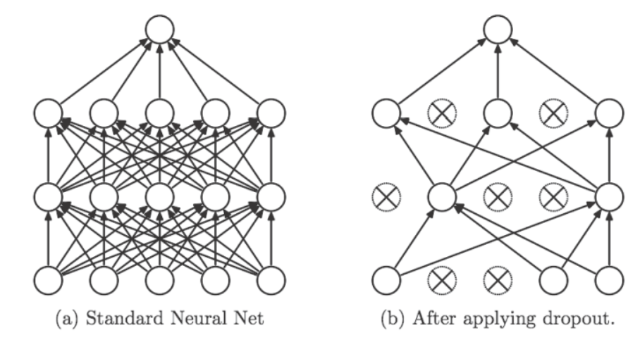

# regularization


过拟合指的是只能拟合训练数据，但不能很好地拟合不包含在训练数据中的其他数据.
过拟合的主要原因, 主要是两个:
- 模型拥有大量的参数, 表现力强
- 训练数据少

抑制过拟合的方法:

## 权重衰减
该方法通过在学习过程中对大的权重进行惩罚, 来抑制过拟合. 很多过拟合原本就是因为权重参数取值过大才发生的.

神经网络的学习目的是减小损失函数的值. 例如为损失函数加上权重的平方范数(L2). 这样就可以抑制权重变大. 用符号表示的话, 如果将权重记为$W$, L2范数的权重衰减就是$\frac{1}{2}\lambda W^2$, 然后将其加到损失函数上. $\lambda$是控制正则化强度的超参数. $\lambda$是控制正则化强度的超参数, $\lambda$的值越大, 对权重施加的惩罚就越重. $\frac{1}{2}$是用于将$\frac{1}{2}\lambda W^2$求导的结果变成$\lambda W$的调整为常量. 因此在求权重梯度的计算中, 要为之前的误差反向传播法的结果上加上正则化项的导数$\lambda W$.

- L2范数相当于各个元素的平方和, 假设有权重$W=(w_1,w_2,...,w_n)$, 则L2范数可用$\sqrt{w_1^2+w_2^2+...+w_n^2}$计算出来.
- L1范数是各个元素的绝对值之和, 相当于$|w_1|+|w_2|+...|w_n|$
- $L_\infty$也称为Max范数, 相当于各个元素的绝对值中最大的那一个.


## Dropout
如果网络的模型变得复杂, 仅靠权重衰减就难以对付了, 这种情况我们会用到Dropout方法.
Dropout会在学习的过程中随机删除神经元, 被删除的神经元不再进行信号的传递. 训练时每传递一次数据, 就会随机选择要删除的神经元.


python实现:
```python
class Dropout:
    def __init__(self, dropout_ratio=0.5):
        self.dropout_ratio = dropout_ratio
        self.mask = None
    def forward(self, x, train_flg=True):
        if train_flg:
            self.mask = np.random.rand(*x.shape) > self.dropout_ratio
            return x * self.mask
        else:
            return x * (1.0 - self.dropout_ratio)
    def backward(self, dout):
        return dout * self.mask
```