# cnn


卷积神经网络(（Convolutional Neural Network, CNN)相比神经网络出现了卷积层(Convolution层)和池化层(pooling层).

之前介绍的神经网络中, Affine相邻层的所有神经元之间都有连接, 这称为全连接(fully-connected).

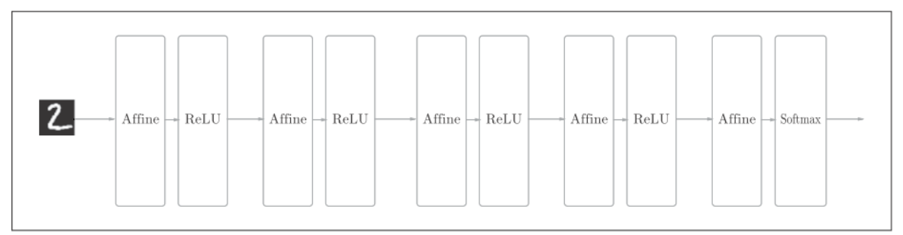
全连接的神经网络中, Affine层后面跟着激活函数ReLU层(或sigmoid层). 这里堆叠了4层"Affine-ReLU'组合, 然后第5层是Affine层, 最后由Softmax层输出最后最终结果.

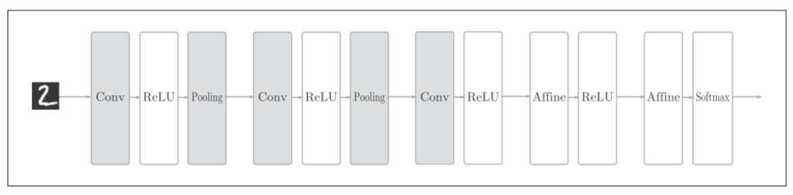
CNN中新增了Convolution层和Pooling层.CNN的层的连接顺序是"Convolution-ReLU-(Pooling)"(Pooling层有时会被省略). 这里可以理解为之前的"Affine-ReLU"连接被替换成了"Convolution-ReLU-(Pooling)"连接.

## 卷积层
全连接层忽略了数据的形状. 比如, 输入数据是图像时, 图像通常是高, 长, 通道上的3维形状. 但是, 向全连接层输入时, 需要将3维数据拉平为1维数据. 实际上, 前面提到的使用MNIST数据集的例子中, 输入图像就是1通道, 高28像素, 长28像素的(1,28,28)形状. 它们被排成一列, 以784个数据的形式输入到最开始的Affine层.

图像是3维形状, 这个形状中包含了空间信息. 比如, 空间上, 相邻的像素为相似的值, RGB的各个通道之间分别有密切的关联性/相距较远的像素之间没有什么关联等. 但是因为全连接层会忽视形状, 无法利用这些信息.

而卷积层可以保持形状不变. 当输入数据是图像时, 卷积层会以3维数据的形式接收输入数据, 并同样以3维数据的形式输出至下一层.

CNN中, 将卷积层的输入输出数据称为特征图(feature map).其中, 卷积层的输入数据称为输入特征图(input feature map), 输出数据称为输出特征图(output feature map).

## 卷积运算
卷积运算相当于图像处理中的滤波器运算.
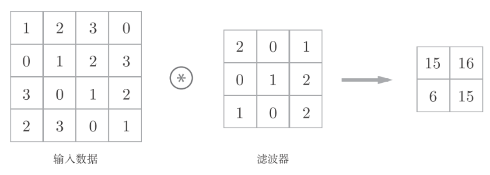
上图中, 输入的大小是(4,4),滤波器的大小是(3,3), 输出的大小是(2,2)

计算过程为:
卷积运算以一定的间隔滑动滤波器的窗口. 将各个位置上的滤波器元素和输入的对应元素相乘, 然后求和, 并将结果保存到输出的对应位置.
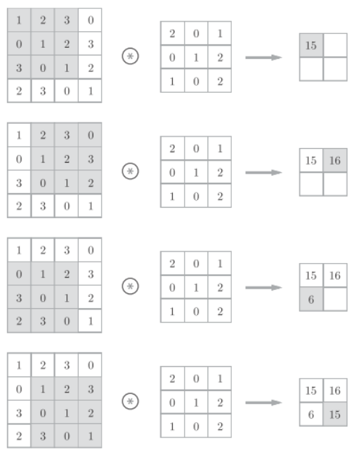

在全连接的神经网络中，除了权重参数，还存在偏置。CNN中，滤波器的参数就对应之前的权重。并且，CNN中也存在偏置。如下图:
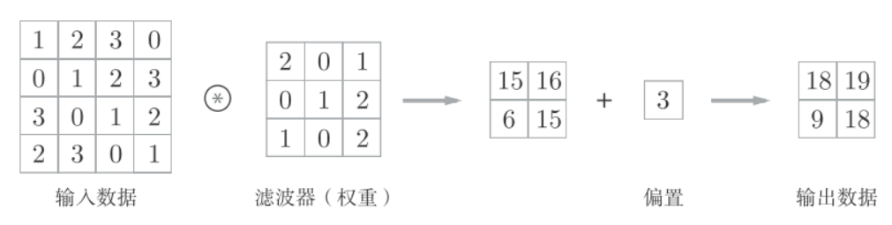

## 填充
在卷积处理之前, 有时要想输入数据的周围填入固定的数据(比如0), 这称为填充(padding)
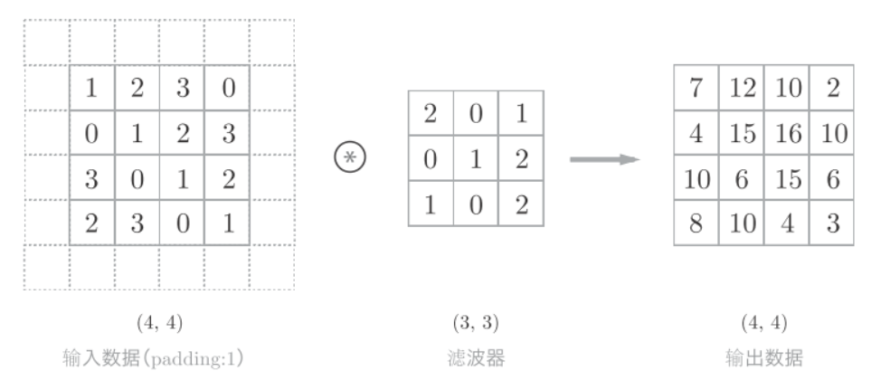

## 步幅
应用滤波器的位置间隔称为步幅(stride), 如下图步长为2.
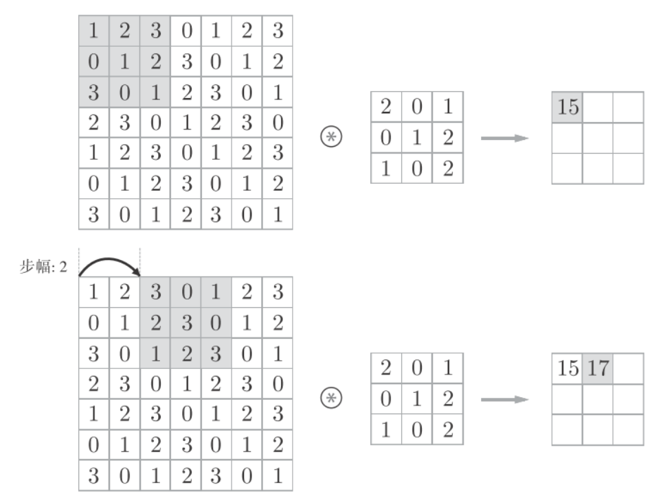


## 三维卷积运算
通道方向上有多个特征图时,会相应创建多通道的滤波器, 按通道进行输入数据和滤波器的卷积运算, 并将结果相加,从而得到输出
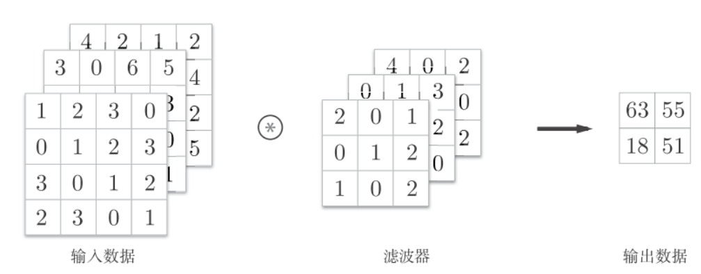
注意输入数据和滤波器的通道数要一致.


## 多个滤波器
三维数据表示为多维数组时, 书写顺序为(channel, height, width), 比如通道数为C, 高度为H, 长度为W的数据的形状可以写成(C,H,W). 滤波器也一样, 按照(channel, height, width)的顺序来书写, 比如通道数为C, 滤波器高度为FH(Filter Height), 长度为FW(Filter Width)时, 可以写成(C,FH,FW).

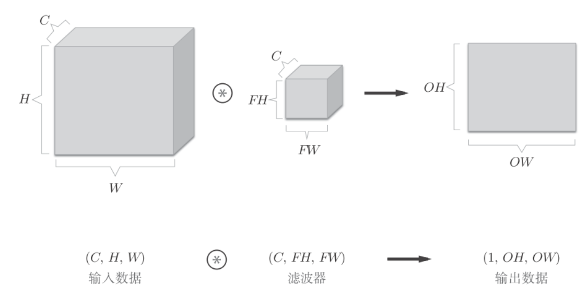

上图中, 数据输出是一张特征图, 就是通道数为1的特征图, 如果需要多张特征图, 剧需要用到多个滤波器.

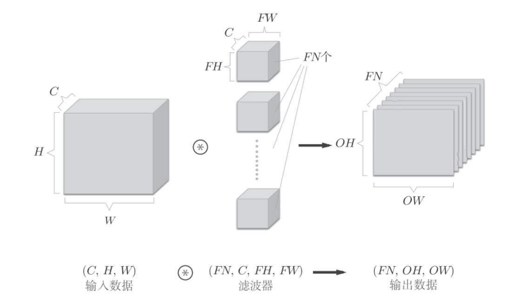
上图中, 通过使用FN个滤波器, 输出特征图也有FN个. 讲这FN个特征图汇集在一起, 就得到了形状为(FN,OH,OW)的方块.
作为4维数据, 滤波器的权重数据要按照(output_channel, input_channel, height, width)的顺序书写. 比如通道数为3, 大小为5*5的滤波器有20个时, 可以写成(20,3,5,5).

档案也可以加上偏置项:
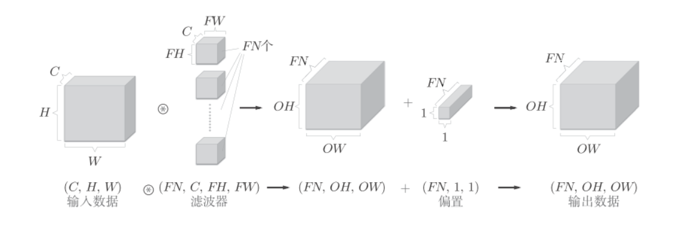


## 批处理
卷积批处理和全连接批处理一样, 就是在数据的开头加入批的维度, 比如(batch_num,channel,height,width). 如下图, 网络间传递的是4维数据, 对这N个数据进行了卷积运算.
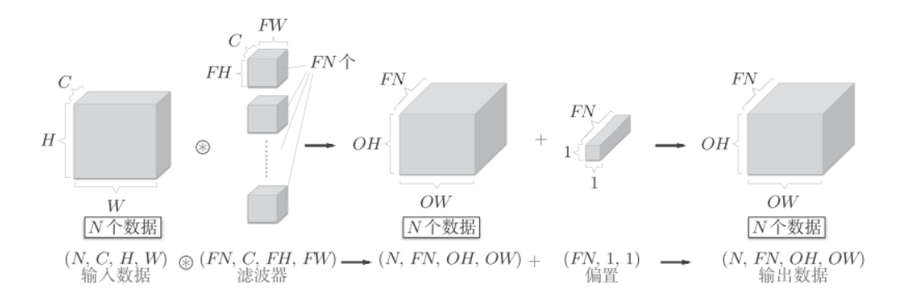

CNN中各层间传递的数据是4维数组.比如(10,1,28,28), 它对应的就是10个高为28, 长为28, 通道数为1的图片.用python表示:
```python
x = np.random.rand(10, 1, 28, 28) # 随机生成数据
x.shape  # (10, 1, 28, 28)
```
如果想访问第一个数据, 则输入`x[0]`即可.
```python
x[0].shape # (1, 28, 28)
```
方位第一个数据的第一个通道的空间数据
```python
 x[0, 0] # 或者x[0][0]
```


## 池化层
如下图, 将2*2的区域缩放成1个元素(取其中的最大值)
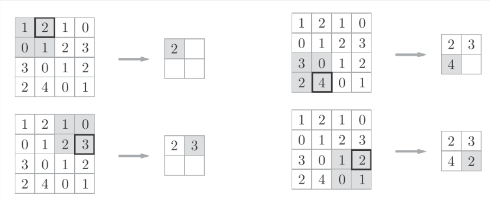
除了MAX池化之外, 还会有Average池化(取均值).
池化层的特点:
- 没有要学习的参数, 只是提取最大值或平均值
- 通道数不发生变化
- 对微小的位置变化具有鲁棒性, 输入数据发生微小偏差时, 池化仍会返回相同的结果, 如果下图, 像素虽有有微小的变动, 但是池化的结果相同


