# lstm


如图 是lstm与rnn的区别:
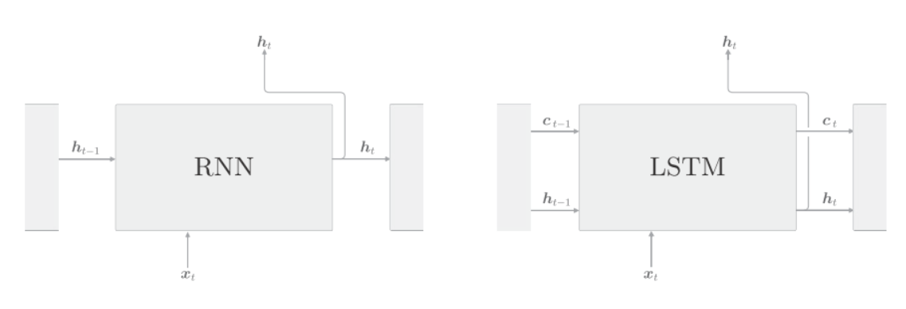
lstm与rnn的接口不同之处在于,lstm多了路径$c$,这个$c$称为记忆单元, 记忆单元只在lstm层内部工作, 不向其它层输出.

lstm的记忆单元$c_t$, 存储了时刻$t$时lstm的记忆, 可以理解为保存了从过去的时刻到$t$时刻的所有有必要的信息. 然后基于这个必要信息, 向下一时刻的lstm输出隐状态$h_t$.
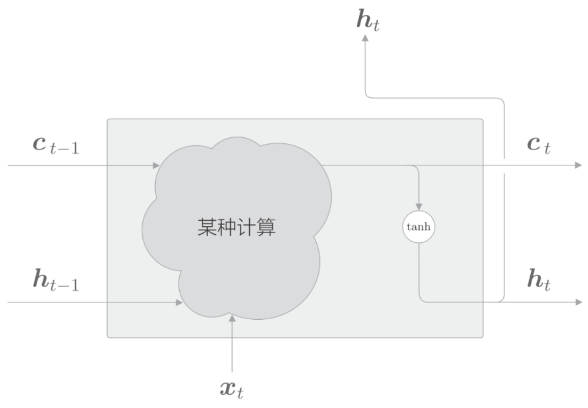
当前时刻的记忆单元$c_t$是基于3个输入$c_{t-1},h_{t-1}和x_t$计算得来的. 而隐状态$h_t$要使用更新后的$c_t$来计算, 既$h_t=tanh(c_t)$


### 输出门
隐状态$h_t$是对记忆单元$c_t$应用了tanh函数. 这里对$tanh(c_t)$添加门. 换句话说, 针对$tanh(c_t)$的各个元素, 调整它们作为下一时刻的隐藏状态的重要程度. 由于这个门管理下一个隐状态的$h_t$输出, 所以称为输出门($h_t$).
输出门的开合程度(流出的比例)根据输入$x_t$和上一个状态$h_{t-1}$求出, 使用$o$来表示:
$$o=\sigma(x_tW_x^{(o)}+h_{t-1}W_h^{(o)}+b^{(o)})$$
输入$x_t$有权重$W_x^{(o)}$, 上一时刻的状态$h_{t-1}$有权重$W_h^{(o)}$. 将他们的矩阵乘积和偏置$b^{(o)}$之和传给sigmoid函数, 结果就是输出门$o$. 最后将这个$o$和$tanh(c_t)$的对应元素的乘积作为$h_t$的输出.
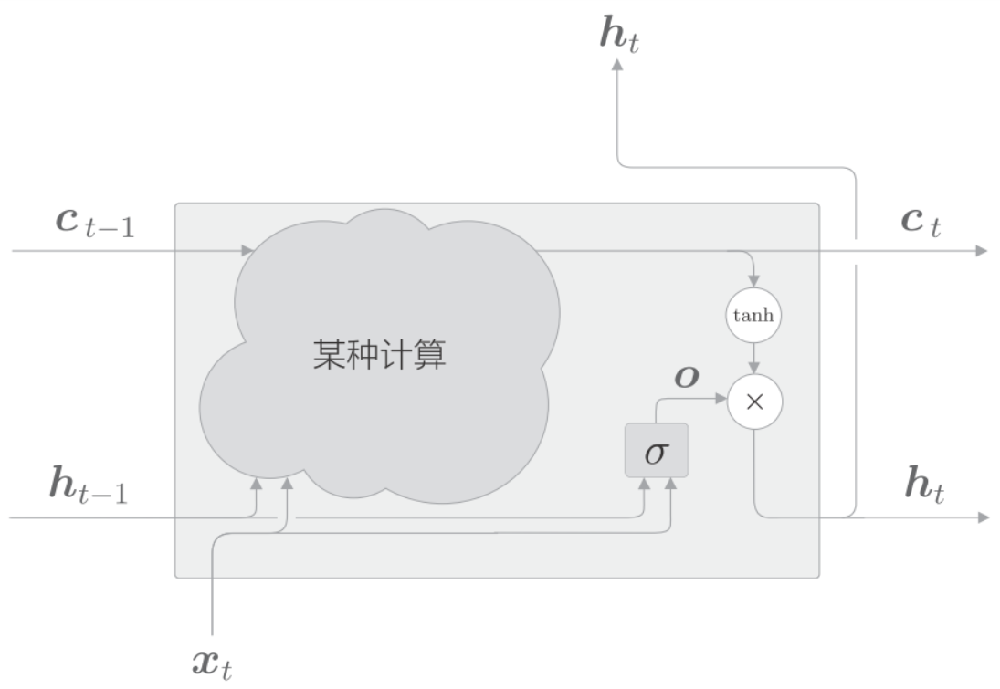
$h_t$可由$o$和$tanh(c_t)$的乘积计算出来, 这里的乘积是对应元素的乘积, 也称为阿达马乘积, 用$\odot$表示.

$$h_t = o \odot tanh(c_t)$$

tanh的输出是(-1,1)的实数, 可以理解为某种被编码的"信息"的强弱程度. 而sigmoid函数的输出是(0,1)的实数, 表示数据流的比例. 因此, 门使用sigmoid函数作为激活函数, 而包含实质信息的数据使用tanh函数作为激活函数.

### 遗忘门
在记忆单元$c_{t-1}$上添加一个忘记不必要记忆的门, 这里称为遗忘门(forget gate).
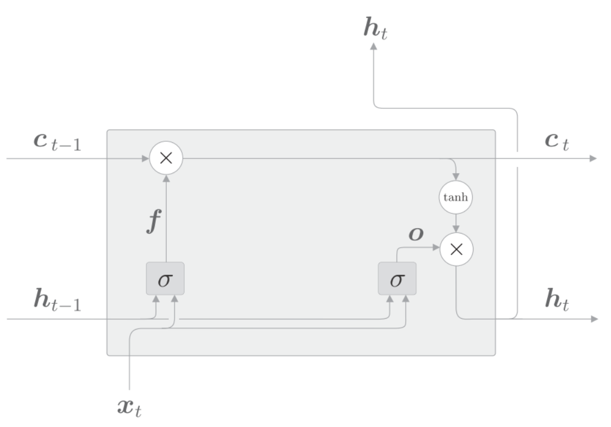
遗忘门使用$f$表示, 公式如下:
$$f=\sigma(x_tW_x^{(f)}+h_{t-1}W_h^{(f)}+b^{(f)})$$
$c_t$由这个$f$和上一个记忆单元$c_{t-1}$的对应元素的乘积求得:
$$c_t=f\odot c_{t-1}$$


### 记忆单元
遗忘门从上一时刻的记忆单元中删除了应该忘记的东西, 但是记忆单元只会忘记信息, 我们还需要添加记忆门, 使之记住一些东西:
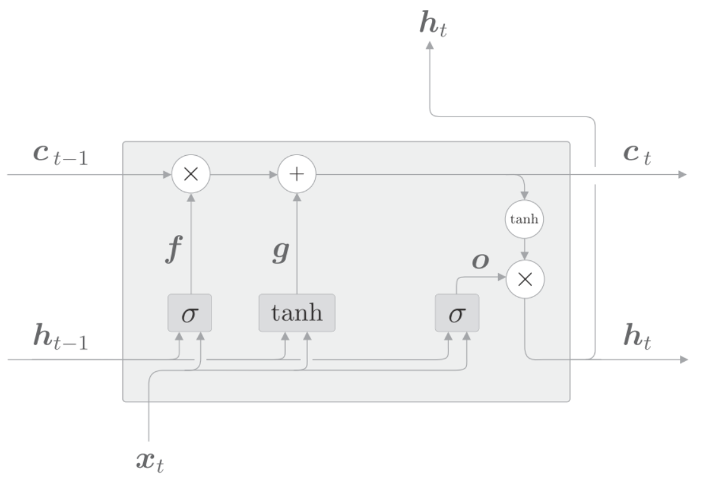
基于tanh节点计算出来的结果被加到上一时刻的记忆单元$c_{t-1}$上, 这样新的信息就被添加到了记忆单元中. 这个tanh节点的作用不是门, 而是将新的信息添加到记忆单元中. 因此, 它不用sigmoid函数作为激活函数, 而是使用tanh函数, 公式如下:
$$g=tanh(x_tW_x^{(g)}+h_{t-1}W_h^{(g)}+b^{(g)})$$
将$g$加到上一时刻$c_{t-1}$上, 形成新的记忆.


### 输入门
我们给$g$添加门, 称为输入门(input gate).
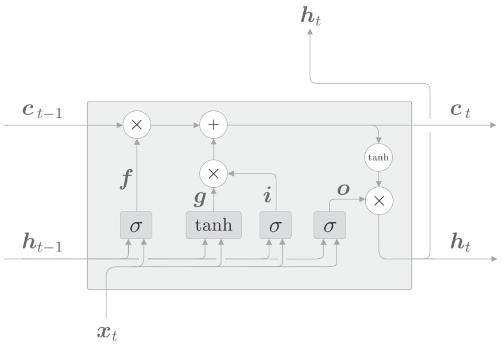
输入门用来判断新增信息$g$的各个元素的价值有多大, 对要添加的信息进行取舍, 给信息加权.用$\sigma$表示输入门, 用$i$表示输出.
$$i=\sigma(x_tW_x^{(i)}+h_{t-1}W_h^{(i)}+b^{(i)})$$
然后将$i$和$g$对应元素的乘积添加到记忆单元中去.


### 反向传播
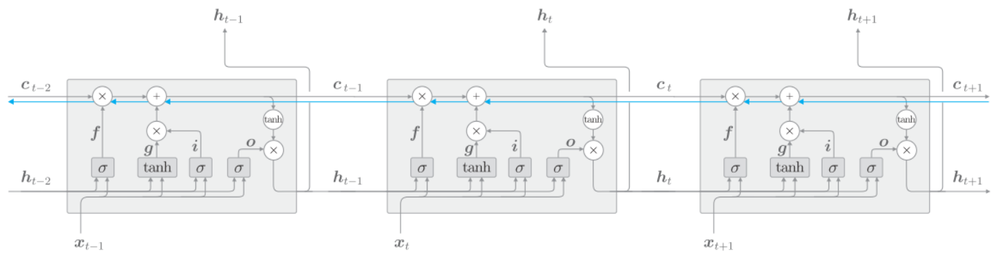
记忆单元的反向传播仅流过"+"和"X"节点. "+"节点将上游传来的梯度原样流出, 所以梯度没有变化.
"X"节点的计算并不是矩阵乘积, 而是对应元素乘积, 而且每次都会基于不同门值进行对应元素的乘积计算, 所以不会发生梯度消失.

## lstm的实现


$$f=\sigma(x_tW_x^{(f)}+h_{t-1}W_h^{(f)}+b^{(f)})$$
$$g=tanh(x_tW_x^{(g)}+h_{t-1}W_h^{(g)}+b^{(g)})$$
$$i=\sigma(x_tW_x^{(i)}+h_{t-1}W_h^{(i)}+b^{(i)})$$
$$c_t=f \odot c_{t-1} + i \odot g$$

$$o=\sigma(x_tW_x^{(o)}+h_{t-1}W_h^{(o)}+b^{(o)})$$
$$h_t=o \odot tanh(c_t)$$

首先是计算遗忘门$f$, 然后计算记忆单元$g$和记忆门$i$, 然后将他们添加到当前时刻的记忆单元里$c_t$
然后计算输出门, 并和当前的记忆单元乘积$c_t$计算当前的隐状态$h_t$.

注意式子中的4个放射变换$xW_x+hW_h+b$, 可以进行合并:

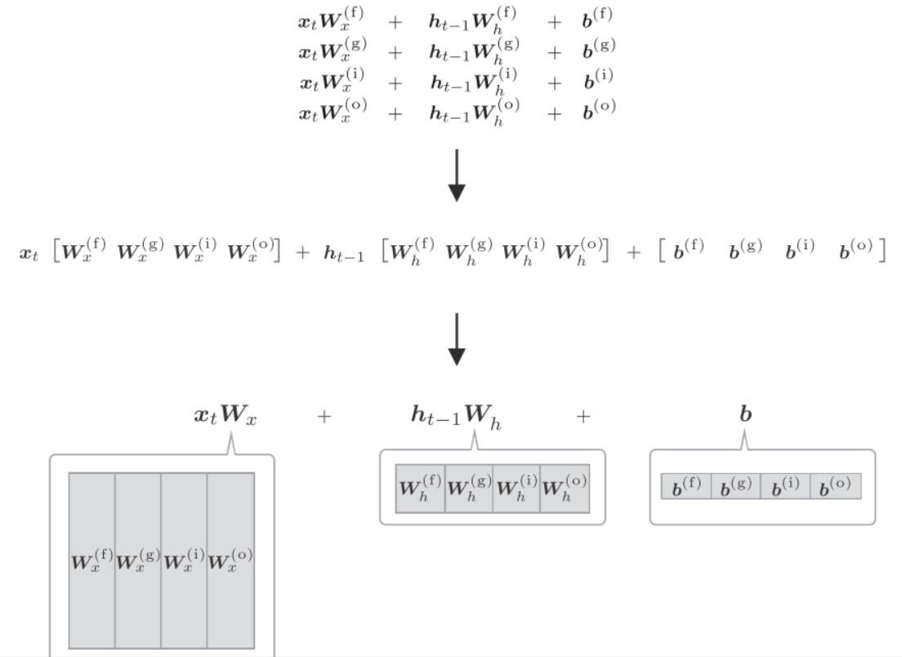
四个权重和偏置被整合成了1个, 原本单独执行4次的放射变换通过1次计算即可完成, 加快计算. 矩阵库计算"大矩阵"会非常快, 而且代码写起来也更简单:
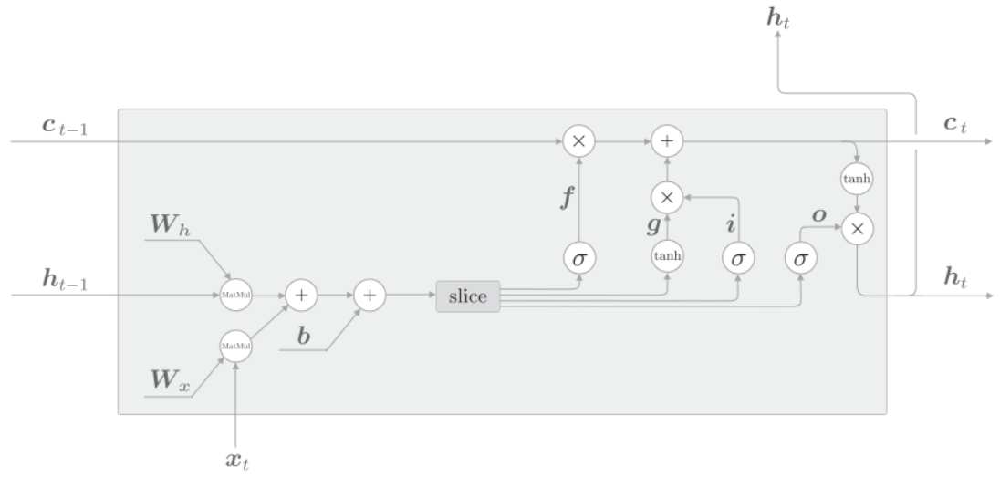
如上图, 先执行4个放射变换. 然后基于slice节点, 取出4个结果. slice节点是将放射变换的结果均等的分成4个等份.

python实现, 首先是`__init__`方法:
```python
class LSTM:
    def __init__(self, Wx, Wh, b):
        self.params = [Wx, Wh, b]
        self.grads = [np.zeros_like(Wx), np.zeros_like(Wh),
   np.zeros_like(b)]
        self.cache = None
```
初始化的参数有`Wx`,`Wh`,`b`, 这些权重整合了4个权重. 把这些参数获得的权重参数设定给成员变量params, 并初始化形状与之对应. `cache`保存正向传播的中间结果, 将在反向传播的计算中使用.


#### forward
接下来实现正向传播的`forward(x,  h_prev,  c_prev)`方法. 它的参数接收当前时刻的输入`x`, 上一时刻的隐状态`h_prev`, 以及上一时刻的记忆单元`c_prev`

```python
def forward(self, x, h_prev, c_prev):
    Wx, Wh, b = self.params
    N, H = h_prev.shape
    A = np.dot(x, Wx) + np.dot(h_prev, Wh) + b
    # slice
    f = A[:, :H]
    g = A[:, H:2*H]
    i = A[:, 2*H:3*H]
    o = A[:, 3*H:]
    f = sigmoid(f)
    g = np.tanh(g)
    i = sigmoid(i)
    o = sigmoid(o)
    c_next = f * c_prev + g * i
    h_next = o * np.tanh(c_next)
    self.cache = (x, h_prev, c_prev, i, f, g, o, c_next)
    return h_next, c_next
```
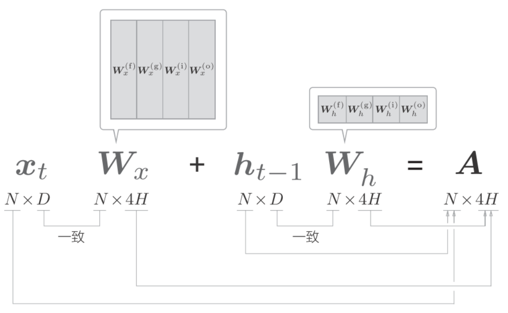
批大小是N, 输入数据的维度是D, 记忆单元和隐状态的维度都是H. A中保存了4个放射变换的结果. 通过`A[:,  :H]、A[:,  H:2*H]`这样的切片取出数据, 并分配给之后的计算节点.


#### back
slice节点将矩阵分成了4份, 因此反向传播需要整合4个梯度:
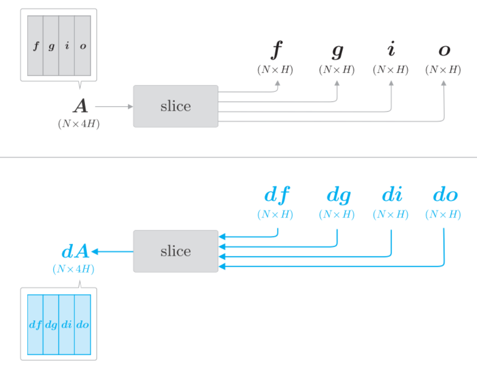
图中有4个梯度, `df`,`dg`,`di`和`do`, 将他们拼接成`dA`. 使用`NumPy`的`np.hstack()`可在水平方向上将给定的数组拼贴起来.
```python
dA = np.hstack((df, dg, di, do))
```


### Time LSTM层的实现
Time LSTM由T个LSTM层构成, 如下图:
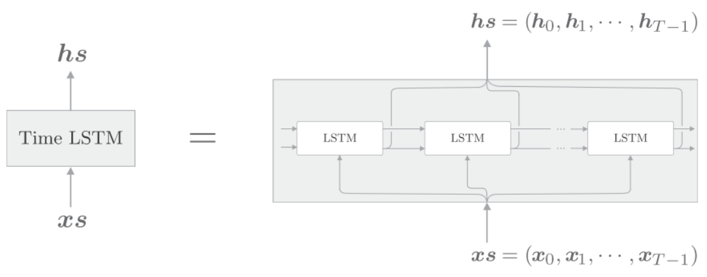
因为使用Truncated BPTT进行学习, 它以适当的长度截断反向传播的连接, 但是需要维持正向传播的数据流, 因此将隐状态和记忆单元保存在成员变量中. 这样`forward()`调用时, 就可以继承上一时刻的隐状态和记忆单元.
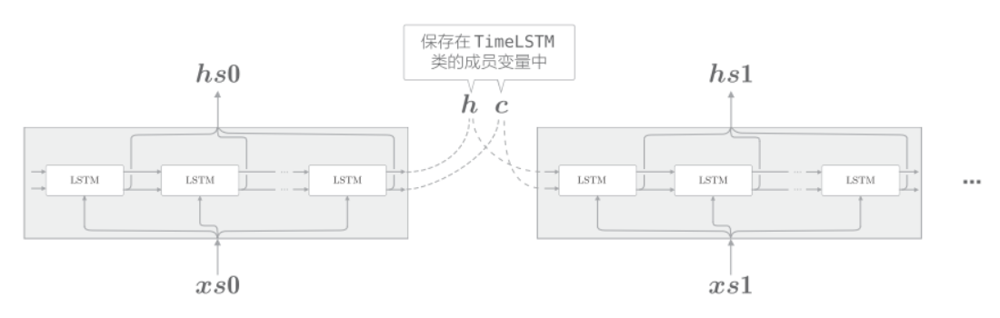

python实现:
```python
class TimeLSTM:
    def __init__(self, Wx, Wh, b, stateful=False):
        self.params = [Wx, Wh, b]
        self.grads = [np.zeros_like(Wx), np.zeros_like(Wh),
   np.zeros_like(b)]
        self.layers = None
        self.h, self.c = None, None
        self.dh = None
        self.stateful = stateful
    def forward(self, xs):
        Wx, Wh, b = self.params
        N, T, D = xs.shape
        H = Wh.shape[0]
        self.layers = []
        hs = np.empty((N, T, H), dtype='f')
        if not self.stateful or self.h is None:
            self.h = np.zeros((N, H), dtype='f')
        if not self.stateful or self.c is None:
            self.c = np.zeros((N, H), dtype='f')
        for t in range(T):
            layer = LSTM(*self.params)
            self.h, self.c = layer.forward(xs[:, t, :], self.h, self.c)
            hs[:, t, :] = self.h
            self.layers.append(layer)
        return hs
    def backward(self, dhs):
        Wx, Wh, b = self.params
        N, T, H = dhs.shape
        D = Wx.shape[0]
        dxs = np.empty((N, T, D), dtype='f')
        dh, dc = 0, 0
        grads = [0, 0, 0]
        for t in reversed(range(T)):

            layer = self.layers[t]
            dx, dh, dc = layer.backward(dhs[:, t, :] + dh, dc)
            dxs[:, t, :] = dx
            for i, grad in enumerate(layer.grads):
                grads[i] += grad
        for i, grad in enumerate(grads):
            self.grads[i][...] = grad
            self.dh = dh
            return dxs
    def set_state(self, h, c=None):
        self.h, self.c = h, c
    def reset_state(self):
        self.h, self.c = None, None
```
