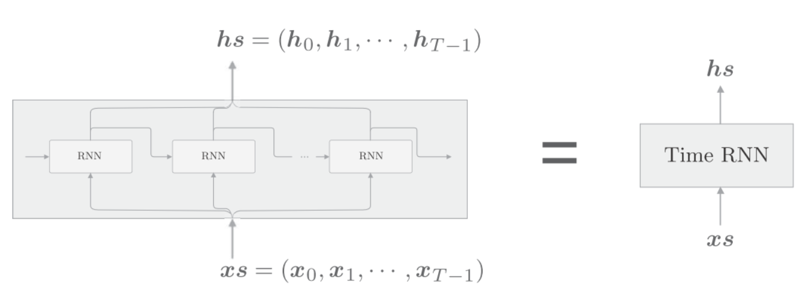

# rnn


循环神经网络(Recurrent Neural Network, RNN), recurrent是"重复发生", "周期性的发生"的意思, 这里翻译为循环.
循环有重复并持续的意思, 从某个地点出发, 经过一定时间又回到这个地点, 然后重复进行. 注意循环需要一个"环路". 通过数据循环, RNN一遍记住过去的数据, 一边更新到最新的数据.

## 单步RNN层

时刻$t$的输入是$x_t$, 这表示$(x_0,x_1,...,x_t,...)$会被输入到RNN层中, 然后对应输出$(h_0,h_1,...,h_t,...)$.
这里各个时刻RNN层输入的$x_t$是向量, 比如, 在处理句子时, 每个单词以词向量的形式作为输入.


各个时刻的RNN层接收传给该层的输入和前一个时刻RNN层的输出, 然后计算当前时刻的输出, 公式如下:
$$h_t=tanh(h_{t-1}W_h+x_tW_x+b)$$
RNN有两个权重, $W_h$控制前一时刻的输出, $W_x$控制当前时刻的输入.
首先执行矩阵的乘积运算, 然后使用tanh变换他们的和, 结果是$t$时刻的输出$h_t$. 这个$h_t$一方面向上输出到另一个层, 另一方面向右输出到下一个时刻的RNN层.
当前时刻的$h_t$输出, 一部分由上一时刻的$h_{t-1}$来控制, 这可以解释为RNN具有状态$h$, 并被不断的更新.也就是说RNN层是具有状态(hidden state)的层.
RNN层输出了两个箭头, 这两个箭头代表的是同一份数据.


## Backpropagation Through Time
RNN展开收, 可以看做水平方向的神经网络, 因为这里的误差反向传播法是"按时间顺序展开的神经网络的误差反向传播法", 所以称为Backpropagation Through Time, BPTT


## Truncated BPTT
在处理长时序数据时, 通常做法是将网络序列截取适当的长度, 严格地来讲, 只是将网络的反向传播的连接截断, 正向传播的连接依然不变.
假设有一个长度为1000的时序数据, 在自然语言处理的情境下, 相当于一个有1000个单词的句子. 如果展开RNN层, 将在水平方向上排列有1000个层的网络.

如上图, 以10个RNN层为单位进行截断, 各个单位之间没有关联, 因此可以在各个单位内完成误差的反向传播.

考虑使用Truncated BPTT来学习RNN. 首先 ,将第1块的输入数据$(x_0,...,x_9)$输入到RNN层, 如下图:

可以看到, 因为截断反向传播时, 在$x_9$时刻, 没有上一层的梯度传过来. 但是正向传播没有被截断, 所以$h_9$传入到了下一个单元. 接着来到下一个单元, 如下图:

和第1个单元一样, 先执行正向传播, 再执行反向传播. 正向传播开始时计算了上一个单元传进来的$h_9$, 而反向传播则没有使用$x_20$的梯度, 同样的道理继续, 如下图:


## RNN的实现

目标神经网络接收长度为$T$的时序数据(T为任意值), 输出各个时刻的隐状态$T$个. 考虑模块化, 可以将水平方向延伸的神经网络看做一个层, 如下图:

可以将$(x_0,x_1,...,x_{T-1},...)$捆绑为$x_s$作为输入, 将$(h_0,h_1,...,h{T-1},...)$捆绑为$h_s$作为输出. 这里将单步处理的层称为"RNN"层, 将一次处理$T$步的层称为"Time RNN"层.

### 单步RNN层的实现
公式:
$$h_t=tanh(h_{t-1}W_h+x_tW_x+b)$$
将数据整理为mini-batch进行处理, 假设输入个数是$N$, 输入的向量的维度是$D$, 隐藏状态向量的维度是$H$, 则:

python实现:
```python
class RNN:
    def __init__(self, Wx, Wh, b):
        self.params = [Wx, Wh, b]
        self.grads = [np.zeros_like(Wx), np.zeros_like(Wh),
   np.zeros_like(b)]
        self.cache = None
    def forward(self, x, h_prev):
        Wx, Wh, b = self.params
        t = np.dot(h_prev, Wh) + np.dot(x, Wx) + b
        h_next = np.tanh(t)
        self.cache = (x, h_prev, h_next)
        return h_next
```
`__init__`方法
1. 接收两个权重参数和一个偏置参数, 并存入变量`params`中. 
2. 各个参数对应形状的初始化梯度, 保存在`grads`中. 
3. 使用`None`对反向传播是需要用到的中间数据`cache`进行初始化

`forward(x, h_prev)`方法, 接收两个参数
1. 从下方输入的`x`
2. 从左边输入的`h_prev`

代码流程, 如下图:

进行的计算由矩阵乘积"MatMul", 加法"+", "tanh"这三种运算构成.

对应反向传播, 如下图:

python实现:
```python
def backward(self, dh_next):
    Wx, Wh, b = self.params
    x, h_prev, h_next = self.cache
    dt = dh_next * (1 - h_next ** 2)
    db = np.sum(dt, axis=0)
    dWh = np.dot(h_prev.T, dt)
    dh_prev = np.dot(dt, Wh.T)
    dWx = np.dot(x.T, dt)
    dx = np.dot(dt, Wx.T)
    self.grads[0][...] = dWx
    self.grads[1][...] = dWh
    self.grads[2][...] = db
    return dx, dh_prev
```

### Time RNN层的实现
Time RNN层由T个RNN层构成(T 可以设置为任意值)



python实现:
```python
class TimeRNN:
    def __init__(self, Wx, Wh, b, stateful=False):
        self.params = [Wx, Wh, b]
        self.grads = [np.zeros_like(Wx), np.zeros_like(Wh),np.zeros_like(b)]
        self.layers = None
        self.h, self.dh = None, None
        self.stateful = stateful
    def set_state(self, h):
        self.h = h
    def reset_state(self):
        self.h = None
```

`__init__`方法参数有权重, 偏置和stateful.
`self.params`保存权重矩阵
`self.grads`保存权重矩阵对应的梯度
`self.layers`保存多个单步RNN层
`self.h`保存调用`forward()`方法时的最后一个RNN层隐状态.
`self.dh`保存传给前 一个单位的隐状态的梯度.
`self.stateful`
- 为True, 是有状态的意思, 具体指维持`Time RNN`层的隐藏状态. 也就是说, 无论时序数据多长, Time RNN的正向传播都可以不中断的进行.
- 为False, 第一个RNN层的隐藏状态会被初始化为零矩阵, 没有状态的模式, 称为无状态.


### 实现正向传播

```python
def forward(self, xs):
    Wx, Wh, b = self.params
    N, T, D = xs.shape
    D, H = Wx.shape
    self.layers = []
    hs = np.empty((N, T, H), dtype='f')
    if not self.stateful or self.h is None:
        self.h = np.zeros((N, H), dtype='f')
    for t in range(T):
        layer = RNN(*self.params)
        self.h = layer.forward(xs[:, t, :], self.h)
        hs[:, t, :] = self.h
        self.layers.append(layer)
    return hs
```
` forward(xs)`方法从下方获得输入$x_s$, $x_s$包含了$T$个时序数据, 如果批大小是$N$, 输入向量的维度是$D$, 则$x_s$的形状为$(N,T,D)$.
首次调用时(`self.h=None`), RNN层的隐藏状态$h$由零矩阵初始化.另外, 在`stateful`为`false`的情况下, $h$将总是被重置为零矩阵. 也就是说, 
- 如果我们预测不相干的两句话分类, 则在预测完第一句话以后, 就要重置`self.h`为零矩阵, 此时要设置`self.stateful`为False
- 如果我们要预测相关的两句话, 比如不停的生成文本, 那么每句话都要使用前一句话的`self.h`, 此时要设置`self.stateful`为True
具体过程:
1. 首先通过`hs = np.empty((N, T, H), dtype='f')`为输出准备一个容器.
2. 在 T 次 for 循环中, 生成 RNN 层，并将其添加到成员变量 layers 中
3. 计算RNN层各个时刻的隐藏状态, 并存放在`hs`的对应时刻中.


### 实现反向传播

如上图, 将上游传来的梯度记为$dhs$, 将流向下游的$dxs$. 因为这里我们进行的是`Truncated BPTT`, 所以不需要流向这个单元的上一时刻的反向传播. 不过我们将流向上一时刻的隐藏状态的梯度存放在成员变量$dh$中. 如果关注第t个RNN层, 则如下图:

从上方传来的梯度$dh_t$和从上游传来的梯度$dh_{next}$会传到第t个RNN层. 注意, RNN层的正向传播的输出有两个分叉. 在正向传播存在分叉的情况下, 在反向传播时各梯度将被求和. 因此在反向传播时, 流向RNN层的是求和后的梯度.
python实现:
```python
def backward(self, dhs):
    Wx, Wh, b = self.params
    N, T, H = dhs.shape
    D, H = Wx.shape
    dxs = np.empty((N, T, D), dtype='f')
    dh = 0
    grads = [0, 0, 0]
    for t in reversed(range(T)):
        layer = self.layers[t]
        dx, dh = layer.backward(dhs[:, t, :] + dh) # 求和后的梯度
        dxs[:, t, :] = dx
        for i, grad in enumerate(layer.grads):
            grads[i] += grad
    for i, grad in enumerate(grads):
        self.grads[i][...] = grad
    self.dh = dh
    return dxs
```
1. 创建传给下游的梯度的"容器"(`dxs`)
2. 按与正向传播相反的方向, 求各个时刻的梯度`dx`, 并存放在`dxs`对应的时刻处

Time RNN层中每个单步的RNN层使用相同的权重, 因此Time RNN层的最终权重梯度是各个RNN层的权重梯度之和.
