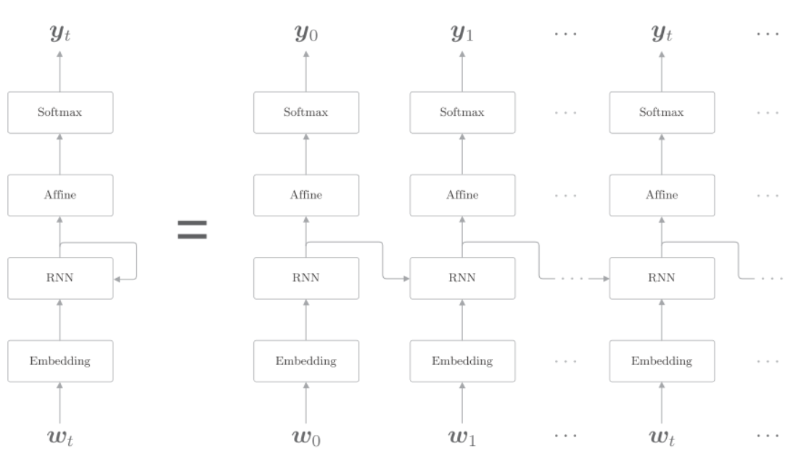
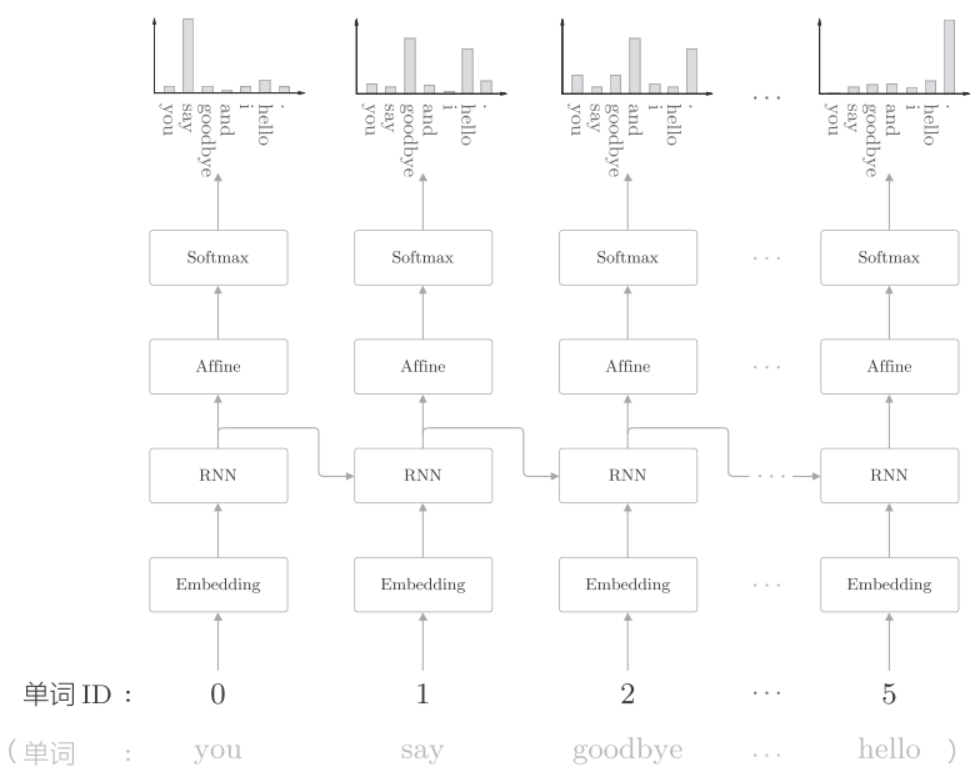
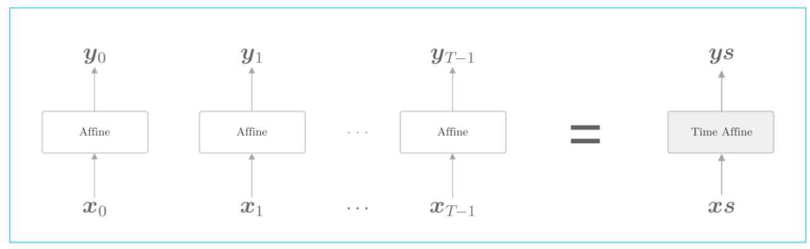
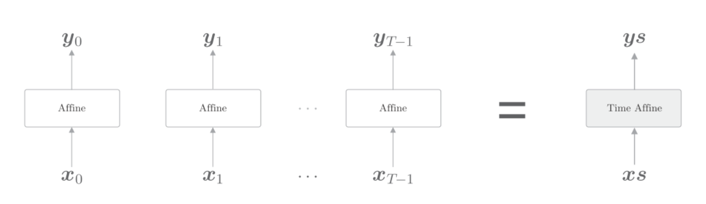
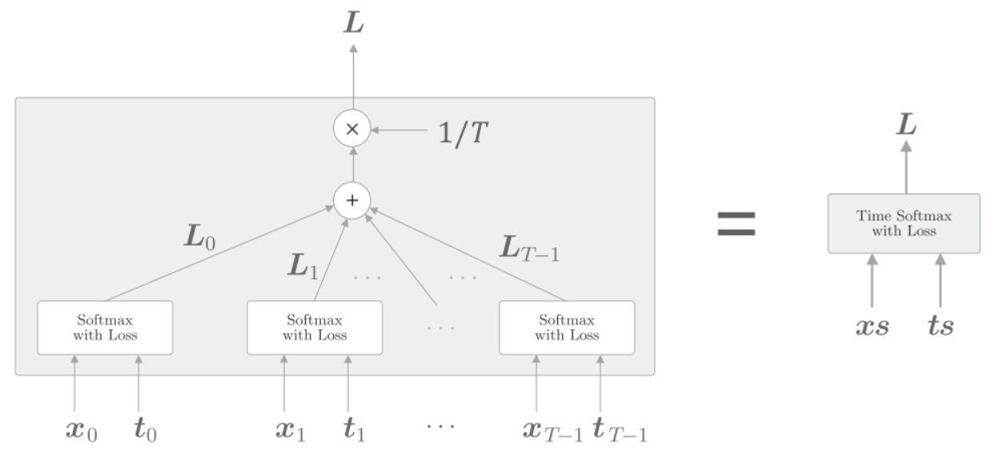
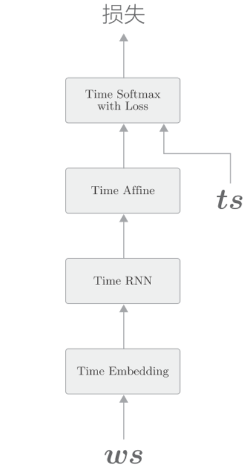

# rnnlm


基于 RNN 的语言模型称为 RNNLM(RNN Language Model)

第一层是Embedding层, 将单词转换为词向量
第二层是Time RNN, 向下一层输出隐状态, 同时也向下一时刻的RNN层输出隐状态
第三层是Affine层, 输入是Time RNN的隐状态
第四层是Softmax层

以"you say goodbye and i say hello"为例



第一时刻, 作为第一个单词ID为0的you被输入.此时, 查看Softmax层输出的概率分布, 可知say的概率最高, 这表明正确预测出了you后面出现的单词say.

同样我们可以把单个的RNN层, Embedding, Affine层都处理成Time RNN, Time Embedding, Time Affine. 就可以写成下图的形式:

Time Affine层是将T个Affine层分别处理各个时刻的数据.

同样的道理, Time Embedding层也是将T个Embedding层分别处理各个时刻的数据.
在 Softmax 中一并实现损失误差 Cross Entropy Error 层。

上图中$x_0,x_1$等数据表示从下方出来的得分,$t_0,t_1$表示正确解的标签. T个时刻各自计算出损失, 然后将它们加在一起取平均作为最终的损失. 公式如下:
$L=\frac{1}{T}(L_0+L_1+...+L_{T-1})$


## RNNLM实现


python实现:
```python
import sys
sys.path.append('..')
import numpy as np
from common.time_layers import *
class SimpleRnnlm:
    def __init__(self, vocab_size, wordvec_size, hidden_size):
        V, D, H = vocab_size, wordvec_size, hidden_size
        rn = np.random.randn
        # 初始化权重
        embed_W = (rn(V, D) / 100).astype('f')
        rnn_Wx = (rn(D, H) / np.sqrt(D)).astype('f')
        rnn_Wh = (rn(H, H) / np.sqrt(H)).astype('f')
        rnn_b = np.zeros(H).astype('f')
        affine_W = (rn(H, V) / np.sqrt(H)).astype('f')
        affine_b = np.zeros(V).astype('f')
        # 生成层
        self.layers = [
            TimeEmbedding(embed_W),
            TimeRNN(rnn_Wx, rnn_Wh, rnn_b, stateful=True),
            TimeAffine(affine_W, affine_b)
        ]
        self.loss_layer = TimeSoftmaxWithLoss()
        self.rnn_layer = self.layers[1]
        # 将所有的权重和梯度整理到列表中
        self.params, self.grads = [], []
        for layer in self.layers:
            self.params += layer.params
            self.grads += layer.grads
```
假设使用`Truncated BPTT`进行学习, 将Time RNN层的stateful设置为True, Time RNN层就可以继承上一时刻的隐藏状态.

```python
def forward(self, xs, ts):
    for layer in self.layers:
        xs = layer.forward(xs)
    loss = self.loss_layer.forward(xs, ts)
    return loss
def backward(self, dout=1):
    dout = self.loss_layer.backward(dout)
    for layer in reversed(self.layers):
        dout = layer.backward(dout)
    return dout
def reset_state(self):
    self.rnn_layer.reset_state()
```

## 评价
语言模型基于给定的已经出现的单词输出将要出现的单词的概率分布. 困惑度(perplexity)常被用来作为评价语言模型的预测性能的指标. 困惑度表示"概率的倒数". 比如如果预测的下一个单词的概率是0.8, 则困惑度就是$\frac{1}{0.8}=1.25$, 如果概率是0.2, 则困惑度为5. 我们可以将困惑度直观的理解为"分叉度", 分叉度是指下一个可能选择的选项数量. 比如困惑度为5, 则说明下一个单词有5种选择. 所以困惑度越少越好. 公式为:
$$L=-\frac{1}{N}\sum_n\sum_kt_{nk}logy_{nk}$$
$$困惑度 = e^L$$
假设数据有N个, $t_n$是one-hot向量形式的正确解标签, $t_{nk}$表示第$n$个数据的第$k$个值, $y_{nk}$表示概率分布(神经网络中softmax的输出).$L$是神经网络的损失.$e^L$是困惑度.


## 训练


```python
import sys
sys.path.append('..')
import matplotlib.pyplot as plt
import numpy as np
from common.optimizer import SGD
from dataset import ptb
from simple_rnnlm import SimpleRnnlm

## 设定超参数
batch_size = 10
wordvec_size = 100
hidden_size = 100 # RNN的隐藏状态向量的元素个数
time_size = 5 # Truncated BPTT的时间跨度大小
lr = 0.1
max_epoch = 100

## 读入训练数据（缩小了数据集）
corpus, word_to_id, id_to_word = ptb.load_data('train')
corpus_size = 1000
corpus = corpus[:corpus_size]
vocab_size = int(max(corpus) + 1)
xs = corpus[:-1] # 输入
ts = corpus[1:] # 输出（监督标签）  输入和输出错一个时间点
data_size = len(xs)
print('corpus size: %d, vocabulary size: %d' % (corpus_size, vocab_size))

## 学习用的参数
max_iters = data_size // (batch_size * time_size)
time_idx = 0
total_loss = 0
loss_count = 0
ppl_list = []
## 生成模型
model = SimpleRnnlm(vocab_size, wordvec_size, hidden_size)
optimizer = SGD(lr)

## 1 计算读入mini-batch的各笔样本数据的开始位置
jump = (corpus_size - 1) // batch_size
offsets = [i * jump for i in range(batch_size)]
for epoch in range(max_epoch):
    for iter in range(max_iters):
        # 2  获取mini-batch
        batch_x = np.empty((batch_size, time_size), dtype='i')
        batch_t = np.empty((batch_size, time_size), dtype='i')
        for t in range(time_size):
            for i, offset in enumerate(offsets):
                batch_x[i, t] = xs[(offset + time_idx) % data_size]
                batch_t[i, t] = ts[(offset + time_idx) % data_size]
            time_idx += 1
        # 计算梯度，更新参数
        loss = model.forward(batch_x, batch_t)
        model.backward()
        optimizer.update(model.params, model.grads)
        total_loss += loss
        loss_count += 1
    # 3 各个epoch的困惑度评价
    ppl = np.exp(total_loss / loss_count)
    print('| epoch %d | perplexity %.2f'
          % (epoch+1, ppl))
    ppl_list.append(float(ppl))
    total_loss, loss_count = 0, 0
```
1. 使用Truncated BPTT进行学习, 因此数据需要按顺序输入, 并且`mini-batch`的各批次要平移读入数据的开始位置