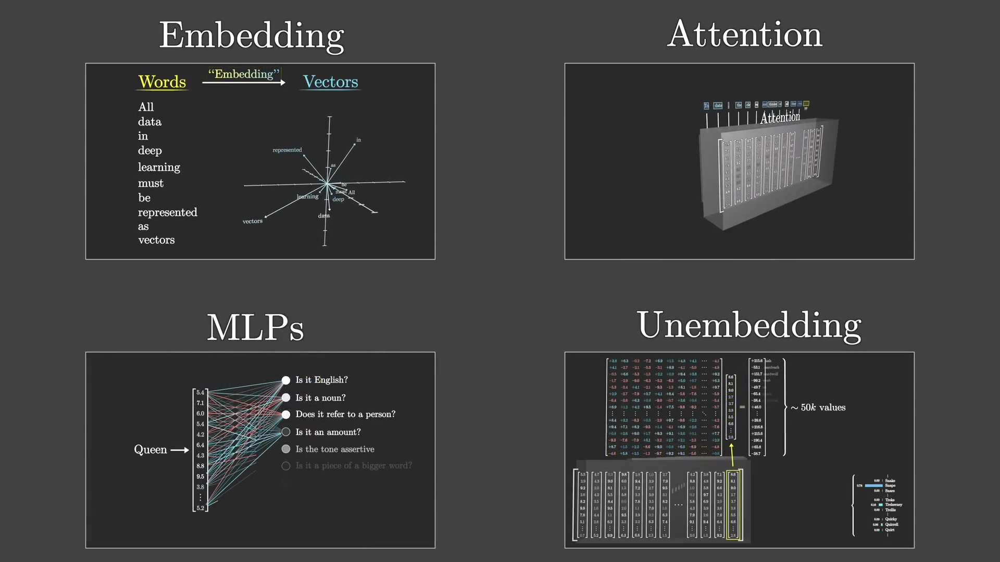
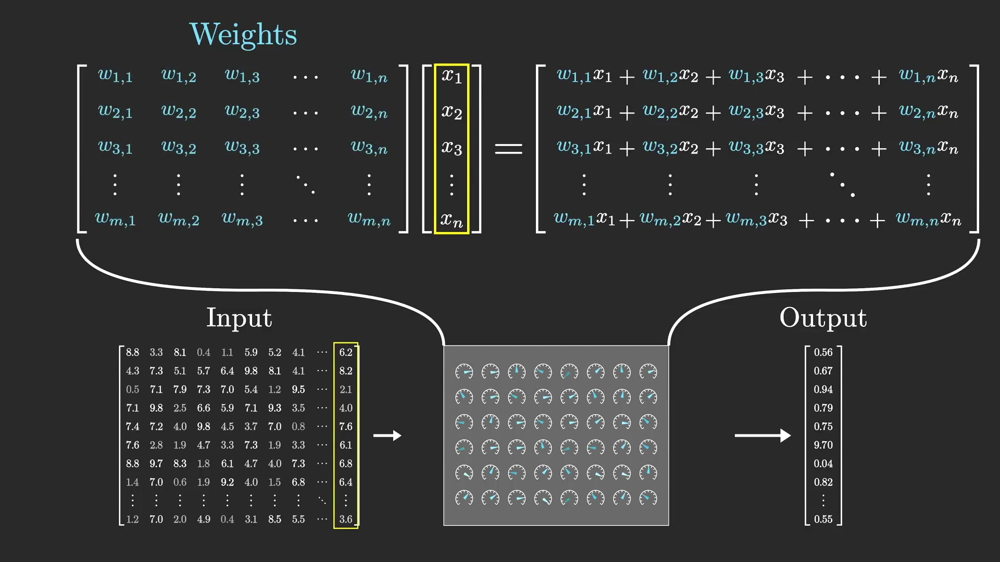
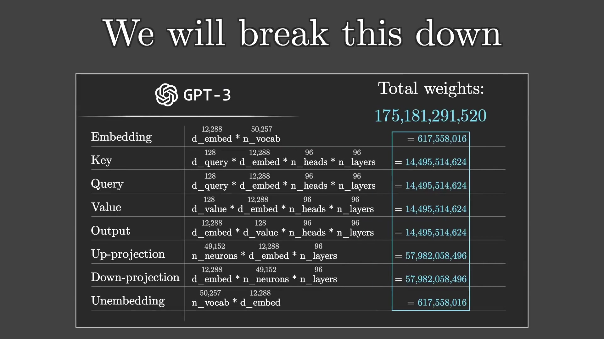
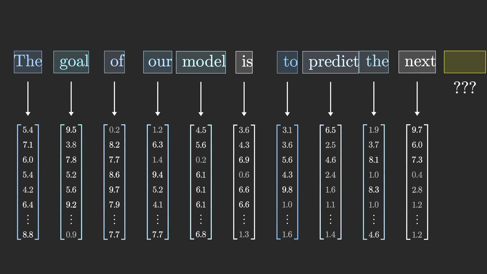
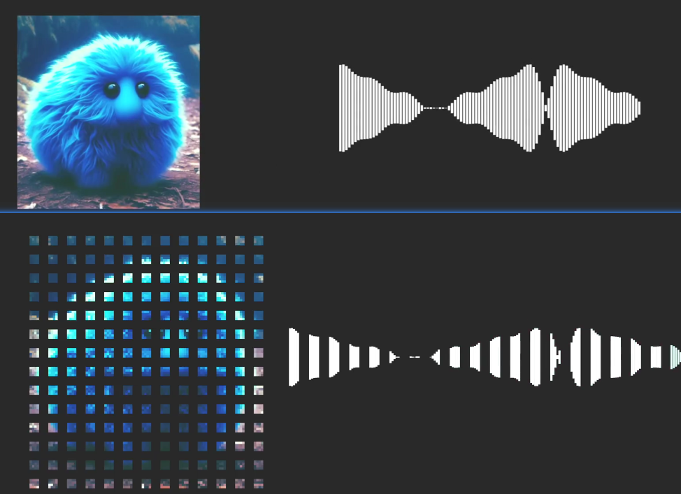

# transform

## GPT
GPT(Generative Pre-trained Transformer)全称是生成式预训练Transformer.
1. 生成式(Generative): 就是像对话一样
2. 预训练(Pre-trained): 预先进行训练好的模型, 使用时只需微调即可
3. transformer是关键, 包含4个部分:
    1. Embedding: 将词语用向量进行表示
    2. Attention: 注意力机制
    3. MLPs(Multi Layer Perceptron): 
    4. Unembedding: 将向量映射到词语并给出预测值

    

## 权重(weight)和数据(data)

深度学习模型的输入, 权重矩阵每一行代表一个神经元, 每一个神经元包含了和词向量长度相同的系数向量.每一列代表一个词向量(或者说每一列代表一个样本).  在生成式语言模型中, 每一个词向量都与矩阵相乘, 从而得到下一个词向量.

而在transformer模型中, 这些权重系数可以分为:
1. Embedding: 
2. Attention:
    1. Key:
    2. Query:
    3. value
    4. Output
3. MLPs:
    1. Up-projection:
    2. Down-projection:
4. unembedding:

详细的数量如下图所示:

## 直观理解

gpt原本是语言模型, 输入是一个词语, 输出的也是一个词语. 

如果我们想要生成图片, 或者音频, 仅需将图片切割成像素, 或将音频切成小片段.

## 参考
1. https://www.youtube.com/playlist?list=PLZHQObOWTQDNU6R1_67000Dx_ZCJB-3pi

