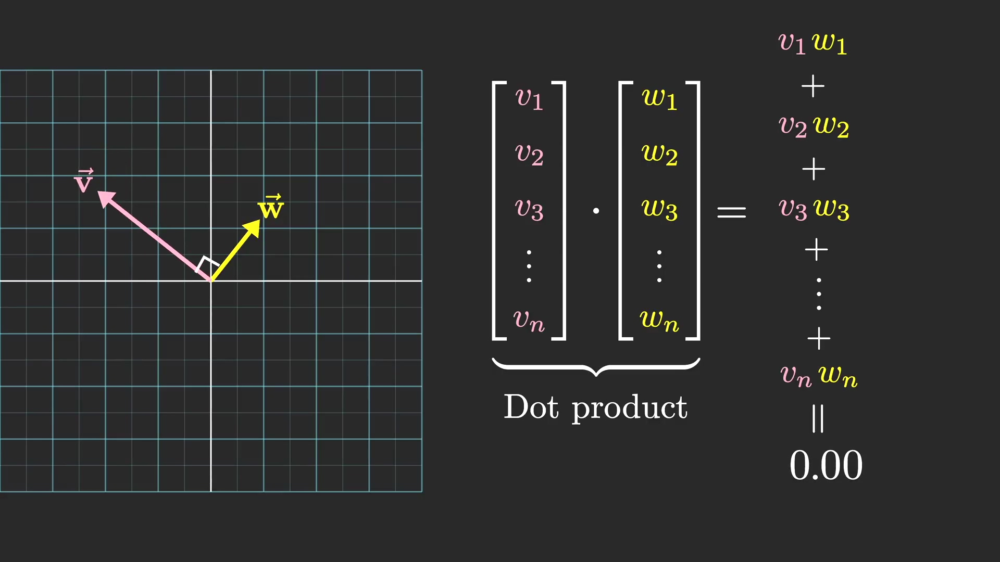

在词嵌入层, 总共有50257个tokens(词语和标点), 每个token使用12288维向量表示, 所以词嵌入矩阵(Embedding matrix)共有12288x50257个参数.

当两个词相似时, 他们的向量内积是正数:

当两个词不相关时, 他们的向量内积是0:

当两个词词义相反时, 他们的向量内积是负数:

使用向量表示词语:

## 参考
1. https://www.youtube.com/playlist?list=PLZHQObOWTQDNU6R1_67000Dx_ZCJB-3pi
